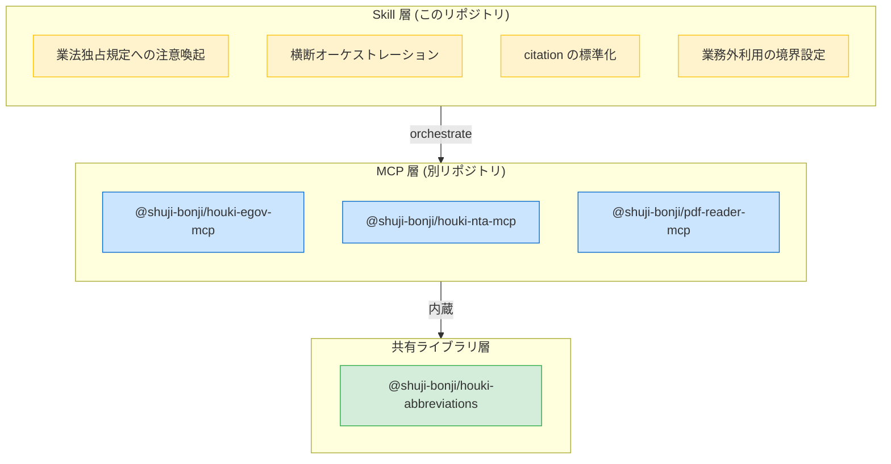

# houki-research-skill

[](https://opensource.org/licenses/MIT)

`houki-hub` MCP family を **横断的に**使うときの行動指針を Claude に与える **Claude Skill**。日本の **全法規 (法律・政令・省令・通達・判例・裁決・行政解釈)** を、「法律 → 政令 → 省令 → 通達 → 改正 + 添付 PDF → 行政解釈 → 判例 → 裁決」の階層に**正しい順序で参照しながら**回答するためのオーケストレーション層。

> **スコープ**: 税務 (税理士法) に限らず、**労務 (社労士法)・登記 (司法書士法)・法律事務全般 (弁護士法)** など分野を問わず日本の法令を扱う。現状は family の MCP が `houki-egov-mcp` (法律本文) + `houki-nta-mcp` (税務通達) + `pdf-reader-mcp` (PDF 抽出) なので税務の例が多いが、将来 `houki-mhlw-mcp` (厚労省) / `houki-saiketsu-mcp` (裁決) / `houki-court-mcp` (判例) が加わっても本スキルの行動指針は変わらない設計。

## 何を提供するのか

このリポジトリは **MCP server ではなく Skill** です。`@modelcontextprotocol/sdk` で `npm install` するものではなく、**Claude が複数 MCP を組み合わせて使うときの行動方針を Markdown でまとめたもの**です。



## なぜ MCP ではなく Skill なのか

[Architecture E](https://github.com/shuji-bonji/houki-nta-mcp/blob/main/docs/DESIGN.md) の「**単一 MCP に責務を集中させない**」原則に基づきます:

- MCP は機械的な fetch + parse に専念
- 複数 MCP を跨ぐロジックを 1 つの MCP に寄せると、その MCP が family の hub になり Architecture E が崩れる
- 業法独占規定への注意喚起のような **人間向けの判断補助** は MCP の責務外

詳細は [`docs/ARCHITECTURE.md`](docs/ARCHITECTURE.md)。

## インストール

### Cowork plugin として (推奨)

[Cowork mode](https://docs.claude.com/) の plugin として `.plugin` ファイルで配布予定。現在は skeleton 段階。

### Claude Code に直接配置

```bash
# ~/.claude/skills/houki-research/ にこのリポジトリを clone
mkdir -p ~/.claude/skills
cd ~/.claude/skills
git clone https://github.com/shuji-bonji/houki-research-skill houki-research
```

その後、Claude Code から `/skill houki-research` で呼び出せます。

### 手動配置

1. このリポジトリを clone
2. `SKILL.md` の指示に従って Claude に **「houki-research skill を使って」** と明示するか、Claude Desktop / Code のシステムプロンプトに `SKILL.md` の内容を含める

## 前提となる MCP 群

このスキルは以下が **すべて Claude に登録済み**であることを前提とします:

| MCP / パッケージ | npm | リポジトリ |
|---|---|---|
| `@shuji-bonji/houki-egov-mcp` | [npm](https://www.npmjs.com/package/@shuji-bonji/houki-egov-mcp) | [GitHub](https://github.com/shuji-bonji/houki-egov-mcp) |
| `@shuji-bonji/houki-nta-mcp` | [npm](https://www.npmjs.com/package/@shuji-bonji/houki-nta-mcp) | [GitHub](https://github.com/shuji-bonji/houki-nta-mcp) |
| `@shuji-bonji/pdf-reader-mcp` | [npm](https://www.npmjs.com/package/@shuji-bonji/pdf-reader-mcp) | [GitHub](https://github.com/shuji-bonji/pdf-reader-mcp) |
| `@shuji-bonji/houki-abbreviations` | [npm](https://www.npmjs.com/package/@shuji-bonji/houki-abbreviations) | [GitHub](https://github.com/shuji-bonji/houki-abbreviations) (上記 MCP に内蔵) |

セットアップの詳細は [houki-nta-mcp の HOUKI-FAMILY-INTEGRATION.md](https://github.com/shuji-bonji/houki-nta-mcp/blob/main/docs/HOUKI-FAMILY-INTEGRATION.md) を参照。

## ディレクトリ構成

```
houki-research-skill/
├── SKILL.md                    # Claude が読み取るメインプロンプト
├── README.md                   # このファイル (人間向け概要)
├── LICENSE                     # MIT
├── docs/
│   ├── ARCHITECTURE.md         # Skill 層と MCP 層の分担
│   ├── BUSINESS-LAW.md         # 業法独占規定の詳細解説
│   └── CITATION.md             # citation 標準フォーマット
├── workflows/                  # 横断 orchestration の典型ワークフロー
│   └── tax-research.md         # 税務リサーチの基本フロー
└── examples/                   # 具体的な session 例 (LLM 向け few-shot)
    └── invoice-registration.md
```

## 業法独占への配慮（重要）

このスキルは **「文献調査・情報整理」までを担うツール** であり、**具体的な税務相談・法律事務に直接回答する行為は税理士法第 52 条 / 弁護士法第 72 条 等に抵触する可能性があります**。

各 MCP のレスポンスには `legal_status` フィールドで法的拘束力の階層を明示しています。Claude が回答する際は **これらのフィールドを引用し、「最終的な実務判断は税理士・弁護士・司法書士・社労士などの有資格者へ」という案内を必ず添える運用**が原則です。

詳細は [`docs/BUSINESS-LAW.md`](docs/BUSINESS-LAW.md)。

## ライセンス

MIT — 個人利用・学習用途のフォーク・改変・再配布を自由に許可します。

ただし、**業としての税務代理・税務書類作成・税務相談（税理士法 52 条が定める独占業務）への利用は想定外**であり、作者は一切の責任を負いません。

## 関連プロジェクト

| プロジェクト | 役割 |
|---|---|
| [houki-nta-mcp](https://github.com/shuji-bonji/houki-nta-mcp) | 国税庁 (通達・改正・文書回答・QA・タックスアンサー) |
| [houki-egov-mcp](https://github.com/shuji-bonji/houki-egov-mcp) | e-Gov (法律・政令・省令の本文) |
| [pdf-reader-mcp](https://github.com/shuji-bonji/pdf-reader-mcp) | PDF 内部構造解析 + 表抽出 |
| [houki-abbreviations](https://github.com/shuji-bonji/houki-abbreviations) | 法令略称辞書 (共有ライブラリ) |
