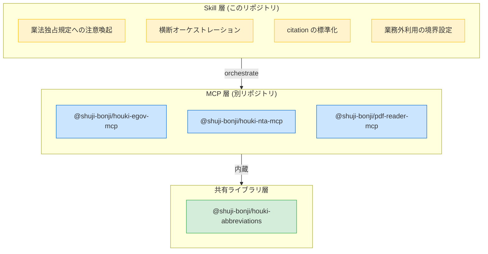
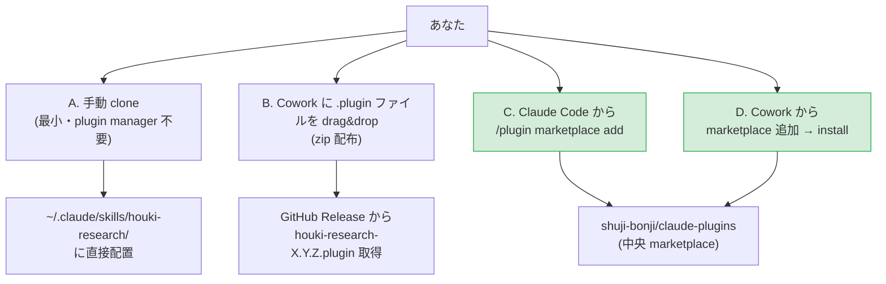

# houki-research-skill

[](https://opensource.org/licenses/MIT)
[](https://github.com/shuji-bonji/claude-plugins)

`houki-hub` MCP family を **横断的に**使うときの行動指針を Claude に与える **Claude Skill**。日本の **全法規 (法律・政令・省令・通達・判例・裁決・行政解釈)** を、「法律 → 政令 → 省令 → 通達 → 改正 + 添付 PDF → 行政解釈 → 判例 → 裁決」の階層に**正しい順序で参照しながら**回答するためのオーケストレーション層。

> **スコープ**: 税務 (税理士法) に限らず、**労務 (社労士法)・登記 (司法書士法)・法律事務全般 (弁護士法)** など分野を問わず日本の法令を扱う。現状は family の MCP が `houki-egov-mcp` (法律本文) + `houki-nta-mcp` (税務通達) + `pdf-reader-mcp` (PDF 抽出) なので税務の例が多いが、将来 `houki-mhlw-mcp` (厚労省) / `houki-saiketsu-mcp` (裁決) / `houki-court-mcp` (判例) が加わっても本スキルの行動指針は変わらない設計。

## 何を提供するのか

このリポジトリは **MCP server ではなく Skill** です。`@modelcontextprotocol/sdk` で `npm install` するものではなく、**Claude が複数 MCP を組み合わせて使うときの行動方針を Markdown でまとめたもの**です。



## なぜ MCP ではなく Skill なのか

[Architecture E](https://github.com/shuji-bonji/houki-nta-mcp/blob/main/docs/DESIGN.md) の「**単一 MCP に責務を集中させない**」原則に基づきます:

- MCP は機械的な fetch + parse に専念
- 複数 MCP を跨ぐロジックを 1 つの MCP に寄せると、その MCP が family の hub になり Architecture E が崩れる
- 業法独占規定への注意喚起のような **人間向けの判断補助** は MCP の責務外

詳細は [`skills/houki-research/docs/ARCHITECTURE.md`](skills/houki-research/docs/ARCHITECTURE.md)。

## インストール

4つの経路があります。Cowork mode と Claude Code 両方に対応します。



| 経路 | 対象 | 手間 | 推奨度 |
|---|---|---|---|
| A. 手動 clone | Claude Code | 小 | 動作確認・編集したい人向け |
| B. .plugin (zip) drag&drop | Cowork | 最小 | 個別配布・Web からの DL |
| C. Claude Code marketplace | Claude Code | 最小 | **推奨** |
| D. Cowork marketplace | Cowork | 最小 | **推奨** |

### A. 手動 clone (Claude Code)

```bash
mkdir -p ~/.claude/skills
cd ~/.claude/skills
git clone https://github.com/shuji-bonji/houki-research-skill houki-research-skill
# Claude Code が自動的に skills/houki-research/SKILL.md を読み込む
```

その後、Claude Code で「houki-research skill を使って」と明示すると skill が起動します。

### B. Cowork に .plugin ファイルを drag&drop

1. [Releases](https://github.com/shuji-bonji/houki-research-skill/releases) から最新の `houki-research-X.Y.Z.plugin` をダウンロード
2. Cowork mode の Settings → Customize → Plugins → 「Upload plugin」へ drag&drop
3. 有効化

### C. Claude Code (marketplace 経由・推奨)

```bash
# 1. shuji-bonji の marketplace を追加 (初回のみ)
/plugin marketplace add shuji-bonji/claude-plugins

# 2. plugin を install
/plugin install houki-research@shuji-bonji
```

### D. Cowork (marketplace 経由・推奨)

1. Cowork mode の Settings → Customize → Plugins → Marketplace
2. URL に `https://github.com/shuji-bonji/claude-plugins` を入力して追加
3. 一覧から **houki-research** を install

## 前提となる MCP 群

このスキルは以下が **すべて Claude に登録済み**であることを前提とします。

| MCP / パッケージ | 推奨最小バージョン | npm | リポジトリ |
|---|---|---|---|
| `@shuji-bonji/houki-egov-mcp` | v0.2.0 以上 | [npm](https://www.npmjs.com/package/@shuji-bonji/houki-egov-mcp) | [GitHub](https://github.com/shuji-bonji/houki-egov-mcp) |
| `@shuji-bonji/houki-nta-mcp` | v0.7.0 以上 (PDF 機能を使う場合は v0.8.0 以上推奨) | [npm](https://www.npmjs.com/package/@shuji-bonji/houki-nta-mcp) | [GitHub](https://github.com/shuji-bonji/houki-nta-mcp) |
| `@shuji-bonji/pdf-reader-mcp` | v0.4.0 以上 | [npm](https://www.npmjs.com/package/@shuji-bonji/pdf-reader-mcp) | [GitHub](https://github.com/shuji-bonji/pdf-reader-mcp) |
| `@shuji-bonji/houki-abbreviations` | v0.3.0 以上 (各 MCP に内蔵) | [npm](https://www.npmjs.com/package/@shuji-bonji/houki-abbreviations) | [GitHub](https://github.com/shuji-bonji/houki-abbreviations) |

> 推奨最小バージョンは family 共通エラー契約 (`OUT_OF_SCOPE` 等のコード語彙) と PDF 抽出機能の整合性を担保するための目安です。それ以前のバージョンでも skill 自体は動作しますが、エラーフォールバック例 (`examples/error-recovery-patterns.md`) の挙動が一致しない可能性があります。

セットアップの詳細は [houki-nta-mcp の HOUKI-FAMILY-INTEGRATION.md](https://github.com/shuji-bonji/houki-nta-mcp/blob/main/docs/HOUKI-FAMILY-INTEGRATION.md) を参照。

## ディレクトリ構成

```
houki-research-skill/
├── .claude-plugin/
│   └── plugin.json                 # Claude Code/Cowork plugin マニフェスト
├── skills/
│   └── houki-research/
│       ├── SKILL.md                # Claude が読み取るメインプロンプト
│       ├── docs/
│       │   ├── ARCHITECTURE.md     # Skill 層と MCP 層の分担
│       │   ├── BUSINESS-LAW.md     # 業法独占規定の詳細解説
│       │   ├── CITATION.md         # citation 標準フォーマット
│       │   ├── ERROR-CODES.md      # family 共通エラー語彙
│       │   └── ERROR-HANDLING.md   # エラー解釈ポリシー
│       ├── workflows/              # 横断 orchestration の典型ワークフロー
│       │   └── tax-research.md
│       └── examples/               # LLM 向け few-shot
│           ├── invoice-registration.md
│           └── error-recovery-patterns.md
├── README.md                       # このファイル (人間向け概要)
└── LICENSE                         # MIT
```

`.claude-plugin/plugin.json` は Claude Code / Cowork の plugin 仕様に準拠した manifest。`skills/houki-research/` 配下が実体で、`SKILL.md` が Claude にロードされるメインプロンプトです。

## 業法独占への配慮（重要）

このスキルは **「文献調査・情報整理」までを担うツール** であり、**具体的な税務相談・法律事務に直接回答する行為は税理士法第 52 条 / 弁護士法第 72 条 等に抵触する可能性があります**。

各 MCP のレスポンスには `legal_status` フィールドで法的拘束力の階層を明示しています。Claude が回答する際は **これらのフィールドを引用し、「最終的な実務判断は税理士・弁護士・司法書士・社労士などの有資格者へ」という案内を必ず添える運用**が原則です。

詳細は [`skills/houki-research/docs/BUSINESS-LAW.md`](skills/houki-research/docs/BUSINESS-LAW.md)。

## ライセンス

MIT — 個人利用・学習用途のフォーク・改変・再配布を自由に許可します。

ただし、**業としての税務代理・税務書類作成・税務相談（税理士法 52 条が定める独占業務）への利用は想定外**であり、作者は一切の責任を負いません。

## 関連プロジェクト

| プロジェクト | 役割 |
|---|---|
| [shuji-bonji/claude-plugins](https://github.com/shuji-bonji/claude-plugins) | shuji-bonji の Claude 拡張全般を集めた marketplace (本 skill もここから install 可能) |
| [houki-nta-mcp](https://github.com/shuji-bonji/houki-nta-mcp) | 国税庁 (通達・改正・文書回答・QA・タックスアンサー) |
| [houki-egov-mcp](https://github.com/shuji-bonji/houki-egov-mcp) | e-Gov (法律・政令・省令の本文) |
| [pdf-reader-mcp](https://github.com/shuji-bonji/pdf-reader-mcp) | PDF 内部構造解析 + 表抽出 |
| [houki-abbreviations](https://github.com/shuji-bonji/houki-abbreviations) | 法令略称辞書 (共有ライブラリ) |
