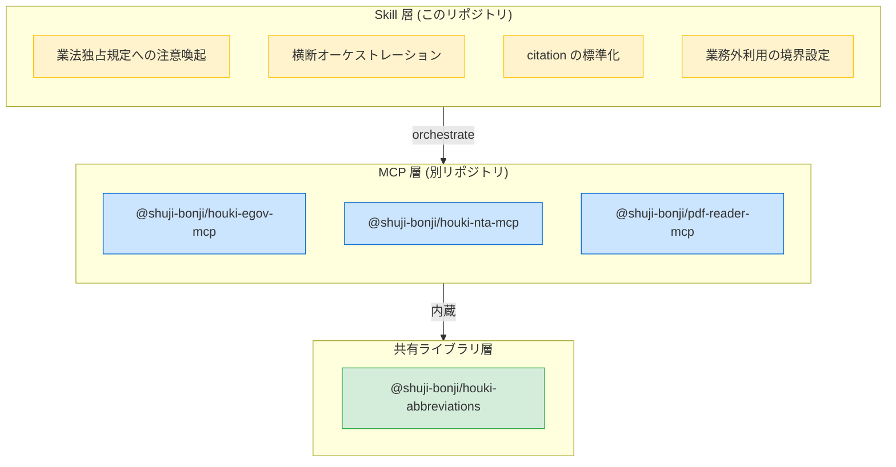
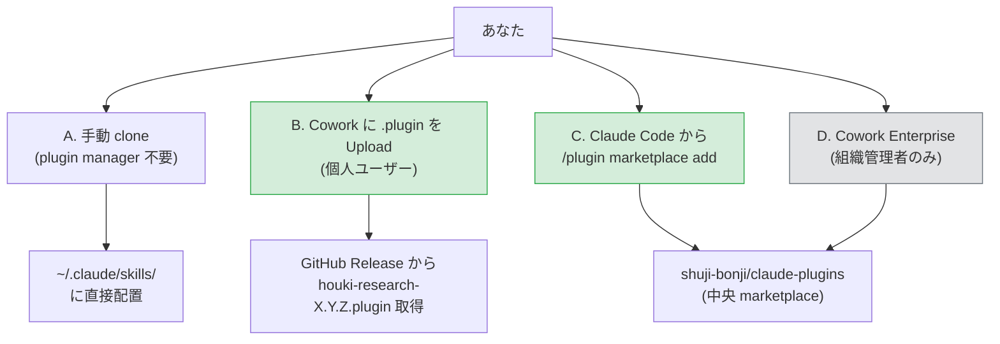

# houki-research-skill

[](https://opensource.org/licenses/MIT)
[](https://github.com/shuji-bonji/claude-plugins)

`houki-hub` MCP family を **横断的に**使うときの行動指針を Claude に与える **Claude Skill**。日本の **全法規 (法律・政令・省令・通達・判例・裁決・行政解釈)** を、「法律 → 政令 → 省令 → 通達 → 改正 + 添付 PDF → 行政解釈 → 判例 → 裁決」の階層に**正しい順序で参照しながら**回答するためのオーケストレーション層。

> [!NOTE]
> **スコープ**: 税務 (税理士法) に限らず、**労務 (社労士法)・登記 (司法書士法)・法律事務全般 (弁護士法)** など分野を問わず日本の法令を扱う。現状は family の MCP が `houki-egov-mcp` (法律本文) + `houki-nta-mcp` (税務通達) + `pdf-reader-mcp` (PDF 抽出) なので税務の例が多いが、将来 `houki-mhlw-mcp` (厚労省) / `houki-saiketsu-mcp` (裁決) / `houki-court-mcp` (判例) が加わっても本スキルの行動指針は変わらない設計。

## 何を提供するのか

提供するのは、**Claude が `houki-hub` の MCP を横断して使うときに従う行動方針**です。日本の法令を調べて答えるまでの、呼ぶ順序・出典の書き方・止めどころを Markdown で書いたもので、Claude が `SKILL.md` を読んで従います。

決めているのは次の 4 つです。

| 行動方針 | 何を決めているか |
| --- | --- |
| ① 業法独占規定への注意喚起 | 個別事案への当てはめに触れたとき、何を返し、何を返さず、誰に案内するか |
| ② 横断オーケストレーション | どの MCP をどの順で呼ぶか。略称の解決を最初に置き、法律 → 政令・省令 → 通達 → 改正履歴 → 添付 PDF → 判例・裁決 と辿る |
| ③ citation の標準化 | 出典の書式と、法令・通達・参考情報の拘束力の階層をどう示すか |
| ④ 業務外利用の境界設定 | 参考調査として答えてよい範囲と、業としての相談にあたる範囲の線引き |

エラーの `code`（`OUT_OF_SCOPE` など）を受け取ったときの解釈もこの Skill が決めます。code の定義の正本は各 MCP の仕様（`specs/current/common_errors/spec.md`）で、この Skill の [`docs/ERROR-CODES.md`](skills/houki-research/docs/ERROR-CODES.md) はそれをまとめた一覧です。

> [!NOTE]
> MCP server ではありません。`houki-egov-mcp` などは別リポジトリで、この Skill が決めるのは **それらを呼ぶ順序と、答えの書き方** です。配布は plugin で、[shuji-bonji/claude-plugins](https://github.com/shuji-bonji/claude-plugins) の marketplace から導入できます (経路は [インストール](#インストール) に 4 つ)。


```mermaid
graph TB
  subgraph skill["Skill 層 (このリポジトリ)"]
    direction TB
    S1["業法独占規定への注意喚起"]
    S2["横断オーケストレーション"]
    S3["citation の標準化"]
    S4["業務外利用の境界設定"]
  end

  subgraph mcp["MCP 層 (別リポジトリ)"]
    direction TB
    M1["@shuji-bonji/houki-egov-mcp"]
    M2["@shuji-bonji/houki-nta-mcp"]
    M3["@shuji-bonji/pdf-reader-mcp"]
  end

  subgraph lib["共有ライブラリ層"]
    L1["@shuji-bonji/houki-abbreviations"]
  end

  skill -->|orchestrate| mcp
  mcp -->|内蔵| lib

  classDef skill fill:#fff3cd,stroke:#ffc107,color:#333
  classDef mcp fill:#cce5ff,stroke:#0066cc,color:#333
  classDef lib fill:#d4edda,stroke:#28a745,color:#333
  class S1,S2,S3,S4 skill
  class M1,M2,M3 mcp
  class L1 lib
```

## なぜ MCP ではなく Skill なのか

[Architecture E](https://github.com/shuji-bonji/houki-nta-mcp/blob/main/docs/DESIGN.md) の「**単一 MCP に責務を集中させない**」原則に基づきます:

- MCP は機械的な fetch + parse に専念
- 複数 MCP を跨ぐロジックを 1 つの MCP に寄せると、その MCP が family の hub になり Architecture E が崩れる
- 業法独占規定への注意喚起のような **人間向けの判断補助** は MCP の責務外

詳細は [`skills/houki-research/docs/ARCHITECTURE.md`](skills/houki-research/docs/ARCHITECTURE.md)。

## インストール

クライアントごとに 4 つの経路があります。


```mermaid
graph TB
  user[あなた]
  user --> A["A. 手動 clone<br/>(plugin manager 不要)"]
  user --> B["B. Cowork に .plugin を Upload<br/>(個人ユーザー)"]
  user --> C["C. Claude Code から<br/>/plugin marketplace add"]
  user --> D["D. Cowork Enterprise<br/>(組織管理者のみ)"]

  A --> dirA["~/.claude/skills/<br/>に直接配置"]
  B --> rel["GitHub Release から<br/>houki-research-X.Y.Z.plugin 取得"]
  C --> mp["shuji-bonji/claude-plugins<br/>(中央 marketplace)"]
  D --> mp

  classDef rec fill:#d4edda,stroke:#28a745,color:#333
  classDef ent fill:#e2e3e5,stroke:#6c757d,color:#333
  class B,C rec
  class D ent
```

| 経路                | 対象              | 手間 | 推奨度                     |
| ------------------- | ----------------- | ---- | -------------------------- |
| A. 手動 clone       | Claude Code       | 小   | 動作確認・編集したい人向け |
| B. .plugin Upload   | Cowork (個人)     | 最小 | **推奨 (個人 Cowork)**     |
| C. marketplace 経由 | Claude Code       | 最小 | **推奨 (Claude Code)**     |
| D. Org marketplace  | Cowork Enterprise | 中   | 組織管理者のみ             |

### A. 手動 clone (Claude Code)

```bash
mkdir -p ~/.claude/skills
cd ~/.claude/skills
git clone https://github.com/shuji-bonji/houki-research-skill houki-research-skill
# Claude Code が自動的に skills/houki-research/SKILL.md を読み込む
```

その後、Claude Code で「houki-research skill を使って」と明示すると skill が起動します。

### B. Cowork (個人ユーザー・推奨)

個人の Cowork ユーザーは marketplace URL の追加 UI を持たないため、`.plugin` ファイルを直接アップロードする方式が標準です。

1. [Releases](https://github.com/shuji-bonji/houki-research-skill/releases) から最新の `houki-research-X.Y.Z.plugin` をダウンロード
2. Claude Desktop アプリを開き、Cowork タブへ
3. サイドバーの **Plugins** をクリック
4. **「Upload plugin」** ボタン (または「+」アイコン) から先ほどの `.plugin` ファイルを選択
5. 有効化

> アップロードした plugin はあなたのマシンにローカル保存されます。組織で共有したい場合は経路 D を参照。

### C. Claude Code (marketplace 経由・推奨)

```bash
# 1. shuji-bonji の marketplace を追加 (初回のみ)
/plugin marketplace add shuji-bonji/claude-plugins

# 2. plugin を install (v0.7.0 以上は houki-egov-mcp と houki-nta-mcp も一緒に入ります)
/plugin install houki-research@shuji-bonji
```

v0.7.0 から `houki-egov-mcp` と `houki-nta-mcp` を `dependencies` に宣言しているため、この 1 コマンドで条文と通達の両方を引ける状態になります。有効化も連動します。

ただし、入っただけでは全文検索は効きません。houki-egov-mcp は約 290 MB、houki-nta-mcp は 6 種別で約 100 分の取り込みが要ります。下記「前提となる MCP 群」のあとに続く各リポジトリの README を参照してください。

### D. Cowork Enterprise (組織管理者向け)

組織で全社員に配布したい場合は、Organization Settings から marketplace URL を登録します。**この機能は Enterprise admin のみ**が利用できます。

1. Organization Settings → Plugins → **「Add plugin」**
2. Source として **GitHub** を選択
3. URL に `https://github.com/shuji-bonji/claude-plugins` を入力
4. 利用許可するチームに per-user provisioning または auto-install を設定

詳細: [Manage Claude Cowork plugins for your organization](https://support.claude.com/en/articles/13837433-manage-claude-cowork-plugins-for-your-organization)

## 前提となる MCP 群

このスキルは `houki-egov-mcp` と `houki-nta-mcp` が Claude に登録済みであることを前提とします。marketplace 経由で install した場合、この 2 つは v0.7.0 から自動で入ります。`pdf-reader-mcp` は添付 PDF を表として取るときに使いますが、必須ではありません — 無ければ `nta_inspect_pdf_meta` が返すファイルのパス（`saved[].path`）か URL と読み方（`layout_note`）を、使っている PDF 読み取りツールに渡します（v0.13.0）。

| MCP / パッケージ                   | 推奨最小バージョン                                 | npm                                                                   | リポジトリ                                                   |
| ---------------------------------- | -------------------------------------------------- | --------------------------------------------------------------------- | ------------------------------------------------------------ |
| `@shuji-bonji/houki-egov-mcp`      | v0.5.3 以上 (`search_fulltext` と `INVALID_ARGUMENT` の `detail.issues` を使うため。枝番号の号 (`item: "12の8"`) は v0.6.0 以上。feasibility-check の ⑤ で委任先を `get_related_laws` / `get_article_references` で辿るのは v0.10.1 以上で、それより前は `law_type` 指定の `search_law` に切り替わる。鉄則 4 の引用の実在確認 (`verify_citations`) は v0.11.0 以上で、それより前はこの手を飛ばす。feasibility-check の ⑤ で別表・様式の図を `list_attachments` で取るのは v0.15.0 以上で、それより前は e-Gov のサイトで図を見る。`save: true` の上限超えの `FILE_TOO_LARGE`、検索の通信の失敗を `LAW_NOT_FOUND` でなく `SOURCE_*` で返すこと、`search_law` の管轄外の略称の `OUT_OF_SCOPE` は v0.16.0 以上。`get_law_revisions` が施行日の新しい順に並ぶこと、`meta.at` などの値の無いキーが `null` で付くこと、`INTERNAL_ERROR` / `UNKNOWN_TOOL` が `retryable: false` になることは v0.17.0 以上。法令名の完全一致が無いときの候補付きの `LAW_NOT_FOUND`、時点 `at` が 2017-04-01 より前のときの `INVALID_ARGUMENT`、`get_article_references` の `kind: "suppl"`、`get_law` / `verify_citations` の `suppl_index`、`search_fulltext` の管轄外の略称の `OUT_OF_SCOPE` は v0.18.0 以上で、v0.18.0 以上では `search_law` / `search_fulltext` に `domain` を渡さない。`search_fulltext` が版の合わない DB を使わずに `search_law` に切り替えることは v0.19.0 以上で、v0.18.x 以前に作った DB は v0.19.0 以上の `--bulk-download-everything` で作り直す。v0.2.0 以上なら動作はする) | [npm](https://www.npmjs.com/package/@shuji-bonji/houki-egov-mcp)      | [GitHub](https://github.com/shuji-bonji/houki-egov-mcp)      |
| `@shuji-bonji/houki-nta-mcp`       | v0.12.0 以上 (質疑応答事例の `related_laws` と `next_actions` で法律本文と通達へ戻る手順を使うため。検索の `DOC_NOT_FOUND` は v0.13.0 以上、枝番号の号の `item` は v0.14.0 以上、取得ツールの docId 誤りと DB 未投入の切り分けは v0.14.1 以上、取得ツールの `source` は v0.16.0 以上、索引から消えた文書の `index_status` は v0.17.0 以上、添付 PDF の `read_strategy` / `layout_note` / `save: true` / `next_actions` は v0.19.0 以上で、それより前は `reader_hints.examples` の `url` を `read_url` に渡す。改正通達の「別紙 N」が `comparison` で返るのは v0.20.0 以上で、v0.19.x は `kind` を付けずに全件を見る。改正通達・事務運営指針の取得で docId が無いときの `DOC_NOT_FOUND` と、`nta_get_qa` / `nta_get_tax_answer` でページが無いときの `DOC_NOT_FOUND` は v0.22.0 以上で、それより前はそれぞれ `TSUTATSU_NOT_FOUND`・`SOURCE_API_ERROR`。索引にある文書の `index_status: null` などの値の無いキーが `null` で付くこと、タックスアンサーの `basisDate`、`INTERNAL_ERROR` / `UNKNOWN_TOOL` の `retryable: false` は v0.23.0 以上。国税庁サイトとの通信の失敗を `SOURCE_TIMEOUT` / `SOURCE_RATE_LIMITED` / `SOURCE_UNAVAILABLE` / `SOURCE_API_ERROR` に分けること、403・400 の `SOURCE_API_ERROR` の `retryable: false`、`nta_get_tax_answer` の 8xxx 帯（災害関係）、事務運営指針の `legal_status.note` の文は v0.24.0 以上で、v0.24.0 以上では `nta_search_qa` に `domain` を渡さない。v0.11.0 以上なら通達の手順は動き、v0.7.0 以上なら動作はする) | [npm](https://www.npmjs.com/package/@shuji-bonji/houki-nta-mcp)       | [GitHub](https://github.com/shuji-bonji/houki-nta-mcp)       |
| `@shuji-bonji/pdf-reader-mcp`      | v0.4.0 以上 (任意。無ければ手元の PDF 読み取りツールで代わりになる) | [npm](https://www.npmjs.com/package/@shuji-bonji/pdf-reader-mcp)      | [GitHub](https://github.com/shuji-bonji/pdf-reader-mcp)      |
| `@shuji-bonji/houki-abbreviations` | v0.3.0 以上 (各 MCP に内蔵)                        | [npm](https://www.npmjs.com/package/@shuji-bonji/houki-abbreviations) | [GitHub](https://github.com/shuji-bonji/houki-abbreviations) |

> [!NOTE]
> 推奨最小バージョンは、エラーの `code`（`OUT_OF_SCOPE` など）と PDF 抽出の手順が Skill の記述と合うための目安です。それ以前のバージョンでも skill 自体は動作しますが、エラーフォールバック例 (`examples/error-recovery-patterns.md`) の挙動が一致しない可能性があります。

> [!IMPORTANT]
> houki-egov-mcp v0.19.0 と houki-nta-mcp v0.24.0 で、ローカル DB の版が上がりました。
>
> - **houki-egov-mcp v0.19.0（DB の版 3）**: v0.18.x 以前に作った DB は使えません。`houki-egov-mcp --bulk-download-everything`（全件の zip 約 290 MB）で作り直してください。作り直すまで、`search_fulltext` は条文本文を探さずに `search_law` に切り替えます。作り直した DB を v0.18.x 以前で開くと全テーブルが消えるので、作り直した後は CLI と MCP サーバー（plugin）の版を v0.19.0 以上にそろえてください
> - **houki-nta-mcp v0.24.0（DB の版 12）**: v0.23.x 以前で作った DB は、v0.24.0 の CLI かツールが最初に開いたときに行を保ったまま移行されます。取り込み直しは要りません。移行した DB を v0.23.x 以前で開くと全テーブルが消えて作り直されるので、v0.23.x 以前に戻すときは `HOUKI_NTA_DB_PATH` で別の DB ファイルを指してください

セットアップの詳細は [houki-nta-mcp の HOUKI-FAMILY-INTEGRATION.md](https://github.com/shuji-bonji/houki-nta-mcp/blob/main/docs/HOUKI-FAMILY-INTEGRATION.md) を参照。

## ディレクトリ構成

```
houki-research-skill/
├── .claude-plugin/
│   └── plugin.json                 # Claude Code/Cowork plugin マニフェスト
├── skills/
│   └── houki-research/
│       ├── SKILL.md                # Claude が読み取るメインプロンプト
│       ├── docs/
│       │   ├── ARCHITECTURE.md     # Skill 層と MCP 層の分担
│       │   ├── BUSINESS-LAW.md     # 業法独占規定の詳細解説
│       │   ├── CITATION.md         # citation 標準フォーマット
│       │   ├── ERROR-CODES.md      # family の MCP が返す code の一覧 (正本は各 MCP の仕様)
│       │   └── ERROR-HANDLING.md   # エラー解釈ポリシー
│       ├── workflows/              # 横断 orchestration の典型ワークフロー (問いの形ごと)
│       │   ├── feasibility-check.md   # 実装前に、仕様が法令のどこに触れるか
│       │   └── tax-research.md        # 通達・Q&A から根拠条文へ
│       └── examples/               # LLM 向け few-shot
│           ├── invoice-registration.md
│           └── error-recovery-patterns.md
├── scripts/                        # CI の検査 (plugin には含めない)
│   ├── mcp-refs.config.json        # 突き合わせる MCP の版と code の正本の場所
│   ├── update-mcp-snapshots.mjs    # MCP の tools/list と code の正本から mcp-snapshots/ を作る
│   └── check-mcp-refs.mjs          # 文書のツール名・引数名・code を mcp-snapshots/ と突き合わせる
├── mcp-snapshots/                  # update-mcp-snapshots.mjs の出力 (自動生成)
├── README.md                       # このファイル (人間向け概要)
└── LICENSE                         # MIT
```

`.claude-plugin/plugin.json` は Claude Code / Cowork の plugin 仕様に準拠した manifest。`skills/houki-research/` 配下が実体で、`SKILL.md` が Claude にロードされるメインプロンプトです。

## 文書の検査（CI）

Skill の文書に書いたツールの呼び出し例とエラーの `code` が、MCP の実物と食い違わないように、CI（`.github/workflows/ci.yml`）で 2 つの検査をします。基準は `scripts/mcp-refs.config.json` に書いた版の MCP です。

| 検査 | 何と突き合わせるか | 見つけるもの |
| --- | --- | --- |
| ツール名・引数名 | 各 MCP の `tools/list` の応答の `inputSchema` | 呼び出し例のツール名が無い、引数名が `properties` に無い（`additionalProperties: false` の MCP では呼ぶと `INVALID_ARGUMENT` になる） |
| エラーの code | houki-egov-mcp・houki-nta-mcp の `specs/current/common_errors/spec.md`、pdf-reader-mcp の型 `LawErrorCode` | `docs/ERROR-CODES.md` の一覧と正本のずれ、文書に出てくる code が一覧に無い |

```bash
node scripts/check-mcp-refs.mjs          # 文書を mcp-snapshots/ と突き合わせる（ネットワーク不要）
node scripts/update-mcp-snapshots.mjs    # MCP の版を上げたら mcp-snapshots/ を作り直す（npm と GitHub に接続する）
node --test 'scripts/test/*.test.mjs'   # 検査スクリプト自体のテスト
```

週に 1 回（`.github/workflows/mcp-drift.yml`）、npm の最新版の MCP でも同じ検査を実行し、新しい版で文書が古くなっていないかを確かめます。

## 業法独占への配慮（重要）

> [!IMPORTANT]
> このスキルが担うのは **文献調査と情報整理** までです。個別の事案に法令を当てはめて結論を出す行為は、税理士法 52 条・弁護士法 72 条・司法書士法 3 条・社労士法 27 条が定める独占業務にあたることがあります。

当てはめを求められたときに何を返すかは、**応答型**として固定しています。

| | 内容 |
| --- | --- |
| 返すもの | 条文・通達・裁決の提示 (出典付き) / 制度の概観と改正履歴 / 論点の列挙 / 何が事実認定で決まるかの明示 |
| 返さないもの | 結論 / 可否の判定 / 金額の確定 / 書類の文案 |

> [!WARNING]
> 「返さないもの」は、注意喚起を添えても返しません。注意喚起は、返してよいものの書き方を定めるものであって、返さないものを返せるようにするものではありません。

各 MCP の応答には `legal_status` があり、法令・通達・参考情報で拘束力が違うことを示します。Claude はこれを引用したうえで、最終的な判断は税理士・弁護士・司法書士・社労士などの有資格者に委ねる旨を添えます。

詳細は [`skills/houki-research/docs/BUSINESS-LAW.md`](skills/houki-research/docs/BUSINESS-LAW.md)。

## ライセンス

MIT — 個人利用・学習用途のフォーク・改変・再配布を自由に許可します。

ただし、**業としての税務代理・税務書類作成・税務相談（税理士法 52 条が定める独占業務）への利用は想定外**であり、作者は一切の責任を負いません。

## 関連プロジェクト

| プロジェクト                                                                | 役割                                                                                  |
| --------------------------------------------------------------------------- | ------------------------------------------------------------------------------------- |
| [shuji-bonji/claude-plugins](https://github.com/shuji-bonji/claude-plugins) | shuji-bonji の Claude 拡張全般を集めた marketplace (本 skill もここから install 可能) |
| [houki-nta-mcp](https://github.com/shuji-bonji/houki-nta-mcp)               | 国税庁 (通達・改正・文書回答・QA・タックスアンサー)                                   |
| [houki-egov-mcp](https://github.com/shuji-bonji/houki-egov-mcp)             | e-Gov (法律・政令・省令の本文)                                                        |
| [pdf-reader-mcp](https://github.com/shuji-bonji/pdf-reader-mcp)             | PDF 内部構造解析 + 表抽出                                                             |
| [houki-abbreviations](https://github.com/shuji-bonji/houki-abbreviations)   | 法令略称辞書 (共有ライブラリ)                                                         |
