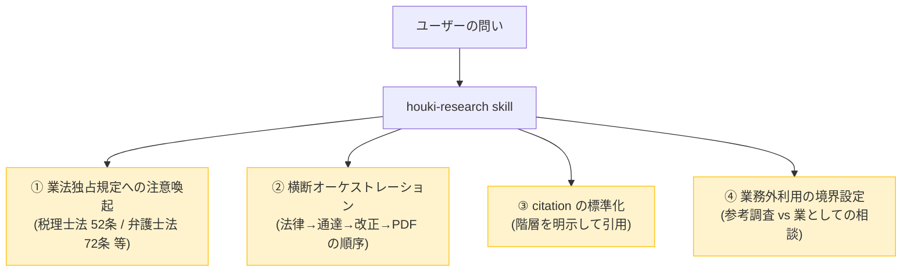
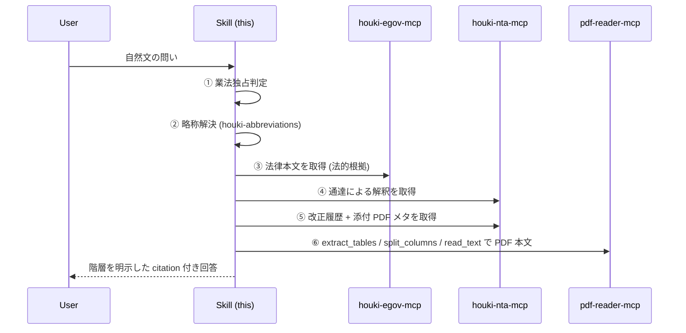
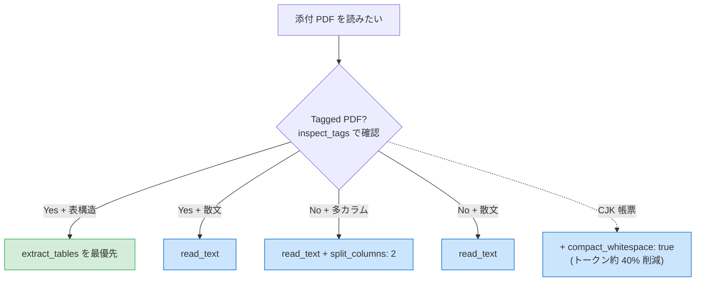

# houki-research

`houki-hub` MCP family を **横断的に**使うときの行動指針。日本の法令の階層 (法律 → 政令 → 省令 → 通達 → 改正通達 + 添付 PDF → 行政解釈 (Q&A・解説) → 判例 → 裁決) を**正しい順序で参照しながら**回答するために LLM が従うべきプロンプト。

## スコープ — 日本の全法規が対象

このスキルは **特定の分野 (税務だけ等) に限定されない** 設計。家庭・企業・公的機関に関わるあらゆる法規を対象にする。現時点では family の MCP がカバーしている範囲が限られるため税務のサンプルが多いが、設計意図として以下の領域すべてを横断的に扱う:

| 分野 | 関連 MCP / family メンバー | 状態 |
|---|---|---|
| 法律・政令・省令の本文 | `houki-egov-mcp` | ✅ 利用可能 |
| 国税庁の通達・改正・QA・タックスアンサー | `houki-nta-mcp` | ✅ 利用可能 |
| PDF (新旧対照表・別紙・様式) の抽出 | `pdf-reader-mcp` | ✅ 利用可能 |
| 略称辞書 (全分野の法令) | `houki-abbreviations` | ✅ 利用可能 (各 MCP に内蔵) |
| 厚労省の通達・通知・指針 (労務・医療・年金) | `houki-mhlw-mcp` | 📅 計画中 |
| 裁決 (国税不服審判所・公取委・特許庁・各省庁不服審査会) | `houki-saiketsu-mcp` | 💭 構想中 |
| 判例 (最高裁・高裁・地裁) | `houki-court-mcp` | 💭 構想中 |

将来の家族メンバーが追加されても、本スキルの **行動指針は変わらない**。新しい MCP は「同じ階層原則に従って統合される」だけ。

## いつこの skill を使うか

ユーザーの問いが以下のいずれかに該当するときに、この skill を呼び出して **回答前に** 行動方針を整える:

- 日本の **法令本文・通達・判例・裁決・行政解釈** に関する質問 (分野不問)
- **税務 / 労務 / 登記 / 民事 / 会社法 / 知財 / 環境** など、各種法令の制度の現状・改正履歴
- **略称が含まれる質問** (税務系: 「消基通」「インボイス」、労務系: 「労基法」「均等法」、民事系: 「民訴」「民執」 等)
- 国税庁・e-Gov・厚労省・裁判所・各省庁の公的サイトの情報を統合的に引きたい場面
- ある条文の **改正履歴** を新旧対照で正確に追いたい場面
- ある通達・行政解釈と **法律本文の対応** を確認したい場面

## この skill が担う 4 つの責務



詳細はそれぞれ [`docs/BUSINESS-LAW.md`](docs/BUSINESS-LAW.md) / [`docs/ARCHITECTURE.md`](docs/ARCHITECTURE.md) / [`docs/CITATION.md`](docs/CITATION.md) を参照。

## 鉄則 (この順序を絶対に守る)

### 鉄則 1: 業法独占規定への注意は **回答前に** 行う

ユーザーの問いが以下のように見えたら、**情報提供は行うが業務への適用判断は専門家へ案内する**旨を回答冒頭で明示する。

| パターン | 該当する独占業務 |
|---|---|
| 「私の確定申告で…」「うちの会社の決算で…」など個別具体の判断を求める | 税理士法 52 条 |
| 「この契約書の条項は…」「相続でこの遺産分割は…」など個別法律事務 | 弁護士法 72 条 |
| 「会社設立の登記を…」「不動産の所有権移転を…」 | 司法書士法 3 条 |
| 「労務管理で就業規則を…」「労働者派遣の届出を…」 | 社労士法 27 条 |

文献調査・制度の概観・条文の引用・改正履歴の説明は **適法な情報提供の範囲**として実施可能。最終判断は税理士・弁護士・司法書士・社労士などの有資格者の関与が必要であることをユーザーに案内する。

### 鉄則 2: 略称は最初に houki-abbreviations 系で解決する

ユーザーが「**消基通**」「**所基通**」「**インボイス**」のような略称を使った場合、最初に **houki-nta-mcp が内蔵する** `resolve_abbreviation` (または各 MCP 内蔵辞書) で正式名と source_mcp_hint を取得する。これにより:

- 略称→正式名の正確な引き当て
- どの MCP に問い合わせるべきか (`source_mcp_hint`) が確定
- 管轄外なら誘導ヒントを返せる

### 鉄則 3: 法律 → 通達 → 改正 → 添付 PDF の順で引く



### 鉄則 4: citation は階層を明示する

回答の末尾に **「Sources:」** セクションを設け、各情報の階層を必ず示す。詳細は [`docs/CITATION.md`](docs/CITATION.md)。

```markdown
## Sources

### 法律 (法的根拠)
- 消費税法 第57条の2 (e-Gov, 取得時刻 2026-05-07T...) — [link](https://...)

### 行政解釈 (税務署員を拘束)
- 消費税法基本通達 1-7-2 「登録番号の構成」 (国税庁, 取得時刻 ...) — [link](https://...)
  > legal_status: binds_tax_office=true, binds_citizens=false

### 改正履歴 (差分 PDF)
- 消費税法基本通達 一部改正 (2025-04-01) — 新旧対照表 — [link](https://...)
  > pdf-reader-mcp の extract_tables で抽出
```

### 鉄則 5: エラー時はフォールバックして citation で注記する

各 MCP は family 共通の `code` 語彙でエラーを返す。LLM はエラーコードをユーザーに直接見せず、[`docs/ERROR-HANDLING.md`](docs/ERROR-HANDLING.md) のフォールバック方針に従って代替経路を試み、citation で「PDF 抽出失敗のため HTML で代替」のように注記する。コード語彙そのものは [`docs/ERROR-CODES.md`](docs/ERROR-CODES.md) を参照。

| 典型エラー | 対応 |
|---|---|
| `LAW_NOT_FOUND` / `*_NOT_FOUND` | 略称解決 → 検索 → 目次の順でフォールバック |
| `SOURCE_TIMEOUT` / `SOURCE_UNAVAILABLE` | 最大 2 回まで retry。失敗時は平易に説明 |
| `SOURCE_RATE_LIMITED` | 当該セッションで同種呼び出しを停止 |
| `INVALID_PDF` / `ENCRYPTED_PDF` | HTML 版や別添付に切替、citation に注記 |
| `INVALID_ARGUMENT` | LLM 内部で引数修正、ユーザーに見せない |

## 利用する MCP ファミリー

### 現状 (✅ 利用可能)

| MCP / パッケージ | 役割 | 主な tool |
|---|---|---|
| `@shuji-bonji/houki-abbreviations` | 略称辞書 (全分野の法令、npm package、各 MCP に内蔵) | (`resolve_abbreviation` 経由) |
| `@shuji-bonji/houki-egov-mcp` | 法律・政令・省令の本文・検索 (全分野) | `search_law` / `get_law` 等 |
| `@shuji-bonji/houki-nta-mcp` | 国税庁の通達・改正・文書回答・QA・タックスアンサー (税務に特化) | `nta_search_*` / `nta_get_*` / `nta_inspect_pdf_meta` |
| `@shuji-bonji/pdf-reader-mcp` | 添付 PDF 本文抽出 (汎用) | `read_text` (`split_columns` / `compact_whitespace`) / `extract_tables` |

### 将来 (📅 計画中 / 💭 構想中)

| MCP / パッケージ | 役割 | カバー領域 |
|---|---|---|
| `@shuji-bonji/houki-mhlw-mcp` | 厚労省の通達・通知・指針 | 労務・医療・年金・介護 |
| `@shuji-bonji/houki-saiketsu-mcp` | 各省庁の裁決 | 国税不服審判所・公取委・特許庁審判部・各省庁不服審査会 |
| `@shuji-bonji/houki-court-mcp` | 判例 | 最高裁・高裁・地裁の全公開判例 |

これらが追加されても本スキルの **行動指針 (4 責務 / 鉄則 4 つ)** は不変。新 MCP は同じ階層原則に従って統合される。

PDF 抽出時の選択ガイド:



## 典型ワークフロー

具体的なユースケースは [`workflows/`](workflows/) を参照:

- [`workflows/tax-research.md`](workflows/tax-research.md) — 税務リサーチの基本フロー (法律 × 通達 × 改正)
- [`examples/invoice-registration.md`](examples/invoice-registration.md) — 「インボイス制度の登録番号」の具体例 (few-shot)

新規ワークフローを追加する場合:

1. `workflows/<topic>.md` に手順書を書く (どの MCP をどの順番で呼ぶか)
2. `examples/<topic>.md` に具体的な session 例を書く (LLM 向け few-shot)
3. SKILL.md からリンクを張る

## 利用前提

- **`houki-egov-mcp` / `houki-nta-mcp` / `pdf-reader-mcp`** が Claude Desktop / Claude Code に登録済みであること
- houki-nta-mcp の bulk DL (`--bulk-download-everything`) が初回完了済みであること

設定方法は houki-nta-mcp の [`docs/HOUKI-FAMILY-INTEGRATION.md`](https://github.com/shuji-bonji/houki-nta-mcp/blob/main/docs/HOUKI-FAMILY-INTEGRATION.md) に詳細あり。

## メンテナンス方針

- 新しい houki-* MCP が family に加わったら、本 SKILL.md の「利用する MCP ファミリー」表を更新する
- 業法独占規定の境界が判例等で更新されたら [`docs/BUSINESS-LAW.md`](docs/BUSINESS-LAW.md) を更新する
- `extract_tables` のような新 tool が出たら、PDF 抽出の選択ガイドを更新する
- 新しいエラー `code` が family のいずれかの MCP に追加されたら [`docs/ERROR-CODES.md`](docs/ERROR-CODES.md) と [`docs/ERROR-HANDLING.md`](docs/ERROR-HANDLING.md) を更新する
- 典型ワークフロー / 具体例は実利用で蓄積されたパターンを追加していく

## 関連リンク

- [`README.md`](README.md) — 人間向け install / 設定ガイド
- [houki-nta-mcp の HOUKI-FAMILY-INTEGRATION.md](https://github.com/shuji-bonji/houki-nta-mcp/blob/main/docs/HOUKI-FAMILY-INTEGRATION.md) — MCP 群の install ガイド
