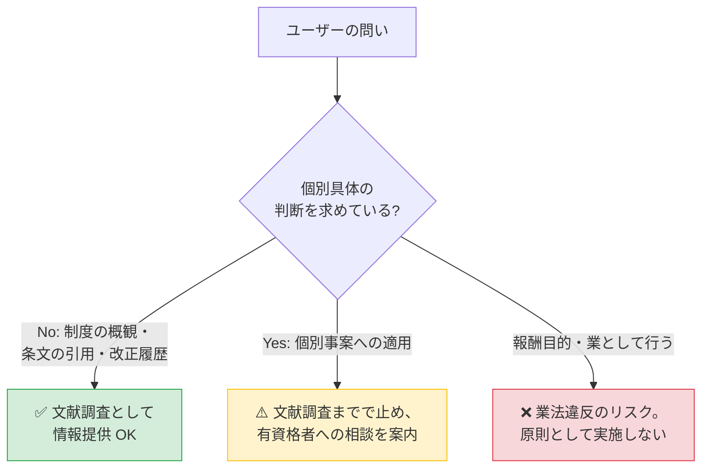

# BUSINESS-LAW — 業法独占規定への配慮

`houki-research-skill` が **「文献調査・情報整理」までを担うツール** として、士業の独占業務領域に踏み込まないための行動指針。

> **重要な前提**: 本ドキュメントは作者の理解に基づく一般情報の整理であり、**法的助言ではない**。境界の最終判断は所管官庁・弁護士の見解によります。

## 1. 関係する独占規定

| 法律 | 該当条文 | 独占内容 (要旨) | 違反すると |
|---|---|---|---|
| 税理士法 | 第 52 条 | 税務代理・税務書類の作成・税務相談 | 2 年以下の懲役・100 万円以下の罰金 (税理士法 59 条) |
| 弁護士法 | 第 72 条 | 報酬目的の法律事務 (鑑定・代理・仲裁・和解その他) | 2 年以下の懲役・300 万円以下の罰金 (弁護士法 77 条) |
| 司法書士法 | 第 3 条・73 条 | 登記・供託・裁判所提出書類の作成 | 1 年以下の懲役・100 万円以下の罰金 |
| 社労士法 | 第 27 条 | 労働社会保険諸法令に基づく書類の作成・申請代行 | 1 年以下の懲役・100 万円以下の罰金 |

## 2. このスキルが扱う 3 つの境界



### 境界 ①: 制度の概観・条文の引用 → ✅ 適法

以下は **「資料の検索・整理・要約」の範囲**であり、独占業務には該当しない:

- 「インボイス制度とは何ですか?」
- 「消費税法第 57 条の 2 の本文を見せてください」
- 「2025 年に消費税法基本通達でどんな改正があった?」
- 「消基通 5-1-9 に書かれている内容を教えて」

これらは **本スキルの主たるユースケース**。各 MCP が提供する一次情報を citation 付きで提示する。

### 境界 ②: 個別事案への適用 → ⚠️ 注意喚起付きで情報提供

以下は **個別具体の事実関係に法令を当てはめる**領域に踏み込むため、文献調査までで止めて有資格者への相談を案内する:

- 「**私の**確定申告でこの取引はインボイス対象になる?」
- 「**うちの会社の**この契約書のこの条項は…」
- 「**この遺産分割協議書**の書き方で問題ある?」
- 「**この就業規則**の改定で労基署に届出は必要?」

回答パターン:

```markdown
ご質問の制度的な背景は以下の通りです:
- 消費税法 第 57 条の 2 (適格請求書発行事業者の登録) は…
- 消費税法基本通達 1-7-2 (登録番号の構成) では…

ただし、**ご質問は具体的な事案への当てはめを含む** ため、最終的な
ご判断は税理士など有資格者の関与が必要です。本ツールは文献調査の
補助としてご利用ください (税理士法 52 条参照)。

## Sources
...
```

### 境界 ③: 業として行う場面 → ❌ 原則として実施しない

「業として」とは反復継続性 + 報酬目的の有償サービス。以下のような利用は **本スキル / 各 MCP の想定外**:

- 顧問先の税務代理を Skill 経由で代行する
- 報酬を得て他人の確定申告書を作成する
- 訴訟代理として書面を起案する

各 MCP の `LICENSE` / `DISCLAIMER.md` は **個人利用・学習用途**を想定しており、業としての利用を許諾していない。`legal_status` フィールドの引用と「有資格者へ」の案内を毎回明示することで、ツール側の責任範囲を明確にする。

## 3. 各 MCP のレスポンスにある `legal_status` の活用

houki-nta-mcp / houki-egov-mcp のレスポンスには `legal_status` フィールドが含まれ、**法的拘束力の階層**が機械的に判別可能:

| 種類 | binds_citizens | binds_tax_office | binds_courts | 引用時の典型注釈 |
|---|:-:|:-:|:-:|---|
| 法律 (e-Gov) | true | true | true | 「法律本文 (国会制定)」 |
| 政令 (e-Gov) | true | true | true | 「政令 (内閣)」 |
| 省令 (e-Gov) | true | true | true | 「省令 (財務省令 等)」 |
| 通達 (国税庁) | **false** | **true** | **false** | 「行政内部文書。納税者・裁判所には直接的拘束力なし (最高裁 昭和 43.12.24)」 |
| 文書回答事例 | false | false | false | 「個別照会への回答。一般化はできない」 |
| タックスアンサー / QA | false | false | false | 「国税庁の参考解説資料」 |

回答時はこの階層を **必ず citation に反映する**。詳細は [`CITATION.md`](CITATION.md)。

## 4. 注意喚起の標準テンプレート

ユーザーの問いが境界 ② (個別事案) に踏み込んでいるとき、以下のテンプレートで案内する。

```markdown
> **業法独占規定について**
>
> 本回答は **文献調査・情報提供** の範囲です。具体的な事案への適用判断は、
> ご質問の領域に応じて以下の有資格者へのご相談を推奨します:
>
> - 税務 → 税理士 (税理士法 52 条)
> - 法律事務 → 弁護士 (弁護士法 72 条)
> - 登記 → 司法書士 (司法書士法 3 条)
> - 労務 → 社会保険労務士 (社労士法 27 条)
```

回答冒頭または末尾に上記を含める。**毎回明示**することで、利用者が境界を意識できる。

## 5. グレーゾーン (判断が分かれるケース)

以下は法律家の間でも見解が分かれる領域。本スキルでは **保守的に「注意喚起付きで情報提供」までで止める**:

- 「**私の**確定申告」と「**一般論として**確定申告」の境界判断
- 過去の判例の事実関係を整理して「**類似ケース**」として提示する場面
- 海外の制度を日本人向けに紹介する際の責任範囲

最終的な判断は所管官庁・弁護士の見解に従うべきであり、本スキルが個別判断を肩代わりすることはしない。

## 6. メンテナンス方針

- 各士業法の改正・最高裁判例で境界が変動した場合、本ドキュメントを更新する
- 注意喚起テンプレートに改善余地があれば、実利用例を見ながら磨く
- グレーゾーンの判例蓄積に応じて §5 を更新する
