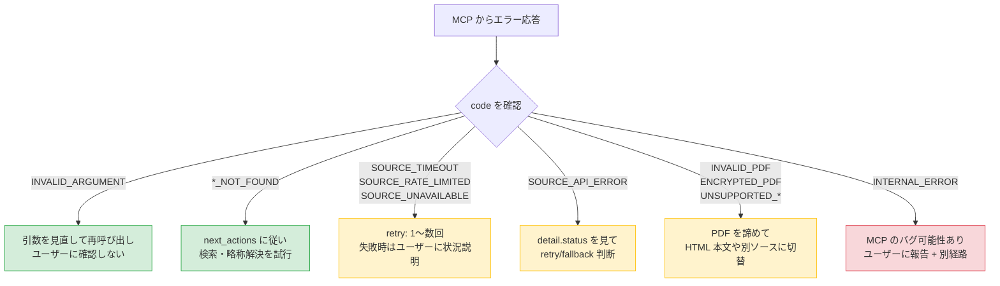
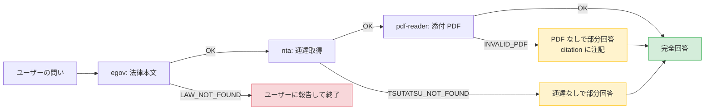

# ERROR-HANDLING — エラー応答の解釈と振る舞い

`houki-hub` MCP family の各 MCP からエラー応答を受け取ったときの **Skill 層 (LLM) の振る舞い**を定める。語彙は [`ERROR-CODES.md`](ERROR-CODES.md) を参照。

## 基本フロー



## コード別の標準対応

各 code に対する **next_actions テンプレ**と **メッセージ整形例**を以下に示す。各 MCP が `next_actions` を埋めて返してきた場合はそれを優先するが、空のときや内容が不十分なときは Skill 層が以下のテンプレで補完する。

### `INVALID_ARGUMENT`

| 項目 | 内容 |
|---|---|
| 原因 | LLM 自身の引数の組み立てミス |
| Skill の振る舞い | エラーメッセージ・`hint` を読んで自力で修正し、再呼び出しする |
| ユーザーに見せるか | 通常は見せない (内部で解決) |
| 例外 | ユーザーの自然文が曖昧で引数を組めない場合は、ユーザーに何が必要か質問する |

### `LAW_NOT_FOUND` / `ARTICLE_NOT_FOUND` / `TSUTATSU_NOT_FOUND` / `DOC_NOT_FOUND`

| 項目 | 内容 |
|---|---|
| 原因 | 法令名・条番号・docId が誤っている / 存在しない / 略称のまま |
| Skill の振る舞い | ① 略称解決 (`resolve_abbreviation`) → ② 検索系 tool (`search_law` / `search_tsutatsu`) → ③ 目次系 (`get_toc`) の順でフォールバック |
| ユーザーに見せるか | 上記をすべて試して見つからなかった場合のみ報告 |
| メッセージ整形例 | 「『○○法 第3000条』は見つかりませんでした。同法は第○○条までです」 |

### `ABBREVIATION_NOT_FOUND`

| 項目 | 内容 |
|---|---|
| 原因 | 辞書未登録の略称 |
| Skill の振る舞い | ユーザーに「正式名称をご教示ください」と聞き返す。同時に `search_law` でファジー検索を試みる |
| ユーザーに見せるか | はい (新規略称登録のフィードバック源にもなる) |

### `SOURCE_TIMEOUT` / `SOURCE_UNAVAILABLE`

| 項目 | 内容 |
|---|---|
| 原因 | 外部 API (e-Gov / NTA) の一時不調 |
| Skill の振る舞い | **1 回まで**自動 retry (5 秒〜数十秒の間隔)。それでも失敗なら fallback または報告 |
| ユーザーに見せるか | 自動 retry も失敗した場合のみ。「e-Gov 側の応答が一時的に得られませんでした」と簡潔に |
| 注意 | retry を**ループにしない**。LLM 同一セッション内では最大 2 回まで |

### `SOURCE_RATE_LIMITED`

| 項目 | 内容 |
|---|---|
| 原因 | 外部 API の HTTP 429 |
| Skill の振る舞い | **このセッションでは同種の呼び出しを停止**。ユーザーに「短時間に多数の問い合わせが発生したため、しばらく時間をおいてから再試行してください」と説明 |
| ユーザーに見せるか | はい |
| 注意 | retry しない。MCP 側の concurrency limit と独立してレート制限が出た場合は、ユーザー側のセッション全体で抑える |

### `SOURCE_API_ERROR`

| 項目 | 内容 |
|---|---|
| 原因 | 外部 API が 4xx/5xx 系のエラーを返した (タイムアウト・レート制限以外) |
| Skill の振る舞い | `detail.status` を見て分岐: `5xx` は retry 1 回、`4xx` は引数見直し or 報告 |
| ユーザーに見せるか | 5xx 持続時のみ |

### `INVALID_PDF` / `ENCRYPTED_PDF` / `UNSUPPORTED_PDF_FEATURE`

| 項目 | 内容 |
|---|---|
| 原因 | PDF 自体の問題 |
| Skill の振る舞い | PDF 抽出は諦め、**HTML 本文** (例: 通達の HTML 版) や **別の添付** (新旧対照表ではなく別紙) に切り替え |
| ユーザーに見せるか | はい (citation で「PDF の機械抽出ができなかったため HTML 版で代替」と注記) |

### `INTERNAL_ERROR` / `UNKNOWN_TOOL`

| 項目 | 内容 |
|---|---|
| 原因 | MCP のバグ or LLM の未知 tool 呼び出し |
| Skill の振る舞い | 同じ呼び出しを retry しない。代替手段で回答するか、ユーザーに「該当 MCP に不具合がある可能性」と伝える |
| ユーザーに見せるか | はい |

## メッセージ整形 — 共通テンプレート

LLM がユーザーに提示する説明文の標準形式。技術的な `code` をそのまま見せず、**何が起きて何ができないか**を平易に書く。

### 一時的エラー (retryable=true) のとき

```markdown
申し訳ありません、e-Gov の応答が一時的に得られませんでした。
時間をおいて (1〜数分後) 再度お問い合わせいただけますでしょうか。

> 取得を試みた情報: 消費税法 第57条の2
> エラーコード: SOURCE_TIMEOUT
```

### 永続的エラー (retryable=false) のとき

```markdown
ご指定の「○○法 第3000条」は見つかりませんでした。
同法は第○○条までで、第3000条は存在しないようです。

正しい条番号でしたら、目次から該当箇所を確認できますので、改めてご質問いただけますでしょうか。
```

### PDF 抽出が失敗したとき (フォールバック成功)

```markdown
※ 添付の新旧対照表 PDF が暗号化されており機械抽出できなかったため、
  通達 HTML 版から条文の改正前後を整理しました。

(以下回答本文)
```

## 複数 MCP を跨ぐエラーの統合

横断オーケストレーション中に複数のエラーが発生した場合、**最初に発生した致命的エラー**を優先して報告する。すべて非致命的なら、できる範囲で結果を返す。



## アンチパターン (やってはいけない)

| アンチパターン | なぜダメか | 代わりに |
|---|---|---|
| `SOURCE_TIMEOUT` を無限 retry する | API 側に追い打ちをかけ、レート制限まで誘発する | 最大 2 回まで。それ以上はユーザーに報告 |
| `code` をユーザーにそのまま見せる | 技術的な記号は不親切 | 「e-Gov の応答が一時的に得られません」など平易な表現に翻訳 |
| `INVALID_ARGUMENT` をユーザーに伝える | LLM 自身のミスをユーザーの問題にすり替えてしまう | 内部で引数を直して再呼び出し |
| `ENCRYPTED_PDF` で諦めて回答全体を打ち切る | HTML 等の代替経路があるのに使わない | フォールバックを試し、citation で代替経路を注記 |
| `next_actions` を読まない | MCP 側が示した最適経路を無視する | まず `next_actions` を試し、足りなければ自前で補う |

## ロギング・観測 (将来)

- 各 MCP で発生したエラーは MCP 側のログに残る (Skill 層は介入しない)
- Skill 層では LLM のセッション内で **同一 code が連続発生**したら方針転換する (例: `LAW_NOT_FOUND` が 2 連続なら略称解決から見直す)
- 利用者から「エラー時の説明が分かりにくい」とフィードバックがあれば、メッセージ整形テンプレを更新する

## メンテナンス方針

- 新しい code を [`ERROR-CODES.md`](ERROR-CODES.md) に追加したら、本書の「コード別の標準対応」表にも対応行を追加する
- 実利用で頻発するエラーパターン・有効だったフォールバック手順は本書に蓄積する
- `retryable` の判定が変わったら retry ポリシーと整合を取る

## 関連

- [`ERROR-CODES.md`](ERROR-CODES.md) — エラーコード語彙の正典
- [`ARCHITECTURE.md`](ARCHITECTURE.md) — Skill 層と MCP 層の責務分担 (本書はこの 3 層構成の Skill 層側を担う)
- [`CITATION.md`](CITATION.md) — 部分回答時の citation 整形ルール
