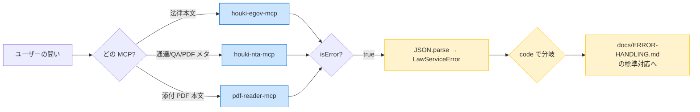

# Example — エラー応答からの回復パターン (3 MCP 横断)

`houki-egov-mcp` / `houki-nta-mcp` / `pdf-reader-mcp` が **family-compatible な構造化エラー** を返したときに、Skill 層 (LLM) がどのように [`docs/ERROR-HANDLING.md`](../docs/ERROR-HANDLING.md) のポリシーを実行に落とすかを示す **few-shot walkthrough**。

各シナリオは「同じ語彙のエラーが 3 MCP のどこから来ても、Skill 層は同じロジックで解釈できる」ことを確認するための実例として使う。

## 共通の前提

- 3 MCP すべて v0.6.0+ / 構造化エラーを返す状態
- 各レスポンスは `isError: true` + `content[0].text = JSON.stringify(LawServiceError)` の形
- LLM は `JSON.parse` してから `code` で分岐し、必要なら `next_actions` のヒントを優先採用する



---

## シナリオ 1 — `ARTICLE_NOT_FOUND` (houki-egov-mcp): 条番号の言い間違いを目次で救う

### 問い

> 消費税法の第 3000 条に登録番号の記載があるはずです。本文を取得してください。

### Skill の動作

[`docs/ERROR-HANDLING.md`](../docs/ERROR-HANDLING.md) §「`*_NOT_FOUND`」: ① 略称解決 → ② 検索 → ③ 目次の順でフォールバック。本シナリオでは `next_actions` が `get_toc` を提示するので **そのまま採用**。

### MCP 呼び出しの引数

```jsonc
// ① まず素直に呼ぶ
{ "tool": "get_law", "args": { "lawNumber": "消費税法", "article": "3000" } }
```

`isError: true` で以下が返る:

```json
{
  "error": "法令『消費税法』第3000条は存在しません",
  "code": "ARTICLE_NOT_FOUND",
  "hint": "条番号を get_toc で確認してください",
  "next_actions": [
    {
      "action": "get_toc",
      "reason": "目次を確認して正しい条番号を特定できます",
      "example": { "law_name": "消費税法" }
    }
  ],
  "retryable": false
}
```

`code: ARTICLE_NOT_FOUND` + `retryable: false` を確認 → retry せず `next_actions[0]` を実行:

```jsonc
// ② next_actions に従って目次取得
{ "tool": "get_toc", "args": { "law_name": "消費税法" } }
// → 「最大条番号は第 67 条」+「第 57 条の 2 が登録関連」
```

LLM は目次から「**第 57 条の 2**」が登録番号関連と当たりを付け、改めて取得:

```jsonc
{ "tool": "get_law", "args": { "lawNumber": "消費税法", "article": "57の2" } }
// → 条文本文 + legal_status
```

### 期待される回答

```markdown
ご指定の「第3000条」は消費税法には存在しません (同法は第67条までです)。
登録番号に関する規定は **第57条の2「適格請求書発行事業者の登録」** ですので、
こちらの条文を以下のとおりお知らせします。

(条文本文 + 解説)

## Sources

### 法律 (法的根拠)
- 消費税法 第57条の2「適格請求書発行事業者の登録」
  ([e-Gov 法令検索](https://elaws.e-gov.go.jp/...))
  > 取得: 2026-05-07T... / `binds_citizens=true`
```

### アンチパターン

❌ `code: ARTICLE_NOT_FOUND` をそのままユーザーに「ARTICLE_NOT_FOUND が返りました」と見せる
❌ `retryable: false` なのに同じ引数で再呼び出しする
❌ `next_actions` を読まず、いきなり全文検索 (`search_law`) から始めてトークンを浪費する

---

## シナリオ 2 — `TSUTATSU_NOT_FOUND` (houki-nta-mcp): docId の typo を検索で救う

### 問い

> インボイス改正通達 docId=0025004-999 を取得してください。

### Skill の動作

[`docs/ERROR-HANDLING.md`](../docs/ERROR-HANDLING.md) §「`*_NOT_FOUND`」: 検索系 tool でフォールバック。`next_actions` の `nta_search_tsutatsu` をそのまま実行。

### MCP 呼び出しの引数

```jsonc
{ "tool": "nta_get_kaisei_tsutatsu", "args": { "docId": "0025004-999" } }
```

`isError: true` で以下が返る:

```json
{
  "error": "通達 docId=0025004-999 が見つかりません",
  "code": "TSUTATSU_NOT_FOUND",
  "hint": "nta_search_kaisei_tsutatsu で正しい docId を検索してください",
  "next_actions": [
    {
      "action": "nta_search_kaisei_tsutatsu",
      "reason": "キーワード検索で該当通達を探せます",
      "example": { "keyword": "適格請求書", "hasPdf": true }
    }
  ],
  "retryable": false,
  "available_doc_ids": ["0025004-026", "0025004-031"]
}
```

houki-nta-mcp 固有の `available_doc_ids` ヒントが付くので、LLM は **タイポの可能性** を察知して `0025004-026` を最有力候補とする:

```jsonc
// ① まず available_doc_ids の最有力候補を試す
{ "tool": "nta_get_kaisei_tsutatsu", "args": { "docId": "0025004-026" } }
// → ヒット
```

候補が外れていれば `next_actions[0]` で検索にフォールバック。

### 期待される回答

```markdown
ご指定の docId=`0025004-999` は見つかりませんでした。
インボイス関連の改正通達としては `0025004-026` (2025-04-01 付け改正) があり、
こちらが該当の可能性が高いと判断しました。

(改正通達の概要 + 添付 PDF への誘導)

## Sources

### 改正履歴
- 消費税法基本通達 一部改正 (2025-04-01) docId=`0025004-026`
  ([国税庁](https://www.nta.go.jp/law/tsutatsu/kihon/shohi/kaisei/0025004-026/))
```

### アンチパターン

❌ `available_doc_ids` を無視して即「見つかりません」と打ち切る
❌ docId のタイポを利用者に再入力させる (LLM が候補補完できる場面で)
❌ `next_actions` を見ず、houki-egov-mcp など別 MCP を試す

---

## シナリオ 3 — `ENCRYPTED_PDF` (pdf-reader-mcp): HTML 版へフォールバックして citation で注記

### 問い

> 改正通達 docId=0025004-026 の新旧対照表 PDF から、改正前後の差分を表で見せてください。

### Skill の動作

[`docs/ERROR-HANDLING.md`](../docs/ERROR-HANDLING.md) §「`INVALID_PDF` / `ENCRYPTED_PDF`」: PDF を諦め、HTML 本文 (通達本文) や別添付に切替。**citation で「PDF 抽出失敗のため HTML で代替」と注記する**。

### MCP 呼び出しの引数

```jsonc
// ① reader_hints に従って extract_tables を呼ぶ
{
  "tool": "extract_tables",
  "args": {
    "file_path": "/tmp/.../0025004-026/pdf/01.pdf",
    "pages": "1"
  }
}
```

`isError: true` で以下が返る:

```json
{
  "error": "This PDF is password-protected.",
  "code": "ENCRYPTED_PDF",
  "hint": "現在 pdf-reader-mcp は暗号化 PDF をサポートしていません。",
  "detail": { "cause": "PasswordException: No password given" }
}
```

`code: ENCRYPTED_PDF` + `retryable` 未設定 (false 扱い) を確認。**retry せず**、HTML 版へフォールバック:

```jsonc
// ② 通達本文を houki-nta から取り直す (HTML 由来)
{ "tool": "nta_get_kaisei_tsutatsu", "args": { "docId": "0025004-026" } }
// → 改正後 / 改正前を含む HTML 本文 (機械抽出より粒度は粗いが、暗号化されていない)

// ③ 同 docId の他添付 PDF (kind=attachment) も試す
{ "tool": "nta_inspect_pdf_meta", "args": { "docType": "kaisei", "docId": "0025004-026" } }
// → attachedPdfs[1] が暗号化されていなければ extract_tables を再試行
```

### 期待される回答

```markdown
> ※ 添付の新旧対照表 PDF (別紙 1) が暗号化されており機械抽出ができなかったため、
>   通達 HTML 本文から改正前後を整理しました。完全な対照表は下記 URL から PDF を直接ご覧ください。

(改正前 / 改正後の整理)

## Sources

### 改正履歴 (HTML 本文での代替)
- 消費税法基本通達 一部改正 (2025-04-01) docId=`0025004-026`
  ([国税庁](https://www.nta.go.jp/law/tsutatsu/kihon/shohi/kaisei/0025004-026/))
  - 添付 PDF「別紙 1 (新旧対照表)」 — **暗号化されており機械抽出不能**
    [PDF link](https://www.nta.go.jp/.../0025004-026/pdf/01.pdf)
    > pdf-reader-mcp `extract_tables` → `ENCRYPTED_PDF` (cause: PasswordException)
```

### アンチパターン

❌ `ENCRYPTED_PDF` で諦めて回答全体を打ち切る (HTML 等の代替経路が複数ある)
❌ citation の注記を省略し、「機械抽出した結果」のように見せる
❌ パスワードを推測 / ブルートフォースしようとする (Skill のスコープ外)

---

## シナリオ 4 — `SOURCE_TIMEOUT` (横断): 1 回 retry → 失敗時は平易な説明

### 問い

> 消費税法 第57条の2 と、対応する消基通 1-7-2 を取得してください。

### Skill の動作

[`docs/ERROR-HANDLING.md`](../docs/ERROR-HANDLING.md) §「`SOURCE_TIMEOUT` / `SOURCE_UNAVAILABLE`」: **最大 1 回 retry**。それでも失敗なら fallback または平易な状況説明。同一セッション内で 2 回までという上限を守る。

### MCP 呼び出しの引数

```jsonc
// ① 法律本文の取得
{ "tool": "get_law", "args": { "lawNumber": "消費税法", "article": "57の2" } }
// → OK
```

```jsonc
// ② 通達取得が timeout
{ "tool": "nta_get_tsutatsu", "args": { "name": "消基通", "clause": "1-7-2" } }
```

```json
{
  "error": "国税庁サイトからの取得に失敗: AbortError",
  "code": "SOURCE_TIMEOUT",
  "hint": "ネットワークが遅いか、サーバーが応答しません。",
  "next_actions": [
    {
      "action": "retry_later",
      "reason": "一時的な API/ネットワークエラーの可能性。30秒〜数分後に再試行してください"
    }
  ],
  "retryable": true,
  "detail": { "url": "https://www.nta.go.jp/.../shohi/01/01.htm", "cause": "AbortError" }
}
```

`retryable: true` を確認。30 秒待って 1 回だけ retry:

```jsonc
// ③ 30s 待機後 retry (1 回のみ)
{ "tool": "nta_get_tsutatsu", "args": { "name": "消基通", "clause": "1-7-2" } }
// → 成功 → そのまま回答へ
```

### 期待される回答

retry が成功した場合は、通常の citation 付き回答を返す (timeout が発生したことには触れない)。
retry も失敗した場合は **法律本文だけで部分回答** + 通達は citation で「取得失敗」を注記:

```markdown
※ 国税庁サイトの応答が一時的に得られませんでした。法律本文のみでお答えします。
通達による解釈は、お時間をおいて再度お問い合わせいただくか、
[消費税法基本通達 1-7-2](https://www.nta.go.jp/law/tsutatsu/kihon/shohi/01/01.htm) を直接ご確認ください。
```

### アンチパターン

❌ `SOURCE_TIMEOUT` を無限 retry する (国税庁側に追い打ち → `SOURCE_RATE_LIMITED` を誘発)
❌ retry なしで即「取得失敗」と返す (`retryable: true` なのに無視)
❌ `code: SOURCE_TIMEOUT` をユーザーにそのまま見せる
❌ retry 間隔をゼロにして連打する (1 回目即時 retry は無効)

---

## シナリオ 5 — `OUT_OF_SCOPE` (houki-nta-mcp): 自動ルーティングで透過的に正しい MCP に切替

### 問い

> 消費税法の第 57 条の 2 の本文をください。

(法律本文を houki-nta-mcp に問い合わせている = 担当 MCP の選択ミス)

### Skill の動作

[`docs/ERROR-HANDLING.md`](../docs/ERROR-HANDLING.md) §「`OUT_OF_SCOPE`」: `resolved.source_mcp_hint` が示す MCP に自動でルーティングして再試行。**ユーザーには見せない** (透過的な切替)。

### MCP 呼び出しの引数

```jsonc
// ① 誤って nta に問い合わせ
{ "tool": "nta_get_tax_answer", "args": { "id": "shohi-57-2" } }
```

```json
{
  "error": "「消費税法 第57条の2」は houki-egov-mcp の管轄です",
  "code": "OUT_OF_SCOPE",
  "hint": "houki-egov-mcp の get_law を呼んでください",
  "next_actions": [
    {
      "action": "delegate_to_mcp",
      "reason": "houki-egov の管轄リソースです。該当 MCP に切り替えてください",
      "example": { "mcp": "egov" }
    }
  ],
  "resolved": { "formal": "消費税法", "source_mcp_hint": "egov" },
  "retryable": false
}
```

`code: OUT_OF_SCOPE` + `resolved.source_mcp_hint: "egov"` を確認 → 透過的に切替:

```jsonc
// ② 自動で egov にルーティング
{ "tool": "get_law", "args": { "lawNumber": "消費税法", "article": "57の2" } }
// → 条文本文 + legal_status
```

### 期待される回答

```markdown
(条文本文と解説。OUT_OF_SCOPE が発生したことには触れない)

## Sources

### 法律 (法的根拠)
- 消費税法 第57条の2 ([e-Gov 法令検索](https://elaws.e-gov.go.jp/...))
```

### アンチパターン

❌ `code: OUT_OF_SCOPE` をユーザーに見せる (LLM 自身の MCP 選択ミスをユーザーに転嫁)
❌ `resolved.source_mcp_hint` を無視して同じ nta MCP の別 tool を試す
❌ 「houki-egov-mcp に切り替えました」と内部処理を逐一説明する (citation で十分)

---

## まとめ — 3 MCP 横断で確認すべきこと

| 要素 | houki-egov | houki-nta | pdf-reader |
|---|---|---|---|
| 構造化エラー (`isError: true` + JSON `LawServiceError`) | ✅ v0.2.1+ | ✅ Unreleased | ✅ v0.6.0+ |
| `code` 語彙が family 共通 | ✅ | ✅ | ✅ |
| `next_actions` を返す | ✅ | ✅ | ✅ |
| MCP 固有フィールド (`resolved` / `available_*` / `detail.cause` 等) | — | ✅ (resolved / available_*) | ✅ (detail.cause) |

### Skill 層が踏むべきフロー (要約)

1. `isError: true` を確認したら必ず `JSON.parse(content[0].text)` する
2. `code` で分岐し、[`docs/ERROR-HANDLING.md`](../docs/ERROR-HANDLING.md) の「コード別の標準対応」を実行
3. `next_actions[0]` がある場合は **第一候補として採用** (各 MCP が最適経路を知っている)
4. `retryable: true` のときだけ retry。**1 セッション最大 2 回まで**
5. ユーザーには `code` を見せず、平易な日本語に翻訳して伝える
6. PDF/通達取得失敗で部分回答する場合は **citation に必ず注記**

## 関連

- [`../docs/ERROR-CODES.md`](../docs/ERROR-CODES.md) — code 語彙の正典
- [`../docs/ERROR-HANDLING.md`](../docs/ERROR-HANDLING.md) — 解釈ポリシー (本書はその実例集)
- [`../docs/CITATION.md`](../docs/CITATION.md) — フォールバック時の citation 整形ルール
- [`invoice-registration.md`](invoice-registration.md) — happy path の few-shot
