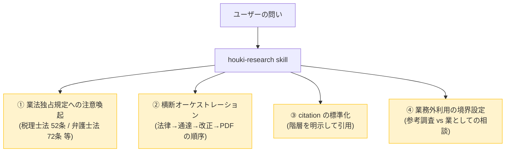
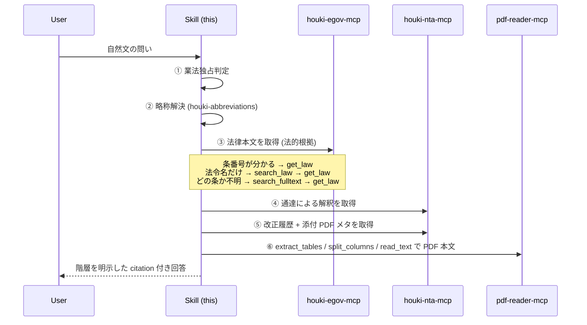
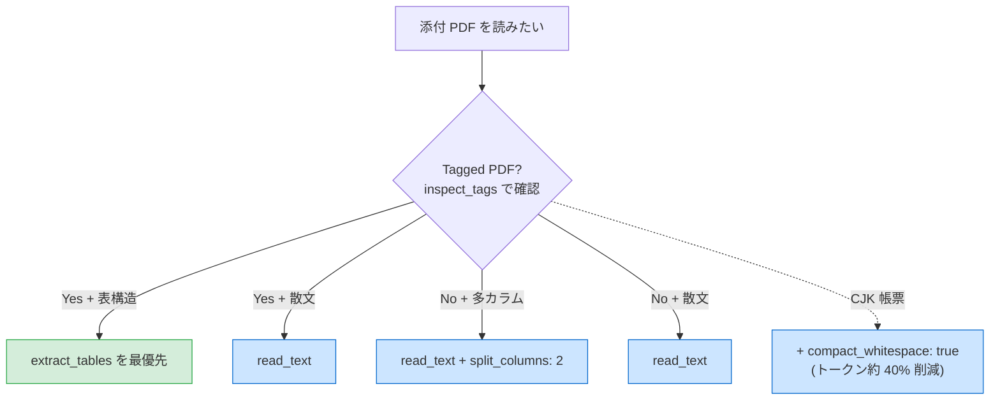

# houki-research

`houki-hub` MCP family を **横断的に**使うときの行動指針。日本の法令の階層 (法律 → 政令 → 省令 → 通達 → 改正通達 + 添付 PDF → 行政解釈 (Q&A・解説) → 判例 → 裁決) を**正しい順序で参照しながら**回答するために LLM が従うべきプロンプト。

## スコープ — 日本の全法規が対象

このスキルは **特定の分野 (税務だけ等) に限定されない** 設計。家庭・企業・公的機関に関わるあらゆる法規を対象にする。現時点では family の MCP がカバーしている範囲が限られるため税務のサンプルが多いが、設計意図として以下の領域すべてを横断的に扱う:

| 分野                                                    | 関連 MCP / family メンバー | 状態                        |
| ------------------------------------------------------- | -------------------------- | --------------------------- |
| 法律・政令・省令の本文                                  | `houki-egov-mcp`           | ✅ 利用可能                 |
| 国税庁の通達・改正・QA・タックスアンサー                | `houki-nta-mcp`            | ✅ 利用可能                 |
| PDF (新旧対照表・別紙・様式) の抽出                     | `pdf-reader-mcp`           | ✅ 利用可能                 |
| 略称辞書 (全分野の法令)                                 | `houki-abbreviations`      | ✅ 利用可能 (各 MCP に内蔵) |
| 厚労省の通達・通知・指針 (労務・医療・年金)             | `houki-mhlw-mcp`           | 📅 計画中                   |
| 裁決 (国税不服審判所・公取委・特許庁・各省庁不服審査会) | `houki-saiketsu-mcp`       | 💭 構想中                   |
| 判例 (最高裁・高裁・地裁)                               | `houki-court-mcp`          | 💭 構想中                   |

将来の家族メンバーが追加されても、本スキルの **行動指針は変わらない**。新しい MCP は「同じ階層原則に従って統合される」だけ。

## いつこの skill を使うか

ユーザーの問いが以下のいずれかに該当するときに、この skill を呼び出して **回答前に** 行動方針を整える:

- **実装する前に、その仕様が法令のどこに触れるか** を条文で確かめたい場面 (保存期間・記載事項・同意の取り方・届出の要否など。[`workflows/feasibility-check.md`](workflows/feasibility-check.md))
- 日本の **法令本文・通達・判例・裁決・行政解釈** に関する質問 (分野不問)
- **税務 / 労務 / 登記 / 民事 / 会社法 / 知財 / 環境** など、各種法令の制度の現状・改正履歴
- **略称が含まれる質問** (税務系: 「消基通」「インボイス」、労務系: 「労基法」「均等法」、民事系: 「民訴」「民執」 等)
- 国税庁・e-Gov・厚労省・裁判所・各省庁の公的サイトの情報を統合的に引きたい場面
- ある条文の **改正履歴** を新旧対照で正確に追いたい場面
- ある通達・行政解釈と **法律本文の対応** を確認したい場面

## この skill が担う 4 つの責務



詳細はそれぞれ [`docs/BUSINESS-LAW.md`](docs/BUSINESS-LAW.md) / [`docs/ARCHITECTURE.md`](docs/ARCHITECTURE.md) / [`docs/CITATION.md`](docs/CITATION.md) を参照。

## 鉄則 (この順序を絶対に守る)

### 鉄則 1: 業法独占規定への注意は **回答前に** 行う

ユーザーの問いが以下のように見えたら、**情報提供は行うが業務への適用判断は専門家へ案内する**旨を回答冒頭で明示する。

| パターン                                                             | 該当する独占業務 |
| -------------------------------------------------------------------- | ---------------- |
| 「私の確定申告で…」「うちの会社の決算で…」など個別具体の判断を求める | 税理士法 52 条   |
| 「この契約書の条項は…」「相続でこの遺産分割は…」など個別法律事務     | 弁護士法 72 条   |
| 「会社設立の登記を…」「不動産の所有権移転を…」                       | 司法書士法 3 条  |
| 「労務管理で就業規則を…」「労働者派遣の届出を…」                     | 社労士法 27 条   |

文献調査・制度の概観・条文の引用・改正履歴の説明は **適法な情報提供の範囲**として実施可能。最終判断は税理士・弁護士・司法書士・社労士などの有資格者の関与が必要であることをユーザーに案内する。

何を返し、何を返さないかは [`docs/BUSINESS-LAW.md` の応答型](docs/BUSINESS-LAW.md#応答型) に固定してある。**回答を書く前にこの表を見る。**

| | 内容 |
| --- | --- |
| **返すもの** | 条文・通達・裁決の提示 (citation 付き) / 制度の概観と改正履歴 / 論点の列挙 / 何が事実認定に依存するかの明示 / `legal_status` の階層 |
| **返さないもの** | 結論 (該当する・しない) / 可否の判定 / 金額・税額の確定 / 書類の起案・文案 / 「おそらく〜でしょう」を含む推測 |

「返さないもの」は注意喚起を添えても返さない。当てはめの基準は条文と通達に書いてあるが、返さない理由は精度ではなく独占規定である。判定の置き場所で言えば、当てはめは **系の外** (有資格者) にある。

### 鉄則 2: 略称は最初に houki-abbreviations 系で解決する

ユーザーが「**消基通**」「**所基通**」「**インボイス**」のような略称を使った場合、最初に **houki-nta-mcp が内蔵する** `resolve_abbreviation` (または各 MCP 内蔵辞書) で正式名と source_mcp_hint を取得する。これにより:

- 略称→正式名の正確な引き当て
- どの MCP に問い合わせるべきか (`source_mcp_hint`) が確定
- 管轄外なら誘導ヒントを返せる

### 鉄則 3: 法律 → 通達 → 改正 → 添付 PDF の順で引く



法律本文 (③) の入口は 4 つある。**問いに含まれている情報で選ぶ**:

| 分かっていること | 呼ぶ tool | 例 |
| --- | --- | --- |
| 法令名 + 条番号 | `get_law` | `{ "law_name": "消費税法", "article": "57の2" }` |
| 法令名だけ（条は不明） | `get_toc` → `get_law` | 目次で当たりを付けてから本文 |
| 法令名すら不確か | `search_law` → `get_law` | `{ "keyword": "適格請求書" }` で法令名を探す |
| 「どの法令の何条に書いてあるか」自体が不明 | `search_fulltext` → `get_law` | `{ "keyword": "民法 不法行為" }` で条文本文を横断検索 |

`search_fulltext` はローカル DB (`houki-egov-mcp --bulk-download-everything` で構築) を引く。DB が無いと応答の `source` が `"api-fallback"` になり、`search_law` の結果が `fallback` に入って返る。このときは **本文検索ができていない**ので、回答で「法令名の一致で探した」と明示し、`next_actions` の `bulk_download_everything` をユーザーに案内する。

#### 通達や質疑応答事例を先に引いたら、法律本文へ戻る (houki-nta-mcp v0.11.0 以上。質疑応答事例は v0.12.0 以上)

問いによっては通達の検索 (④) や質疑応答事例 (`nta_search_qa` / `nta_get_qa`) から入ることがある。通達は国民・裁判所を拘束しない。質疑応答事例は国税庁の参考資料で、税務署員も拘束しない (`legal_status` の `binds_*` がすべて `false`)。**どちらも、それだけで回答を終えず、必ず法律本文 (③) へ戻る**。戻り先は houki-nta-mcp の応答に入っている:

| 呼んだ tool | 戻り先が入るフィールド | 中身 |
| --- | --- | --- |
| `nta_get_tsutatsu` | `base_laws` | その通達が解釈している法律・施行令・施行規則の配列 |
| `nta_search_tsutatsu` | `base_laws_by_tsutatsu` | 結果に現れた通達ごとの同じ配列 (`hits[].tsutatsu` をキーに引く) |
| `nta_get_qa` (`format: "json"`) | `related_laws` / `related_tsutatsu` | 【関係法令通達】欄を分けたもの。法令は `law_name` / `article` / `paragraph` / `item`、通達は `name` / `clause`。元の文字列は `raw` |
| 上のすべて | `next_actions` | `{ "action": "delegate_to_mcp", "example": { "mcp": "houki-egov", "tool": "get_law", … } }`。質疑応答事例では `nta_get_tsutatsu` への案内も入る。**エラーでなくても付く** |

`example` の読み方に注意する。`mcp` と `tool` は **どの MCP のどの tool を呼ぶか**を示すもので、引数ではない。houki-egov-mcp v0.6.0 以上と houki-nta-mcp v0.14.0 以上は inputSchema に無い引数を `INVALID_ARGUMENT` で返すので、`example` をそのまま渡すと `mcp, tool: inputSchema に無い引数です` になる。**`mcp` と `tool` を除いた残りを引数にする**。

```jsonc
// nta_get_qa の next_actions[0].example
{ "mcp": "houki-egov", "tool": "get_law", "law_name": "消費税法", "article": "2", "paragraph": 1, "item": 8 }
// → houki-egov-mcp の get_law に渡す引数
{ "law_name": "消費税法", "article": "2", "paragraph": 1, "item": 8 }
```

通達から戻るとき:

1. `next_actions[].example` から `mcp` と `tool` を除いた残り (法律名だけが入っている) を houki-egov-mcp の `get_law` に渡す
2. 条番号は応答に入っていない。通達の本文にある「法第34条第6項」「令第133条」のような参照を読み、`base_laws` の該当する法令名と `article` / `paragraph` を指定して引き直す。基本通達の本文では「法」は法律、「令」は施行令、「規則」は施行規則を指すのが通例 (正確には各通達の冒頭の用語の定義で確かめる)
3. 引いた条文を citation の「法律 (法的根拠)」「政令 / 省令」に置き、通達はその下の「行政解釈」に置く

質疑応答事例から戻るとき:

1. `nta_get_qa` は `format` の既定が `markdown` で、markdown には `related_laws` などが出ない。**`format: "json"` を指定する**
2. `next_actions[].example` には条・項・号まで入っているので、`mcp` と `tool` を除いた残りを `get_law` に渡す。通達と違い、条番号を本文から補う手順は要らない。`nta_get_tsutatsu` への案内の `example` は `name` と `clause` だけなので、そのまま渡せる
3. 枝番号の号 (「法人税法第2条第12号の8」) は `item: "12の8"` の文字列で入る (houki-nta-mcp v0.14.0 以上)。`get_law` が文字列の `item` を受け付けるのは houki-egov-mcp v0.6.0 以上。それより前の egov なら `item` を外して項全体を引き、本文から探す
4. `next_actions` が付かない参照は、`related_laws` / `related_tsutatsu` の `raw` を読んで次のとおり扱う:

| 参照 | 例 | 扱い |
| --- | --- | --- |
| 租税条約 | 「日・ハンガリー租税条約第12条第2項(b)」 | e-Gov では引けない。`raw` を citation に書き、条約の本文は確認していないと明記する |
| 「旧」「改正前」の条文 | 「旧所得税法第…条」 | `get_law_revisions` で改正の時点を調べ、その前の日付を `get_law` の `at` に渡す。時点が決まらなければ `raw` だけ書く。`qa.basisDate` は質疑応答事例の作成時点で、改正前の時点ではない |
| 条番号の無い法令 | 「消費税法施行令」だけ | `get_toc` → `get_law` |
| 基本通達 4 種以外の通達 | 「租税特別措置法関係通達70の6-6」 | `nta_get_tsutatsu` は扱わない。`raw` を citation に書く |

5. 引いた条文を「法律 (法的根拠)」に、通達を「行政解釈」に置き、質疑応答事例はその下の「参考情報 (拘束力なし)」に置く。`qa.notice` (作成時点と、個別の取引では異なる課税関係が生じうるという国税庁の断り書き) を注に残す

タックスアンサー (`nta_get_tax_answer`) には構造化された根拠法令が無い。本文の「根拠法令等」の節を読み、そこに挙がっている法令を `get_law` で引く。

houki-nta-mcp が v0.10.x 以前だと `base_laws` は無く、v0.11.x 以前だと `related_laws` は無い。そのときは本文の参照から法令名を自分で補う。

#### 索引から消えた文書は現行の取扱いとして引用しない (houki-nta-mcp v0.17.0 以上)

`nta_search_*` の結果の各件と `nta_get_*` の応答に `index_status: "removed_from_index"` と `orphaned_at` が付いていたら、その文書は国税庁の索引から外れている。houki-nta-mcp は削除せず残しているので、過去の課税期間を調べるときは引ける。**現在の取扱いを答える根拠にはしない。**

- 検索結果から除外はされない。索引にある文書と同じ形で並び、`search_notes` に「N 件のうち M 件は索引から外れています」の行が入る
- `sourceUrl` は 404 になることがある。本文はローカル DB に残っているので `nta_get_*` では読める
- 現在の取扱いを問われているなら、同じ論点の現行の文書を探し直す。見つからなければ「索引から外れた文書しか見つからなかった」と書き、断定しない
- citation では、印が付いていることと `orphaned_at` を注に残す ([`docs/CITATION.md`](docs/CITATION.md))

`freshness` の `stale` / `outdated` とは別のことを指す。`freshness` は「最後に取得してから日が経った」で、`index_status` は「国税庁の索引から外れた」。ローカル DB が新しくても印は付く。

houki-nta-mcp が v0.16.x 以前だと `index_status` は付かない。そのときは索引から消えた文書を現行の文書と区別できないので、`sourceUrl` が 404 になる文書に当たったら、その旨を citation に書く。

#### 取得ツールの `source` は取得時刻の意味を変える (houki-nta-mcp v0.16.0 以上)

`nta_get_tsutatsu` / `nta_get_qa` / `nta_get_tax_answer` の応答の `source` は、ローカル DB (`"db"`) と国税庁サイト (`"live"`) のどちらから返したかを示す (質疑応答事例とタックスアンサーは v0.16.0 以上。それ以前は毎回国税庁サイトから取得していた)。

判断の根拠は変わらないが、`fetchedAt` の意味が変わる。`"db"` なら bulk download で取り込んだ日時で、呼び出した時刻ではない。citation の取得時刻にはその値をそのまま書く。呼び出した時刻に置き換えない。

### 鉄則 4: citation は階層を明示する

回答の末尾に **「Sources:」** セクションを設け、各情報の階層を必ず示す。詳細は [`docs/CITATION.md`](docs/CITATION.md)。

書き出す前に、法律・政令・省令の引用を `verify_citations` にまとめて渡して実在を確かめる (houki-egov-mcp v0.11.0 以上)。`summary.all_found` が true のときだけ「引用はすべて実在を確認した」と書ける。`not_found` の件は citation から外して引き直し、`ambiguous` の件は `candidates[]` から選び直す。判定ごとの扱いは [`docs/CITATION.md` の「引用を書き出す前に確かめる」](docs/CITATION.md#引用を書き出す前に確かめる-verify_citations)。

```markdown
## Sources

### 法律 (法的根拠)

- 消費税法 第57条の2 (e-Gov, 取得時刻 2026-05-07T...) — [link](https://...)

### 行政解釈 (税務署員を拘束)

- 消費税法基本通達 1-7-2 「登録番号の構成」 (国税庁, 取得時刻 ...) — [link](https://...)
  > legal_status: binds_tax_office=true, binds_citizens=false

### 改正履歴 (差分 PDF)

- 消費税法基本通達 一部改正 (2025-04-01) — 新旧対照表 — [link](https://...)
  > pdf-reader-mcp の extract_tables で抽出
```

### 鉄則 5: エラー時はフォールバックして citation で注記する

各 MCP は family 共通の `code` 語彙でエラーを返す。LLM はエラーコードをユーザーに直接見せず、[`docs/ERROR-HANDLING.md`](docs/ERROR-HANDLING.md) のフォールバック方針に従って代替経路を試み、citation で「PDF 抽出失敗のため HTML で代替」のように注記する。コード語彙そのものは [`docs/ERROR-CODES.md`](docs/ERROR-CODES.md) を、3 MCP 横断の具体的フォールバック例は [`examples/error-recovery-patterns.md`](examples/error-recovery-patterns.md) を参照。

| 典型エラー                              | 対応                                       |
| --------------------------------------- | ------------------------------------------ |
| `LAW_NOT_FOUND` / `*_NOT_FOUND`         | 略称解決 → 検索 → 目次の順でフォールバック |
| `DOC_NOT_FOUND` / `TSUTATSU_NOT_FOUND` で `next_actions` が `cli_bulk_download` | その種別の文書がローカル DB に無い。**「該当なし」と答えない**。フォールバックせず、`next_actions` の投入コマンドをユーザーに案内する (検索ツールは houki-nta-mcp v0.13.0 以上、取得ツールは v0.14.1 以上) |
| 取得ツールの `DOC_NOT_FOUND` / `TSUTATSU_NOT_FOUND` で `available_doc_ids` が付く | docId の誤り。投入は案内しない。`available_doc_ids` から選ぶか、`next_actions` の検索ツールで docId を探し直す (houki-nta-mcp v0.14.1 以上) |
| `SOURCE_TIMEOUT` / `SOURCE_UNAVAILABLE` | 最大 2 回まで retry。失敗時は平易に説明    |
| `SOURCE_RATE_LIMITED`                   | 当該セッションで同種呼び出しを停止         |
| `INVALID_PDF` / `ENCRYPTED_PDF`         | HTML 版や別添付に切替、citation に注記     |
| `INVALID_ARGUMENT`                      | `detail.issues[].path` の引数を直して呼び直す。ユーザーに見せない |
| `verify_citations` の件ごとの `not_found` / `ambiguous` | ツール全体のエラーではない。`results[]` の件ごとに扱う ([`docs/CITATION.md`](docs/CITATION.md#引用を書き出す前に確かめる-verify_citations))。`not_found` の引用は citation から外し、`ambiguous` は `candidates[]` から選び直す |

## 利用する MCP ファミリー

### 現状 (✅ 利用可能)

| MCP / パッケージ                   | 役割                                                            | 主な tool                                                               |
| ---------------------------------- | --------------------------------------------------------------- | ----------------------------------------------------------------------- |
| `@shuji-bonji/houki-abbreviations` | 略称辞書 (全分野の法令、npm package、各 MCP に内蔵)             | (`resolve_abbreviation` 経由)                                           |
| `@shuji-bonji/houki-egov-mcp`      | 法律・政令・省令の本文・検索 (全分野)                           | `search_law` / `get_law` / `get_toc` / `search_fulltext` (要ローカル DB) / `get_law_revisions` / `get_related_laws` / `get_article_references` (v0.10.0 以上) / `verify_citations` (v0.11.0 以上) |
| `@shuji-bonji/houki-nta-mcp`       | 国税庁の通達・改正・文書回答・QA・タックスアンサー (税務に特化) | `nta_search_*` / `nta_get_*` / `nta_inspect_pdf_meta`                   |
| `@shuji-bonji/pdf-reader-mcp`      | 添付 PDF 本文抽出 (汎用)                                        | `read_text` (`split_columns` / `compact_whitespace`) / `extract_tables` |

### 将来 (📅 計画中 / 💭 構想中)

| MCP / パッケージ                  | 役割                     | カバー領域                                             |
| --------------------------------- | ------------------------ | ------------------------------------------------------ |
| `@shuji-bonji/houki-mhlw-mcp`     | 厚労省の通達・通知・指針 | 労務・医療・年金・介護                                 |
| `@shuji-bonji/houki-saiketsu-mcp` | 各省庁の裁決             | 国税不服審判所・公取委・特許庁審判部・各省庁不服審査会 |
| `@shuji-bonji/houki-court-mcp`    | 判例                     | 最高裁・高裁・地裁の全公開判例                         |

これらが追加されても本スキルの **行動指針 (4 責務 / 鉄則 5 つ)** は不変。新 MCP は同じ階層原則に従って統合される。

PDF 抽出時の選択ガイド:



## 典型ワークフロー

workflow は **問いの形** で選ぶ。利用者が名乗る立場 (エンジニア / 納税者本人 / MCP を組む開発者) では選ばない。同じ人の問いが途中で別の行に移ることがあり、そのときは行を変える。

| 問いの形 | workflow | 業法の線 |
| --- | --- | --- |
| この仕様は法令のどこに触れるか / この機能の法令上の要件は | [`workflows/feasibility-check.md`](workflows/feasibility-check.md) | 自己の事務。触れる条文と要件まで返し、「適法か」は返さない |
| この取扱いの根拠と、今も有効か (通達・Q&A から入る) | [`workflows/tax-research.md`](workflows/tax-research.md) | 一般的解釈まで。`next_actions` で法律本文へ戻る |
| 私の場合はどうなるか (個別の事案) | 鉄則 1 の応答型 (返すもの / 返さないもの) | **ここが線。** 条文・通達・論点までを返し、結論・可否・金額は返さない |
| この改正はいつから、何が変わるか | `workflows/revision-tracking.md` (予定。それまでは `get_law_revisions` と tax-research の ⑤〜⑦) | 線に近づかない |

MCP を組み込む開発者は問いを投げる利用者ではなく、契約を読む利用者なので workflow は要らない。[`docs/ARCHITECTURE.md`](docs/ARCHITECTURE.md) / [`docs/ERROR-CODES.md`](docs/ERROR-CODES.md) / 各 MCP の `tools/list` の `inputSchema` を参照する。

具体的なユースケースは [`workflows/`](workflows/) を参照:

- [`workflows/feasibility-check.md`](workflows/feasibility-check.md) — 実装前に、仕様が法令のどこに触れるかを条文で確かめる (法律 × 委任先 × 施行日)
- [`workflows/tax-research.md`](workflows/tax-research.md) — 税務リサーチの基本フロー (法律 × 通達 × 改正)
- [`examples/invoice-registration.md`](examples/invoice-registration.md) — 「インボイス制度の登録番号」の具体例 (happy path)
- [`examples/error-recovery-patterns.md`](examples/error-recovery-patterns.md) — 3 MCP 横断のエラー応答からの回復パターン (5 シナリオ)

新規ワークフローを追加する場合:

1. `workflows/<topic>.md` に手順書を書く (どの MCP をどの順番で呼ぶか)
2. `examples/<topic>.md` に具体的な session 例を書く (LLM 向け few-shot)
3. SKILL.md からリンクを張る

## 利用前提

- **`houki-egov-mcp` / `houki-nta-mcp` / `pdf-reader-mcp`** が Claude Desktop / Claude Code に登録済みであること
- houki-nta-mcp の bulk DL (`--bulk-download-everything`) が初回完了済みであること

設定方法は houki-nta-mcp の [`docs/HOUKI-FAMILY-INTEGRATION.md`](https://github.com/shuji-bonji/houki-nta-mcp/blob/main/docs/HOUKI-FAMILY-INTEGRATION.md) に詳細あり。

## メンテナンス方針

- 新しい houki-\* MCP が family に加わったら、本 SKILL.md の「利用する MCP ファミリー」表を更新する
- 業法独占規定の境界が判例等で更新されたら [`docs/BUSINESS-LAW.md`](docs/BUSINESS-LAW.md) を更新する
- `extract_tables` のような新 tool が出たら、PDF 抽出の選択ガイドを更新する
- 新しいエラー `code` が family のいずれかの MCP に追加されたら [`docs/ERROR-CODES.md`](docs/ERROR-CODES.md) と [`docs/ERROR-HANDLING.md`](docs/ERROR-HANDLING.md) を更新する
- 典型ワークフロー / 具体例は実利用で蓄積されたパターンを追加していく

## 関連リンク

- [`README.md`](../../README.md) — 人間向け install / 設定ガイド
- [houki-nta-mcp の HOUKI-FAMILY-INTEGRATION.md](https://github.com/shuji-bonji/houki-nta-mcp/blob/main/docs/HOUKI-FAMILY-INTEGRATION.md) — MCP 群の install ガイド
