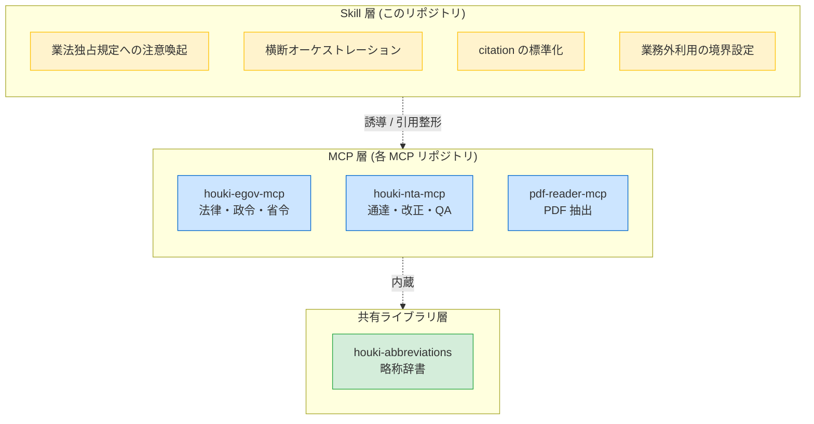
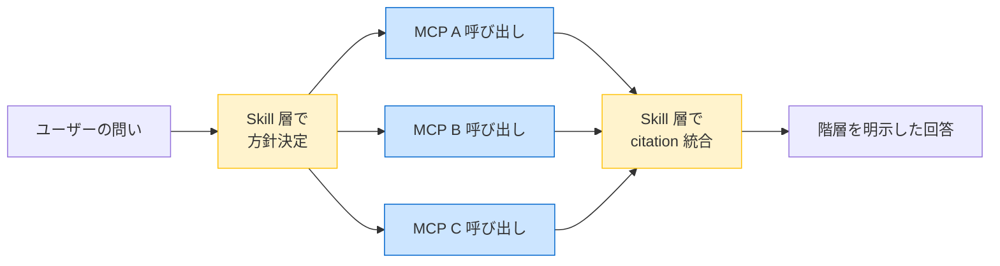

# Architecture — Skill 層と MCP 層の分担

houki-research-skill が **MCP ではなく Skill として** 設計されている理由と、各層の責務分担を整理する。

## スコープ — 日本の全法規

このスキルは **特定の分野に限定されない** 設計。家庭・企業・公的機関に関わるあらゆる法令・通達・判例・裁決を縦串で引く orchestration を担う。現状の family メンバー (`houki-egov-mcp` / `houki-nta-mcp` / `pdf-reader-mcp`) では **法律本文 + 税務通達 + PDF 抽出** までをカバーする。将来:

- `houki-mhlw-mcp` (計画中) → 厚労省: 労務・医療・年金・介護
- `houki-saiketsu-mcp` (構想中) → 裁決: 国税不服審判所・公取委・特許庁審判部・各省庁不服審査会
- `houki-court-mcp` (構想中) → 判例: 最高裁・高裁・地裁

が追加されても、本スキルの行動指針 (4 責務 / 鉄則 4 つ) は不変。新 MCP は同じ階層原則 (法律 → 政令 → 省令 → 通達 → 改正 + 添付 PDF → 行政解釈 → 判例 → 裁決) に従って統合される。

## 3 層構成

| 層               | 責務                           | 配布形態                                        |
| ---------------- | ------------------------------ | ----------------------------------------------- |
| Skill 層         | LLM の振る舞いを方向付ける指針 | Markdown ベースの Claude Skill (このリポジトリ) |
| MCP 層           | 機械的な fetch + parse + 検索  | npm package + MCP server                        |
| 共有ライブラリ層 | 略称辞書・カテゴリ定義         | npm package (MCP に内蔵)                        |

## なぜ MCP ではなく Skill なのか

`houki-hub` family の設計原則 [Architecture E](https://github.com/shuji-bonji/houki-nta-mcp/blob/main/docs/DESIGN.md) は **「単一 MCP に責務を集中させない」** を掲げる。横断 orchestration を 1 つの MCP に持たせると以下の問題が生じる:

1. **その MCP が family の hub になり、他の MCP が "従属物" 化する** — Architecture E が崩壊し、独立した npm package として配布する意味が薄れる
2. **MCP の責務 (fetch + parse) と Skill の責務 (人間向け判断補助) が同居する** — テスト戦略が混乱し、API 表面が肥大化する
3. **業法独占規定の判定は機械的な fetch + parse の領域ではない** — LLM の判断・対話の領域で、ツール (MCP) ではなく行動指針 (Skill) として持たせる方が自然

## Skill 層の 4 責務 (詳細)

### ① 業法独占規定への注意喚起

詳細: [`BUSINESS-LAW.md`](BUSINESS-LAW.md)

ユーザーの問いが税理士法・弁護士法・司法書士法・社労士法の独占業務に該当する場合、回答前に「文献調査の範囲で情報提供する。最終判断は有資格者へ」と明示する。

### ② 横断オーケストレーション

詳細: [`../workflows/`](../workflows/)

法律本文 (e-Gov) → 通達による解釈 (国税庁) → 改正履歴 (添付 PDF) という階層的な引き方を skill が誘導する。LLM が単独で MCP を選ぶより一貫性が高い。

### ③ citation の標準化

詳細: [`CITATION.md`](CITATION.md)

各 MCP の出典 URL・取得時刻・`legal_status` を統一フォーマットで提示する。「法律 → 政令 → 省令 → 通達 → 判例」の層を明示する。

### ④ 業務外利用の境界設定

「個人の調査用途」「学習・研究目的」前提を確認し、業として税務相談・法律事務に転用しないよう促す。

## MCP 層との情報の流れ

このスキルが期待する MCP 側の応答契約 (informal contract) を以下に示す。各 MCP リポジトリの個別仕様に従いつつ、共通の最低保証は次の通り:

| フィールド     | 内容                                                                       | どの MCP で必須か              |
| -------------- | -------------------------------------------------------------------------- | ------------------------------ |
| `legal_status` | `binds_citizens` / `binds_courts` / `binds_tax_office` 等の Boolean フラグ | houki-nta-mcp / houki-egov-mcp |
| `freshness`    | `staleness` (`fresh` / `stale` / `outdated`) + `oldest_fetched_at`         | houki-nta-mcp                  |
| `sourceUrl`    | 一次情報の URL (取得元の永続リンク)                                        | 全 MCP                         |
| `fetched_at`   | 取得時刻 (ISO 8601)                                                        | 全 MCP                         |
| `attachedPdfs` | `kind` / `url` / `sizeKb` 付きの添付 PDF メタ                              | houki-nta-mcp                  |
| `reader_hints` | `kind` 別の pdf-reader-mcp 呼び出し例                                      | houki-nta-mcp v0.7.2+          |

これらが揃うことで、Skill 層は「**どの情報をどの順序で引用するか**」を機械的に決められる。

## 配布形態

このリポジトリは **Claude Skill plugin** として配布する想定:

- リポジトリ root の `SKILL.md` が Claude にロードされるメインプロンプト
- `docs/` / `workflows/` / `examples/` 配下のファイルは SKILL.md からリンクされ、必要に応じて Claude が `Read` で取り込む

将来 Cowork plugin としてパッケージ化する場合、`.plugin` ファイル形式に固める予定。現時点では Claude Code の `~/.claude/skills/` 配下に直接配置する形で利用可能。

## 関連設計ドキュメント

- [houki-nta-mcp の DESIGN.md](https://github.com/shuji-bonji/houki-nta-mcp/blob/main/docs/DESIGN.md) — Architecture E の原本
- [houki-nta-mcp の HOUKI-FAMILY-INTEGRATION.md](https://github.com/shuji-bonji/houki-nta-mcp/blob/main/docs/HOUKI-FAMILY-INTEGRATION.md) — 4 つの MCP を併用する install ガイド
