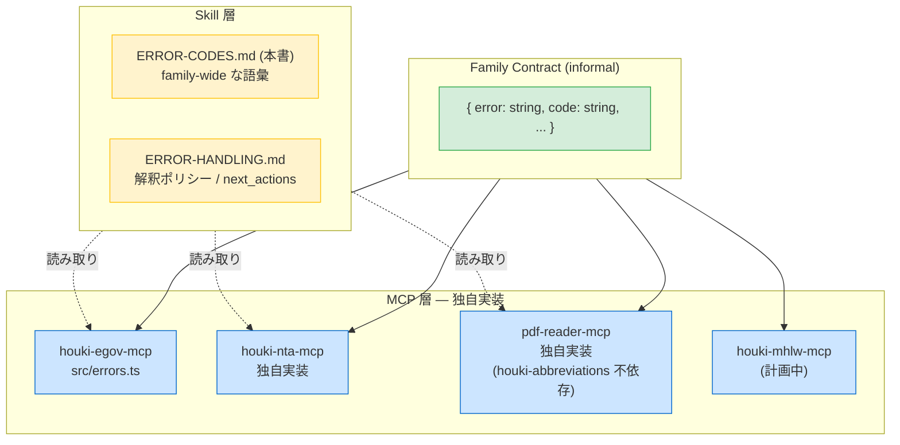

# ERROR-CODES — family 共通エラー語彙の正典

`houki-hub` MCP family の各 MCP は、エラー応答に **共通の `code` 文字列**を使う。各 MCP は独自に `errors.ts` 等を実装するが、`code` の語彙だけは本ドキュメントを正典とする。

これにより、Skill 層 (`houki-research-skill`) は **どの MCP からのエラーでも一貫したロジックで解釈・表示**できる。

## 設計原則 — 共有するのはコードのみ、実装は独立



**各 MCP に求められる最低保証 (informal contract):**

```ts
// 各 MCP がエラー時に返すべき最低構造
interface FamilyErrorContract {
  error: string; // 1文の人間可読メッセージ (LLM もここを読む)
  code: string; // 本ドキュメントの語彙に従う安定コード
  // 以下は任意だが、揃っているとSkill層の処理が綺麗になる
  hint?: string;
  next_actions?: { action: string; reason: string; example?: object }[];
  retryable?: boolean;
  detail?: { status?: number; url?: string; cause?: string };
}
```

各 MCP は houki-abbreviations 等の共通パッケージに依存せず、**自前で型を定義**してよい。共有するのはコード文字列の語彙だけ。

## 共通コード語彙

### 引数・入力 (クライアント責任)

| code                  | 意味                                                                    | retryable | 主な発生 MCP   |
| --------------------- | ----------------------------------------------------------------------- | --------- | -------------- |
| `INVALID_ARGUMENT`    | 引数バリデーション失敗 (Zod 等で弾かれた)                               | `false`   | 全 MCP         |
| `INVALID_ARTICLE_NUM` | 条番号フォーマットが不正 (例: 未対応の漢数字)                           | `false`   | houki-egov-mcp |
| `OUT_OF_SCOPE`        | 別 MCP の管轄リソースが要求された (略称解決の結果、他 MCP の対象と判明) | `false`   | 全 MCP         |

### リソース未発見

| code                     | 意味                                | retryable | 主な発生 MCP                   |
| ------------------------ | ----------------------------------- | --------- | ------------------------------ |
| `LAW_NOT_FOUND`          | 指定された法令が見つからない        | `false`   | houki-egov-mcp / houki-nta-mcp |
| `ARTICLE_NOT_FOUND`      | 条/項/号が見つからない              | `false`   | houki-egov-mcp                 |
| `ABBREVIATION_NOT_FOUND` | 略称辞書に該当なし                  | `false`   | houki-abbreviations 内蔵側     |
| `TSUTATSU_NOT_FOUND`     | 通達が見つからない                  | `false`   | houki-nta-mcp                  |
| `DOC_NOT_FOUND`          | 文書 (添付 PDF 含む) が見つからない | `false`   | houki-nta-mcp / pdf-reader-mcp |

### 外部ソース由来

家族横断のため、`EGOV_*` のような MCP 固有プレフィックスは避け、`SOURCE_*` で統一する。詳細は `detail.url` で識別する。

| code                  | 意味                                              | retryable  | 主な発生 MCP                                                |
| --------------------- | ------------------------------------------------- | ---------- | ----------------------------------------------------------- |
| `SOURCE_API_ERROR`    | 外部 API (e-Gov / NTA / 各省庁) がエラー応答      | 状況による | houki-egov-mcp / houki-nta-mcp                              |
| `SOURCE_TIMEOUT`      | 外部 API がタイムアウト                           | `true`     | houki-egov-mcp / houki-nta-mcp / pdf-reader-mcp (URL fetch) |
| `SOURCE_RATE_LIMITED` | 外部 API がレート制限を返した (HTTP 429)          | `true`     | houki-egov-mcp / houki-nta-mcp                              |
| `SOURCE_UNAVAILABLE`  | 外部リソースに接続不能 (DNS 失敗・ネットワーク断) | `true`     | 全 fetch 系 MCP                                             |

> **後方互換**: houki-egov-mcp の既存コード `EGOV_API_ERROR` / `EGOV_TIMEOUT` / `EGOV_RATE_LIMITED` は **`SOURCE_*` のサブセット**として位置づける。Skill 層は両方を解釈できるよう実装する (移行期間)。新規実装は `SOURCE_*` を使うこと。

### コンテンツ問題 (PDF など)

| code                      | 意味                                   | retryable | 主な発生 MCP   |
| ------------------------- | -------------------------------------- | --------- | -------------- |
| `INVALID_PDF`             | PDF が破損していて読めない             | `false`   | pdf-reader-mcp |
| `ENCRYPTED_PDF`           | PDF が暗号化されておりパスワードが必要 | `false`   | pdf-reader-mcp |
| `UNSUPPORTED_PDF_FEATURE` | 未対応の PDF 機能 (XFA フォーム等)     | `false`   | pdf-reader-mcp |

### システム

| code             | 意味                            | retryable | 主な発生 MCP |
| ---------------- | ------------------------------- | --------- | ------------ |
| `UNKNOWN_TOOL`   | 存在しない tool 名が呼ばれた    | `false`   | 全 MCP       |
| `INTERNAL_ERROR` | 内部エラー (バグ・予期せぬ例外) | `false`   | 全 MCP       |

## コード命名規則

新しい code を追加する場合のルール:

1. **SCREAMING_SNAKE_CASE** で大文字英字+アンダースコア
2. **MCP 固有プレフィックスを避ける** — 同種の問題は共通コードで揃える (例: `EGOV_TIMEOUT` → `SOURCE_TIMEOUT`)
3. **意味のスコープを表す接頭辞**を使う:
   - `INVALID_*` — 入力検証失敗
   - `*_NOT_FOUND` — リソース未発見
   - `SOURCE_*` — 外部リソース由来
   - `INVALID_*` / `ENCRYPTED_*` / `UNSUPPORTED_*_FEATURE` — コンテンツ問題
4. **新規 code を追加するときは本ドキュメントを更新** — Skill 層が解釈ロジックに反映できるように

## 利用例 — 各 MCP からの応答イメージ

### houki-egov-mcp の応答

```json
{
  "error": "法令『消費税法』第3000条は存在しません",
  "code": "ARTICLE_NOT_FOUND",
  "hint": "条番号を get_toc で確認してください",
  "next_actions": [
    {
      "action": "get_toc",
      "reason": "目次を確認して正しい条番号を特定できます",
      "example": { "law_name": "消費税法" }
    }
  ],
  "retryable": false
}
```

### houki-nta-mcp の応答

```json
{
  "error": "通達 docId=0025004-999 が見つかりません",
  "code": "TSUTATSU_NOT_FOUND",
  "hint": "nta_search_tsutatsu で正しい docId を検索してください",
  "next_actions": [
    {
      "action": "nta_search_tsutatsu",
      "reason": "キーワード検索で該当通達を探せます",
      "example": { "keyword": "適格請求書" }
    }
  ],
  "retryable": false
}
```

### pdf-reader-mcp の応答

```json
{
  "error": "PDF ファイルが破損しています",
  "code": "INVALID_PDF",
  "hint": "URL の取得元を確認するか、別の PDF を試してください",
  "retryable": false,
  "detail": { "url": "https://www.nta.go.jp/.../broken.pdf" }
}
```

3 つの MCP は内部実装が独立しているが、`code` 語彙が揃っているため Skill 層は同じロジックで処理できる。

## メンテナンス方針

- **新しい code を追加するとき**: 本ドキュメントの該当カテゴリ表に追記し、`retryable` と発生 MCP を明記
- **MCP 固有 code を共通化するとき**: 後方互換のため旧 code を残しつつ「サブセット」として注記
- **新規 MCP が family に加わるとき**: その MCP がどのカテゴリの code を発する可能性があるか棚卸しし、必要なら新コードを追加
- **`retryable` の判定が変わったとき**: ERROR-HANDLING.md の retry ポリシーと整合を取る

## 関連

- [`ERROR-HANDLING.md`](ERROR-HANDLING.md) — エラーを受け取ったときの解釈・next_actions・メッセージ整形指針
- [houki-egov-mcp の src/errors.ts](https://github.com/shuji-bonji/houki-egov-mcp/blob/main/src/errors.ts) — リファレンス実装 (本語彙の起点)
