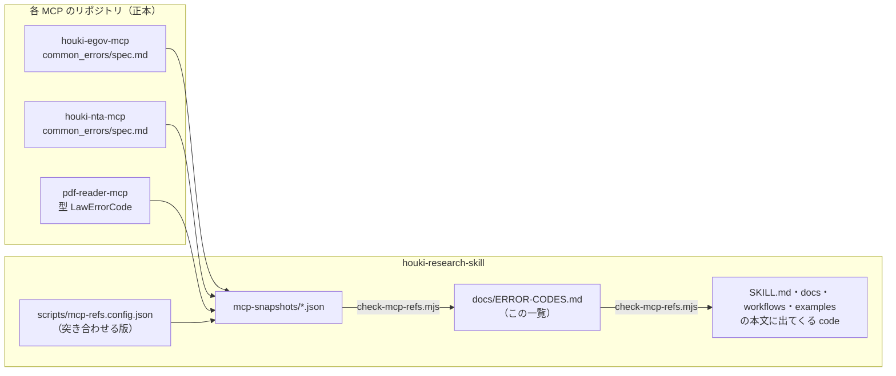

# ERROR-CODES — family の MCP が返すエラーの code の一覧

この文書は、Skill がエラー応答を解釈するときに、どの MCP がどの `code` を返しうるかを 1 か所で見渡すための一覧です。code の定義そのもの（正本）は各 MCP のリポジトリにあり、この一覧はそれをまとめたものです。

## 正本の場所

各 code の意味、どの場面でどの code を返すか、`retryable` を付けるかは、各 MCP の仕様が決めます。この一覧は決めません。

| MCP | code の正本 | どの場面で返すか |
| --- | --- | --- |
| houki-egov-mcp | [`specs/current/common_errors/spec.md`](https://github.com/shuji-bonji/houki-egov-mcp/blob/main/specs/current/common_errors/spec.md) の「エラーの code」の表 | 各ツールの `specs/current/<ツール名>/spec.md` |
| houki-nta-mcp | [`specs/current/common_errors/spec.md`](https://github.com/shuji-bonji/houki-nta-mcp/blob/main/specs/current/common_errors/spec.md) の「エラーの code」の表 | 各ツールの `specs/current/<ツール名>/spec.md` |
| pdf-reader-mcp | [`src/errors.ts`](https://github.com/shuji-bonji/pdf-reader-mcp/blob/main/src/errors.ts) の型 `LawErrorCode`（specs/ はまだ無い） | README とツールの説明 |

エラー応答の形（`error` と `code` は必ず付き、`hint` / `next_actions` / `retryable` / `detail` は値があるときだけ付く）も、houki-egov-mcp と houki-nta-mcp の `common_errors` の spec.md が正本です。

## 一覧と正本を揃える仕組み

この一覧が正本とずれていないかは、CI の `node scripts/check-mcp-refs.mjs` が確かめます。基準は `mcp-snapshots/` の JSON で、`node scripts/update-mcp-snapshots.mjs` が `scripts/mcp-refs.config.json` の版の MCP から作ります。

```mermaid
flowchart LR
  subgraph mcp["各 MCP のリポジトリ（正本）"]
    e["houki-egov-mcp<br/>common_errors/spec.md"]
    n["houki-nta-mcp<br/>common_errors/spec.md"]
    p["pdf-reader-mcp<br/>型 LawErrorCode"]
  end
  subgraph skill["houki-research-skill"]
    cfg["scripts/mcp-refs.config.json<br/>（突き合わせる版）"]
    snap["mcp-snapshots/*.json"]
    doc["docs/ERROR-CODES.md<br/>（この一覧）"]
    other["SKILL.md・docs・workflows・examples<br/>の本文に出てくる code"]
  end
  e --> snap
  n --> snap
  p --> snap
  cfg --> snap
  snap -->|"check-mcp-refs.mjs"| doc
  doc -->|"check-mcp-refs.mjs"| other
```

`check-mcp-refs.mjs` は次の 3 点を確かめ、1 つでも合わなければ CI が失敗します。

- 各 MCP の正本にある code が下の表にあり、その MCP の列に印がある
- 下の表で MCP の列に印のある code が、その MCP の正本にある
- Skill の文書の本文に出てくる code（`ARTICLE_NOT_FOUND` など）が、下の表にある

### code が増えたり変わったりしたときの順番

1. MCP のリポジトリで `common_errors` の spec.md を変える仕様 PR を出し、実装して公開する
2. この Skill の `scripts/mcp-refs.config.json` の版を上げ、`node scripts/update-mcp-snapshots.mjs` で `mcp-snapshots/` を作り直す
3. `node scripts/check-mcp-refs.mjs` が示す行に合わせて、この一覧と [`ERROR-HANDLING.md`](ERROR-HANDLING.md) の「コード別の標準対応」を直す

この Skill の側で code を先に決めて MCP に実装を求めることはしません。

## code の一覧

印（○）は、その MCP の正本の code の表に載っていることを表します。正本に載っていても今の版では返さない code があります（下の「正本に載っているが返さない code」）。

### 引数と呼び出しの誤り

| code | 意味 | houki-egov-mcp | houki-nta-mcp | pdf-reader-mcp |
| --- | --- | --- | --- | --- |
| `INVALID_ARGUMENT` | 引数が tools/list の inputSchema に合わない、または値の形がツールの受け付ける形でない。`detail.issues[]` に `{ path, message }` が入る | ○ | ○ | ○ |
| `INVALID_ARTICLE_NUM` | 条番号・号番号の書き方が受け付ける形でない | ○ | | |
| `UNKNOWN_TOOL` | 存在しないツール名を呼んだ | ○ | ○ | |
| `OUT_OF_SCOPE` | このサーバーの管轄でない資料を求めた（別の MCP で取る） | ○ | ○ | |

### 求めたものが無い

| code | 意味 | houki-egov-mcp | houki-nta-mcp | pdf-reader-mcp |
| --- | --- | --- | --- | --- |
| `LAW_NOT_FOUND` | 法令名の検索が成功して 0 件だった（法令が見つからない）。検索が通信の失敗で終わったときは `SOURCE_*` | ○ | | |
| `ARTICLE_NOT_FOUND` | 法令・通達はあるが、求めた条・項・号（通達では条項）が無い | ○ | ○ | |
| `RANGE_NOT_FOUND` | 求めた編・章・節、または附則の番号が無い | ○ | | |
| `ATTACHMENT_NOT_FOUND` | 求めた添付ファイルが無い | ○ | | |
| `ABBREVIATION_NOT_FOUND` | 略称辞書に無い名前を指定した | | ○ | |
| `TSUTATSU_NOT_FOUND` | 求めた通達が、ローカル DB に無く国税庁サイトから取る先も無い | | ○ | |
| `DOC_NOT_FOUND` | 求めた文書がローカル DB に無い、または国税庁サイトにそのページが無い（`nta_get_qa` / `nta_get_tax_answer` の 404）（houki-nta-mcp）／ PDF が見つからない（pdf-reader-mcp） | | ○ | ○ |

### 取得元（e-Gov・国税庁・PDF の URL）からの取得の失敗

| code | 意味 | houki-egov-mcp | houki-nta-mcp | pdf-reader-mcp |
| --- | --- | --- | --- | --- |
| `SOURCE_API_ERROR` | 取得元との通信が失敗した（HTTP エラー）。houki-nta-mcp は、接続できない・時間切れ・5xx・429 もこの code で返す。ページが無い（404）ことや検索が成功して 0 件のことは含まない（`*_NOT_FOUND`） | ○ | ○ | ○ |
| `SOURCE_TIMEOUT` | 取得が時間切れになった | ○ | ○ | ○ |
| `SOURCE_RATE_LIMITED` | 取得元が回数制限を返した（HTTP 429） | ○ | ○ | |
| `SOURCE_UNAVAILABLE` | 取得元に接続できない（DNS の失敗・接続拒否・接続の切断） | ○ | | ○ |

### PDF の中身の問題

| code | 意味 | houki-egov-mcp | houki-nta-mcp | pdf-reader-mcp |
| --- | --- | --- | --- | --- |
| `INVALID_PDF` | PDF が壊れていて読めない | | | ○ |
| `ENCRYPTED_PDF` | PDF が暗号化されていてパスワードが要る | | | ○ |
| `UNSUPPORTED_PDF_FEATURE` | pdf-reader-mcp が扱えない PDF の機能（XFA フォームなど）を使っている | | | ○ |
| `FILE_TOO_LARGE` | ファイルが大きさの上限（50 MB）を超えている（pdf-reader-mcp は PDF、houki-egov-mcp は `get_attachment` / `get_law_file` の `save: true`） | ○ | | ○ |

### サーバー内部の失敗

| code | 意味 | houki-egov-mcp | houki-nta-mcp | pdf-reader-mcp |
| --- | --- | --- | --- | --- |
| `INTERNAL_ERROR` | サーバー内部の失敗（処理中の想定外の例外、ページの解析の失敗など） | ○ | ○ | ○ |

### 正本に載っているが返さない code

次の code は正本の表にありますが、表の版の MCP はどのツールからも返しません。一覧に残すか、取得の失敗を分けて返すかは各 MCP の Issue で決めます。

- houki-nta-mcp の `SOURCE_TIMEOUT` と `SOURCE_RATE_LIMITED`（時間切れも `SOURCE_API_ERROR` になる。houki-nta-mcp の `common_errors` の spec.md の「未決」9）

houki-egov-mcp は v0.16.0 で、どのツールも返さない code を型から外した（houki-egov-mcp #57）。v0.16.0 の正本の表にある code は、どれもいずれかのツールが返す。

## `retryable` の読み方

再試行してよいかは、code から決めずに応答の `retryable` を見ます。同じ code でも、MCP と場面によって `retryable` が違います（例: `SOURCE_API_ERROR` は、5xx では `retryable: true` だが、houki-egov-mcp が 429 以外の 4xx を受けたときは `retryable: false`）。`INTERNAL_ERROR` と `UNKNOWN_TOOL` は、houki-egov-mcp v0.17.0・houki-nta-mcp v0.23.0 以上では、どの場面でも `retryable: false` です（処理中の想定外の例外も、ページの解析の失敗も）。`retryable` が付かない応答の扱いと、再試行の回数は [`ERROR-HANDLING.md`](ERROR-HANDLING.md) に書きます。

## code の名前の付け方

MCP に新しい code を足すときに、family で揃えておきたい名前の付け方です。決めるのは各 MCP の仕様 PR です。

1. 大文字の英字・数字とアンダースコアで書く（`SCREAMING_SNAKE_CASE`）
2. MCP の名前を接頭辞にしない。取得元の失敗は、どの MCP でも `SOURCE_*` にする。どの取得元かは `detail.url` で分かる
3. 種類を表す形を使う: 入力の誤りは `INVALID_*`、無いものは `*_NOT_FOUND`、取得元の失敗は `SOURCE_*`、PDF の中身の問題は `INVALID_*` / `ENCRYPTED_*` / `UNSUPPORTED_*_FEATURE`

## 関連

- [`ERROR-HANDLING.md`](ERROR-HANDLING.md) — エラーを受け取ったときの Skill の振る舞い（code ごとの対応・再試行・メッセージの書き方）
- [`../examples/error-recovery-patterns.md`](../examples/error-recovery-patterns.md) — エラーから別の経路に切り替える例
