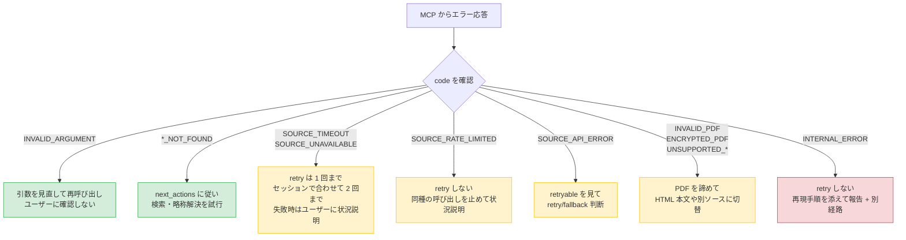
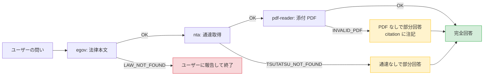

# ERROR-HANDLING — エラー応答の解釈と振る舞い

`houki-hub` MCP family の各 MCP からエラー応答を受け取ったときの **Skill 層 (LLM) の振る舞い**を定める。どの MCP がどの code を返すかは [`ERROR-CODES.md`](ERROR-CODES.md) の一覧を、code の定義は各 MCP の仕様（正本）を参照。

## 基本フロー



## コード別の標準対応

各 code に対する **next_actions テンプレ**と **メッセージ整形例**を以下に示す。各 MCP が `next_actions` を埋めて返してきた場合はそれを優先するが、空のときや内容が不十分なときは Skill 層が以下のテンプレで補完する。

### `INVALID_ARGUMENT`

| 項目               | 内容                                                                       |
| ------------------ | -------------------------------------------------------------------------- |
| 原因               | LLM 自身の引数の組み立てミス                                               |
| Skill の振る舞い   | `detail.issues[].path` でどの引数かを特定し、`tools/list` の `inputSchema` に合わせて直して再呼び出しする。`issues` が無い MCP では `hint` を読む |
| ユーザーに見せるか | 通常は見せない (内部で解決)                                                |
| 例外               | ユーザーの自然文が曖昧で引数を組めない場合は、ユーザーに何が必要か質問する |

houki-egov-mcp v0.18.0 以上は、e-Gov が時点 `at` を受け付けない（2017-04-01 より前の時点）ときも `INVALID_ARGUMENT`（`detail.issues[0].path: "at"`、`hint` に e-Gov の文）を返す。引数の組み立ての誤りではなく、e-Gov が古い時点の法令本文を持っていないことによる。`at` を変えて呼び直しても求めた時点の本文は取れないので、e-Gov で取れるのは 2017-04-01 以降の時点だけであることをユーザーに伝える。v0.17.x は同じ場面で `SOURCE_API_ERROR`（`retryable: false`）だった。

外した引数を渡したときも `INVALID_ARGUMENT` になる。houki-egov-mcp v0.18.0 以上の `search_law` / `search_fulltext` の `domain`、houki-nta-mcp v0.24.0 以上の `nta_search_qa` の `domain` がこれに当たる。`domain` を外して呼び直す（`nta_search_qa` の税目は `topic` で絞る）。`search_law` / `search_fulltext` の `law_type` で勅令を絞るときは `ImperialOrder` を渡す（`ImperialOrdinance` は houki-egov-mcp v0.18.0 以上で `INVALID_ARGUMENT`）。

### `LAW_NOT_FOUND` / `ARTICLE_NOT_FOUND` / `TSUTATSU_NOT_FOUND` / `DOC_NOT_FOUND`

| 項目               | 内容                                                                                                                               |
| ------------------ | ---------------------------------------------------------------------------------------------------------------------------------- |
| 原因               | 法令名・条番号・docId が誤っている / 存在しない / 略称のまま                                                                       |
| Skill の振る舞い   | ① 略称解決 (`resolve_abbreviation`) → ② 検索系 tool (`search_law` / `nta_search_tsutatsu`) → ③ 目次系 (`get_toc`) の順でフォールバック |
| ユーザーに見せるか | 上記をすべて試して見つからなかった場合のみ報告                                                                                     |
| メッセージ整形例   | 「『○○法 第3000条』は見つかりませんでした。同法は第○○条までです」                                                                  |

houki-egov-mcp v0.18.0 以上は、略称辞書に無い法令名で e-Gov の題名の完全一致が無いとき、検索結果の先頭の法令を使わずに `LAW_NOT_FOUND` を返す。部分一致した法令があれば、`hint` に候補の題名と法令番号を、`next_actions` に候補ごとの呼び直しの例（`law_name` だけを候補の題名に替えたもの）を入れる。問いから指す法令が 1 つに決まるならその `example` で呼び直し、決まらないなら候補をユーザーに示して選んでもらう。v0.17.x は同じ場面で先頭の法令（たとえば「所得税法施行」に対して所得税法施行令）を成功として返していたので、v0.18.0 以上で `LAW_NOT_FOUND` になった呼び出しは、法令名を正しい題名に直す。

law_id を決めた後に e-Gov が「その法令が無い」と答えたとき（404）も、houki-egov-mcp v0.18.0 以上は `LAW_NOT_FOUND` を返す（`detail.cause` に e-Gov の code。v0.17.x は `SOURCE_API_ERROR`）。`at` を渡していれば、その時点にまだ法令が無かった可能性が高いので、`next_actions` の `get_law_revisions` で施行日を確かめるか、`at` を外して呼び直す。

houki-nta-mcp の `nta_get_qa` / `nta_get_tax_answer` は、国税庁サイトにそのページが無い（HTTP 404・410、404 ページへの転送）ときも `DOC_NOT_FOUND` を返す（`retryable: false`、`next_actions` は `nta_search_qa` / `nta_search_tax_answer`。houki-nta-mcp v0.22.0 以上。v0.21.x までは `SOURCE_API_ERROR`・`retryable: true` だった）。番号の誤りなので時間をおいて取り直さず、`next_actions` の検索ツールで正しい番号を探す。

houki-nta-mcp の `nta_get_tsutatsu` で、基本通達 4 種（消費税法基本通達・所得税基本通達・法人税基本通達・相続税法基本通達）以外の通達（`電帳法取通` など）を求めると、`TSUTATSU_NOT_FOUND` を返す（SPEC-NTA-GET-TSUTATSU-007）。houki-nta-mcp は 4 種以外の通達を国税庁サイトから取れず、投入のフラグ（`--bulk-download` の `--tsutatsu`）も 4 種の正式名しか受け付けない。略称解決・検索でフォールバックしても、投入しても取れないので、上の ①〜③ は行わない。通達なしで、法律本文（houki-egov-mcp）と国税庁サイトの案内までで部分回答し、「houki-nta-mcp の対象外」と書く。「通達は無い」とは答えない（[`../workflows/feasibility-check.md`](../workflows/feasibility-check.md) の ⑤'）。

| 版 | `hint` | `next_actions` | 見分け方 |
| --- | --- | --- | --- |
| v0.27.0 以上 | `この通達（<正式名>）は、今は取り込めません。国税庁サイトから取れるのも、投入のフラグ（--bulk-download の --tsutatsu）で DB に入れられるのも、基本通達 4 種（…）だけです` | 付かない | `hint` の先頭。ローカル DB の状態によらず同じ応答で、DB を開けないときも `retryable` と `detail` は付かない（DB を開けないことは MCP サーバーのログの `warn` の行に出る。SPEC-NTA-DB-SCHEMA-030。#155） |
| v0.26.x 以前 | ``先に `<コマンド>` を実行して DB に投入してください。`` | `cli_bulk_download`（`example.command` は `--bulk-download --tsutatsu="<正式名>"`） | `error` が `"<正式名>" は DB にも未投入で、ライブ取得用 URL も未登録です`（v0.27.0 でも同じ文）。案内のコマンドは `--tsutatsu` の値の誤りで終了コード 2 で止まる（SPEC-NTA-CLI-BULK-DOWNLOAD-011）ので、ユーザーに実行を勧めない。v0.26.x で DB を開けないときは、先に下の「`next_actions` が `cli_bulk_download` の …」の表の最後の行の応答になる |

### `OUT_OF_SCOPE`

| 項目               | 内容                                                                                               |
| ------------------ | -------------------------------------------------------------------------------------------------- |
| 原因               | 略称解決の結果、別 MCP の管轄リソースと判明 (例: `houki-nta-mcp` に「消費税法」本文を要求)         |
| Skill の振る舞い   | `resolved.source_mcp_hint` が示す MCP に**自動でルーティング**して再試行する。ユーザーには見せない |
| ユーザーに見せるか | 通常は見せない (透過的に正しい MCP に切り替える)                                                   |
| 例外               | 推奨先 MCP が family にまだ実装されていない場合 (`houki-court-mcp` 等) は、その旨をユーザーに案内  |

houki-egov-mcp の `search_law` も、houki-egov の管轄でない略称（`消基通` など）を渡すと、0 件の成功ではなく `OUT_OF_SCOPE`（`get_law` と同じ本文）を返す（houki-egov-mcp v0.16.0 以上）。`search_fulltext` も、`keyword` 全体が管轄外の略称のときは、ローカル DB の有無によらず `OUT_OF_SCOPE` を返す（houki-egov-mcp v0.18.0 以上。`消基通 仕入税額控除` のように別の語と組み合わせたときは本文を探す）。

### `next_actions` が `cli_bulk_download` の `DOC_NOT_FOUND` / `TSUTATSU_NOT_FOUND` (ローカル DB に無い)

houki-nta-mcp の検索ツール (`nta_search_qa` / `nta_search_tax_answer` / `nta_search_kaisei_tsutatsu` / `nta_search_jimu_unei` / `nta_search_bunshokaitou`。v0.13.0 以上) は、その種別の文書がローカル DB に 1 件も無いとき `DOC_NOT_FOUND` を返す。`nta_search_tsutatsu` は通達が 1 件も無いとき `TSUTATSU_NOT_FOUND` を返す。取得ツール (`nta_get_kaisei_tsutatsu` / `nta_get_jimu_unei` / `nta_get_bunshokaitou`。v0.14.1 以上) も、その種別の文書が 1 件も無いときは同じ形で返す。投入で直る場面（下の表で `next_actions` が「投入の案内」の行）では、いずれも `next_actions` の `action` が `cli_bulk_download` になっている。版が新しい・読めない DB と、DB を開けないとき（houki-nta-mcp v0.26.0 以上）は、同じ code でも `cli_bulk_download` が入らない。上の「docId が誤っている」ときの `*_NOT_FOUND` とは原因が違う。

**投入が必要なのか、docId が誤っているのかは `next_actions` で見分ける。** `action` が `cli_bulk_download` なら投入が必要。`action` が検索ツール (`nta_search_*`) で `available_doc_ids` が付いていれば、投入は済んでいて docId が誤っているだけなので、投入を案内しない。`cli_bulk_download` が無く `available_doc_ids` も付かないときは、`hint` の先頭で DB の状態を見分ける（下の表）。ただし houki-nta-mcp v0.26.x 以前の `nta_get_tsutatsu` で基本通達 4 種以外の通達を求めたときは、`cli_bulk_download` が付いていても投入では直らない（上の「`LAW_NOT_FOUND` / `ARTICLE_NOT_FOUND` / `TSUTATSU_NOT_FOUND` / `DOC_NOT_FOUND`」の節。`error` が `ライブ取得用 URL も未登録です` で終わる）。

| 項目               | 内容                                                                                                   |
| ------------------ | ------------------------------------------------------------------------------------------------------ |
| 原因               | その種別を投入していない / `--bulk-download-everything` の途中でその種別だけ失敗した / bulk download を実行した環境と MCP サーバーとで DB のパス (`HOUKI_NTA_DB_PATH` / `XDG_CACHE_HOME`) が違う (MCP クライアントやプラグインから起動したサーバーは、シェルの環境変数を受け継がないことがある) |
| Skill の振る舞い   | 略称解決・検索でのフォールバックはしない (何度検索しても同じ)。**「該当なし」「国税庁の資料に無い」と答えない**。`next_actions[].example.command` の投入コマンドと、`hint` の DB のパスをユーザーに伝える。ユーザーが投入したはずだと言うときは、下の「MCP サーバーが開いている DB を確かめる」の手順を案内する |
| ユーザーに見せるか | 見せる (ユーザーの環境で投入が必要なため)                                                             |
| メッセージ整形例   | 「質疑応答事例がローカル DB に入っていないため、検索できませんでした。`npx -y @shuji-bonji/houki-nta-mcp@latest --bulk-download-qa` で投入してください (DB: ~/.cache/houki-nta-mcp/cache.db)」 |

houki-nta-mcp v0.24.0 以上では、ローカル DB の版がこの houki-nta-mcp で使えないときも、読むだけのツール（検索ツールと、改正通達・事務運営指針・文書回答事例の取得、`nta_inspect_pdf_meta`）は同じ code を返し、`hint` だけを DB の状態の文にする。houki-nta-mcp v0.25.0 以上では、`hint` の先頭の文で DB の状態が分かる（SPEC-NTA-DB-SCHEMA-029・021）。どの文も MCP サーバーが開こうとした DB のパス（ホームディレクトリの部分は `~`）を含む。文の中のコマンドは `next_actions[].example.command` と同じ `npx -y @shuji-bonji/houki-nta-mcp@latest <フラグ>` の形で、DB の場所を環境変数で決めて起動したときは `HOUKI_NTA_DB_PATH="$HOME/…" npx -y …` のように同じ変数が前に付く。houki-nta-mcp v0.26.0 以上では、DB を開けないとき（SQLite でないファイル、フォルダー、パスの途中が普通のファイル、DB のファイルを読む権限が無い）も同じ code を返し、表の最後の行の `hint` にする（SPEC-NTA-DB-SCHEMA-029、SPEC-NTA-COMMON-ERRORS-006）。v0.25.x 以前は同じ場面が `INTERNAL_ERROR` だった（下の「`INTERNAL_ERROR` / `UNKNOWN_TOOL`」）。houki-nta-mcp v0.27.0 以上では、置き場所のフォルダー（またはパスの途中のフォルダー）に入る権限が無いときも、DB のファイルがあるかどうかによらず「開けない」と判定し、表の最後の行の `hint` にする（SPEC-NTA-DB-SCHEMA-021・029、#154）。v0.26.x 以前は、同じ場面でファイルが無いときの `hint`（表の 1 行目か 2 行目）と `cli_bulk_download` を返していたが、案内どおりに投入しても `[ERROR] DB を開けません` で止まる（下の「MCP サーバーが開いている DB を確かめる（`--status`）」）。

| `hint` の先頭（v0.25.0 以上） | DB の状態 | `next_actions` | ユーザーに伝えること |
| --- | --- | --- | --- |
| `ローカル DB（<パス>）がありません` | ファイルが無い（DB の場所の設定が既定か `XDG_CACHE_HOME`） | 投入の案内（`cli_bulk_download`） | 案内のコマンドで投入すること |
| `HOUKI_NTA_DB_PATH が指すファイル（<パス>）がありません` | `HOUKI_NTA_DB_PATH` が無いファイルを指している | 投入の案内（`cli_bulk_download`） | `HOUKI_NTA_DB_PATH` を投入した DB のファイルに直すか、案内のコマンドでそのパスに投入すること |
| `ローカル DB（<パス>）にはまだ何も投入されていません` | ファイルはあるが版の記録が無い（0 バイトのファイルなど） | 投入の案内（`cli_bulk_download`） | 案内のコマンドで投入すること |
| `ローカル DB（<パス>）に<種別>（doc_type="<doc_type>"）が入っていません` | DB は使えるが、その種別が 1 件も無い（他の種別だけがある DB を含む） | 投入の案内（`cli_bulk_download`） | 案内のコマンドで投入すること。投入したはずなら、投入したシェルで `--status` を実行し、表示される DB がこのパスと同じか確かめること（`hint` にも同じ手順が書いてある） |
| `ローカル DB（<パス>）の版 (<DB の版>) は古く移行できないため` | 版 1・2 | 投入の案内（`cli_bulk_download`） | 投入のフラグ（`npx -y @shuji-bonji/houki-nta-mcp@latest --quickstart` など）を実行すると作り直されること。取り込んだ中身は消える |
| `ローカル DB（<パス>）の版 (<DB の版>) がこの houki-nta-mcp の版 (12) より新しいため` | 版 13 以上 | 投入の案内は無い | houki-nta-mcp を新しい版に更新すること。投入のフラグを実行しても終了コード 1 で止まる |
| `ローカル DB（<パス>）の版を読めないため` | 版の値が整数として読めない | 投入の案内は無い | DB ファイルを消してから投入のフラグを実行すること |
| `ローカル DB（<パス>）を開けません`（v0.26.0 以上） | 開けない（SQLite でないファイル、フォルダー、パスの途中が普通のファイル、DB のファイルを読む権限が無い、置き場所のフォルダー（またはパスの途中のフォルダー）に入る権限が無い（v0.27.0 以上））。開けない理由の文は `detail.cause` に入る（ホームディレクトリの部分は `~`。入る権限の無いフォルダーのときは `EACCES: パスの途中のフォルダーに入る権限がありません (<フォルダー>)`）。`retryable: false` | 投入の案内は無い（ほかの案内も無ければ `next_actions` 自体が付かない） | パスがフォルダーを指していないか、途中に普通のファイルが無いか、読む権限があるか、SQLite の DB のファイルかを確かめて直すこと（`HOUKI_NTA_DB_PATH` を設定しているときはその値を直す）。`detail.cause` が `EACCES:` で始まるときは、括弧の中のフォルダーに入る権限を直すか、`HOUKI_NTA_DB_PATH` で入れるフォルダーの DB を指すこと。`hint` の `--status` のコマンドを実行すると、開けない理由が出ること。投入のフラグも同じ DB では `[ERROR] DB を開けません` で止まるので、投入は案内しない |

`nta_search_tsutatsu` で通達が 1 件も無いときと、`nta_inspect_pdf_meta` で DB はあるがその種別が無いときの `hint` は、4 行目と違う文になる（SPEC-NTA-SEARCH-TSUTATSU-003、SPEC-NTA-INSPECT-PDF-META-001）。版 3〜11 の DB は、読むだけのツールが開いたときに行を保ったまま版 12 に移行してから引くので、この表のどれにも当たらない。

書き戻す 3 ツール（`nta_get_tsutatsu` / `nta_get_qa` / `nta_get_tax_answer`）は、houki-nta-mcp v0.26.0 以上では DB を開けないときもエラーにせず、DB を使わずに国税庁サイトから取って返す（`source: "live"`。SPEC-NTA-DB-SCHEMA-030）。DB には書かないので、同じ文書でも呼ぶたびに国税庁サイトから取り直す。DB を開けないことは MCP サーバーのログの `warn` の行に出るだけで、応答は DB を使えるときに国税庁サイトから取ったときと同じになる。国税庁サイトに取りに行く先の無い通達（SPEC-NTA-GET-TSUTATSU-007）は、v0.26.x では表の最後の行と同じ `TSUTATSU_NOT_FOUND`（`retryable: false`、`detail.cause`）になる。v0.27.0 以上では、DB を開けるときと同じ「今は取り込めない」応答（上の「`LAW_NOT_FOUND` / `ARTICLE_NOT_FOUND` / `TSUTATSU_NOT_FOUND` / `DOC_NOT_FOUND`」の節）になり、`retryable` と `detail` は付かない。DB を開けないことは `warn` の行に出るだけである（SPEC-NTA-DB-SCHEMA-030）。国税庁サイトとの通信の失敗などは DB を使えるときと同じ code で、`next_actions` に `cli_bulk_download` は入らない。v0.25.x 以前は、DB を開けないと国税庁サイトに取りに行かずに `INTERNAL_ERROR` を返した。

houki-nta-mcp v0.24.x では、`hint` の先頭はどの場面でも `MCP サーバーが開いている DB（<絶対パス>）に…が入っていません`（`nta_search_tsutatsu` は `初回は …` でパスなし）、版の合わない DB では `MCP サーバーが開いている DB（<絶対パス>）の版 …` で、ファイルが無いのか空なのかを区別しない。コマンドは `houki-nta-mcp --<フラグ>` の形で、グローバルにインストールしていないと動かないので、ユーザーには `npx -y @shuji-bonji/houki-nta-mcp@latest --<フラグ>` に読み替えて伝える。

版が新しい DB は、多くの場合、新しい版の houki-nta-mcp で作った DB を古い版の MCP サーバーが開いている（MCP クライアントやプラグインの版が古い）ときに起きる。

キーワードに合わないだけの 0 件は、エラーではなく `results: []` と、検索した件数を書いた `hint` で返る。こちらは「その語を含む文書は無い」という検索結果として扱ってよい。

### `search_fulltext` の `api-fallback`（houki-egov-mcp。エラーではない）

houki-egov-mcp の `search_fulltext` は、ローカル DB を引けないときエラーを返さず、`source: "api-fallback"` で `search_law`（法令名のタイトル一致）の結果を `fallback` に入れて返す。本文検索はできていないので、回答で「法令名の一致で探した」と明示し、`note` の案内をユーザーに伝える（[`SKILL.md`](../SKILL.md) の鉄則 3）。

houki-egov-mcp v0.20.0 以上では、`note` は `<先頭>、search_law (法令名のタイトル一致) にフォールバックしています。<続き>` の形で、`<先頭>` に MCP サーバーが開こうとした DB のパス（ホームディレクトリの部分は `~`）が入る（SPEC-EGOV-SEARCH-FULLTEXT-044）。`<続き>` と `next_actions` の中のコマンドは `npx -y @shuji-bonji/houki-egov-mcp@latest --bulk-download-everything` の形で、DB の場所を環境変数で決めて起動したときは `HOUKI_EGOV_DB_PATH="$HOME/…" npx -y …` のように同じ変数が前に付く。

| `note` の先頭（v0.20.0 以上） | DB の状態 | `next_actions` | ユーザーに伝えること |
| --- | --- | --- | --- |
| `ローカル DB (<パス>) が無いため` | ファイルが無い（DB の場所の設定が既定か `XDG_CACHE_HOME`） | 1 件目 `bulk_download_everything`、2 件目 `search_law` | `bulk_download_everything` の `example.command` で DB を構築すること |
| `HOUKI_EGOV_DB_PATH が指すファイル (<パス>) が無いため` | `HOUKI_EGOV_DB_PATH` が無いファイルを指している | 同上 | `HOUKI_EGOV_DB_PATH` を作ってある DB のファイルに直すか、`example.command` でそのパスに DB を構築すること |
| `ローカル DB (<パス>) にまだ法令が取り込まれていないため` | ファイルはあるが版の記録が無い、または条が 1 件も無い | 同上 | `example.command` で DB を構築すること |
| `ローカル DB (<パス>) の版 (<DB の版>) がこの houki-egov-mcp (3) より古いため` | v0.18.x 以前に作った DB（版 1・2） | 同上 | `example.command` で作り直すこと。取り込んだ中身は消え、全件の zip 約 290 MB を取り直す |
| `ローカル DB (<パス>) の版 (<DB の版>) がこの houki-egov-mcp (3) より新しいため` | 新しい版の houki-egov-mcp で作った DB | `search_law` の 1 件だけ | houki-egov-mcp（MCP サーバー・plugin）を新しい版に更新すること。DB は変更されていない |
| `ローカル DB (<パス>) の版を読めないため (schema_version: <値>)` | 版の値が読めない | `search_law` の 1 件だけ | DB ファイルを消してから `npx -y @shuji-bonji/houki-egov-mcp@latest --bulk-download-everything` を実行すること |
| `ローカル DB (<パス>) を開けなかったため` | パスがフォルダー、途中が普通のファイル、読む権限が無い、SQLite でないファイル | `search_law` の 1 件だけ | パスと権限を確かめること（`HOUKI_EGOV_DB_PATH` を設定しているときはその値を直す）。`--bulk-download-everything` もこの DB では取得の前に止まるので案内しない |

houki-egov-mcp v0.19.x 以前の `note` は `bulk DL 未実行のため` / `bulk DB を開けなかったため` / `bulk DB の版 (<n>) が…` / `bulk DB の版を読めないため …` で始まり、DB のパスを含まない。コマンドは `houki-egov-mcp --bulk-download-everything` で、グローバルにインストールしていないと動かないので、ユーザーには `npx -y @shuji-bonji/houki-egov-mcp@latest --bulk-download-everything` に読み替えて伝える。v0.19.x 以前は、開けない DB にも `bulk_download_everything` を案内していた。

DB を引けた応答（`source: "bulk"`）では、`freshness.db_path` に引いた DB のパスが入る（v0.20.0 以上）。`freshness` は常に 5 つのキーを持つオブジェクトで、同期の記録が無い DB では鮮度の 4 つが `null`、`api-fallback` では `db_path` を含む 5 つとも `null` になる（SPEC-EGOV-SEARCH-FULLTEXT-043）。`freshness` の有無ではなく `source` で、本文検索ができたかを判断する。

### MCP サーバーが開いている DB を確かめる（`--status`）

ユーザーが投入したはずなのに、houki-egov-mcp の `api-fallback`（`無いため` / `まだ法令が取り込まれていないため`）や houki-nta-mcp の `cli_bulk_download` 付きの `DOC_NOT_FOUND` / `TSUTATSU_NOT_FOUND` が返るときは、MCP サーバーと投入した CLI とで別の DB ファイルを開いていることが多い。MCP クライアントやプラグインから起動したサーバーは、シェルの環境変数（`HOUKI_EGOV_DB_PATH` / `HOUKI_NTA_DB_PATH` / `XDG_CACHE_HOME`）を受け継がないことがある。このときはユーザーに、投入したシェルで次のコマンドを実行してもらう。

| MCP | コマンド | 使える版 |
| --- | --- | --- |
| houki-egov-mcp | `npx -y @shuji-bonji/houki-egov-mcp@latest --status` | 3 行目の「DB の場所の設定」と `[WARN]` は v0.20.0 以上 |
| houki-nta-mcp | `npx -y @shuji-bonji/houki-nta-mcp@latest --status` | v0.25.0 以上（v0.24.x 以前は `ERROR: 未知のフラグ: --status` で終了コード 2） |

どちらも DB を作らず、書き換えない（houki-nta-mcp は版 3〜11 の DB も移行しない）。出力は次のとおり読む。

- 2 行目 `  DB: <パス>`: そのシェルの設定で開く DB。応答の `note` / `hint` のパスと `freshness.db_path` はホームディレクトリの部分を `~` で書き、`--status` は絶対パス（環境変数で指定したときはその値のまま）で書くので、`~` を読み替えて比べる
- 3 行目 `  DB の場所の設定: <名前>`: DB の場所を決めた設定。`既定` / `XDG_CACHE_HOME` / `HOUKI_EGOV_DB_PATH`（houki-nta-mcp は `HOUKI_NTA_DB_PATH`、CLI に付けたときは `--db-path`）
- `[WARN] 同じフォルダーに、この DB のほかに laws*.db のファイルがあります: …`（houki-nta-mcp は `cache*.db`）: 同じフォルダーに別の DB ファイルがある。応答のパスと比べ、MCP サーバーと CLI がどちらのファイルを開いているかを確かめる
- その後の行: 件数（houki-nta-mcp は通達と 5 種別ごとの件数・取得日時の範囲）、または `  (DB がまだありません — …)` の行
- houki-nta-mcp で DB を開けないときは、件数の行を出さず、標準エラー出力に `[ERROR] DB を開けません: <文>` を出して終了コード 1 で終わる（SPEC-NTA-CLI-STATUS-007）。`<文>` は、v0.26.0 以上の読むだけのツールの応答の `detail.cause` と同じ文（応答ではホームディレクトリの部分が `~`）
- houki-nta-mcp v0.27.0 以上では、置き場所のフォルダー（またはパスの途中のフォルダー）に入る権限が無いときも開けないときに当たり、`<文>` は `EACCES: パスの途中のフォルダーに入る権限がありません (<フォルダー>)` になる。フォルダーの中に DB のファイルがあってもなくても同じで、同じフォルダーの別の DB の `[WARN]` の行は出ない（SPEC-NTA-CLI-STATUS-004・007）。v0.26.x 以前では、同じ場面で `  (DB がまだありません — …)` を出して終了コード 0 で終わる。このとき投入のフラグは `[ERROR] DB を開けません` で止まるので、「DB がまだありません」と出ても投入で直らないときは、DB のパスのフォルダーに入る権限があるかを確かめるようユーザーに伝える

MCP サーバーの起動時のログ（標準エラー出力）にも、開く DB の絶対パスと設定の名前を書いた `DB: <絶対パス>（DB の場所の設定: <名前>）` の行が出る（houki-egov-mcp v0.20.0・houki-nta-mcp v0.25.0 以上）。

### `ABBREVIATION_NOT_FOUND`

| 項目               | 内容                                                                                         |
| ------------------ | -------------------------------------------------------------------------------------------- |
| 原因               | 辞書未登録の略称                                                                             |
| Skill の振る舞い   | ユーザーに「正式名称をご教示ください」と聞き返す。同時に `search_law` でファジー検索を試みる |
| ユーザーに見せるか | はい (新規略称登録のフィードバック源にもなる)                                                |

### `SOURCE_TIMEOUT` / `SOURCE_UNAVAILABLE`

| 項目               | 内容                                                                                  |
| ------------------ | ------------------------------------------------------------------------------------- |
| 原因               | 取得元 (e-Gov / 国税庁サイト) の一時的な不調、または手元のネットワーク・DNS の問題 (`SOURCE_UNAVAILABLE` の `detail.cause`) |
| Skill の振る舞い   | 1 回のエラーにつき、間隔をあけて (30 秒〜数分) **1 回だけ** retry する。それでも失敗なら fallback または報告 (下の「retry の回数」) |
| ユーザーに見せるか | retry も失敗した場合のみ。「e-Gov 側の応答が一時的に得られませんでした」と簡潔に |
| 注意               | retry を**ループにしない**。同じセッションの retry は合わせて 2 回まで |

houki-nta-mcp は v0.24.0 以上でこの 2 つの code を返す (`nta_get_tsutatsu` / `nta_get_qa` / `nta_get_tax_answer`)。v0.23.x までは、時間切れも接続できないときも `SOURCE_API_ERROR` (`retryable: true`) で、`error` の文と `detail.status` が無いことでしか見分けられなかった。

### retry の回数

「1 回のエラーで何回 retry するか」と「1 セッションで合わせて何回 retry するか」を分けて数える。`SOURCE_TIMEOUT` / `SOURCE_UNAVAILABLE` / `retryable: true` の `SOURCE_API_ERROR` に共通する。

| 数える単位 | 上限 | 上限に達したら |
| --- | --- | --- |
| 1 回のエラー (同じツールを同じ引数で呼んだ 1 回) | retry 1 回 | その資料を取らずに部分回答し、citation に「取得できなかった」と注記する |
| 1 セッション (同じ MCP への retry の合計) | 2 回 | 以後はその MCP で retry せず、取得元が不調であることをユーザーに伝える |

houki-egov-mcp と houki-nta-mcp は、サーバーの中で取り直した後でこれらのエラーを返す (取り直す場面と回数は各 MCP の `common_errors` の spec.md)。Skill の retry はそれに重ねて行うので、間隔をあけずに続けて呼ばない。

### `SOURCE_RATE_LIMITED`

| 項目               | 内容                                                                                                                                               |
| ------------------ | -------------------------------------------------------------------------------------------------------------------------------------------------- |
| 原因               | 外部 API の HTTP 429                                                                                                                               |
| Skill の振る舞い   | **このセッションでは同種の呼び出しを停止**。ユーザーに「短時間に多数の問い合わせが発生したため、しばらく時間をおいてから再試行してください」と説明 |
| ユーザーに見せるか | はい                                                                                                                                               |
| 注意               | retry しない。MCP 側の concurrency limit と独立してレート制限が出た場合は、ユーザー側のセッション全体で抑える                                      |

houki-egov-mcp は 429 をサーバーの中で取り直してからこの code を返し、houki-nta-mcp (v0.24.0 以上) は国税庁サイトへの要求を増やさないよう取り直さずに返す。どちらも `retryable: true` だが、Skill はこのセッションでは retry しない。houki-nta-mcp v0.23.x までは 429 も `SOURCE_API_ERROR` だった。

### `SOURCE_API_ERROR`

| 項目               | 内容                                                                        |
| ------------------ | --------------------------------------------------------------------------- |
| 原因               | 取得元との通信の失敗。HTTP の 5xx と 429 以外の 4xx（403・400 など）と、`SOURCE_UNAVAILABLE` に当たらないネットワークの失敗。時間切れ・429・接続できないときは別の `SOURCE_*` を返す（houki-nta-mcp は v0.24.0 以上。v0.23.x までは、それらもすべてこの code だった） |
| Skill の振る舞い   | 応答の `retryable` を見る。`true`（5xx など）なら、上の「retry の回数」のとおり 1 回だけ retry する。`false`（429 以外の 4xx。houki-nta-mcp では v0.24.0 以上で、`nta_get_tsutatsu` の目次のページの 404 も含む）なら同じ呼び出しを繰り返さず、引数を見直すか報告する。`detail.status` は判断の補いに使う |
| ユーザーに見せるか | retry しても失敗したとき、または `retryable: false` で引数を直せないとき                |
| 注意               | 文書のページが無い（HTTP 404）ことは、houki-nta-mcp v0.22.0 以上では `SOURCE_API_ERROR` ではなく `DOC_NOT_FOUND` で返る（上の `*_NOT_FOUND` の節）。houki-egov-mcp v0.18.0 以上も、law_id を決めた後の e-Gov の 404 は `LAW_NOT_FOUND`、時点 `at` の 400 は `INVALID_ARGUMENT` で返す |

### `INVALID_PDF` / `ENCRYPTED_PDF` / `UNSUPPORTED_PDF_FEATURE`

| 項目               | 内容                                                                                                   |
| ------------------ | ------------------------------------------------------------------------------------------------------ |
| 原因               | PDF 自体の問題                                                                                         |
| Skill の振る舞い   | PDF 抽出は諦め、**HTML 本文** (例: 通達の HTML 版) や **別の添付** (新旧対照表ではなく別紙) に切り替え |
| ユーザーに見せるか | はい (citation で「PDF の機械抽出ができなかったため HTML 版で代替」と注記)                             |

### `FILE_TOO_LARGE`

| 項目               | 内容                                                                                                   |
| ------------------ | ------------------------------------------------------------------------------------------------------ |
| 原因               | ファイルが大きさの上限（50 MB）を超えている（pdf-reader-mcp の PDF、houki-egov-mcp v0.16.0 以上の `get_attachment` / `get_law_file` の `save: true`） |
| Skill の振る舞い   | 保存しない。houki-egov-mcp では、応答の `detail.url` の URL をそのまま使う（`hint` も同じ案内）。`retryable: false` なので同じ呼び出しを繰り返さない |
| ユーザーに見せるか | ファイルを読めなかったときだけ、URL を添えて伝える                                                     |

### `INTERNAL_ERROR` / `UNKNOWN_TOOL`

| 項目               | 内容                                                                                                   |
| ------------------ | ------------------------------------------------------------------------------------------------------ |
| 原因               | `INTERNAL_ERROR`: MCP の中の失敗（処理中の想定外の例外、ページの解析の失敗など）。`UNKNOWN_TOOL`: LLM が存在しないツール名で呼んだ |
| Skill の振る舞い   | `INTERNAL_ERROR` は再試行しない。houki-egov-mcp v0.17.0・houki-nta-mcp v0.23.0 以上では、処理中の想定外の例外もページの解析の失敗も `retryable: false` で、`next_actions`（`retry_later`）は付かない。同じ呼び出しを繰り返さず、代替手段で回答するか、ユーザーに「該当 MCP に不具合がある可能性」と伝え、呼んだツール名・引数・応答の `error` / `detail.cause`（再現手順）を添えて GitHub の Issue での報告を勧める。`UNKNOWN_TOOL`（`retryable: false`）も同じ呼び出しは繰り返さず、tools/list で呼べるツールを確かめ、正しいツール名で呼び直す（ユーザーには見せない） |
| ユーザーに見せるか | `INTERNAL_ERROR` は代替手段で答えられなかったとき。`UNKNOWN_TOOL` は見せない                               |

例外として、ローカル DB の日付を読めないときの `INTERNAL_ERROR` は MCP のバグではない。houki-nta-mcp（v0.22.0 以上）は DB の取得時点（`fetched_at`）を、houki-egov-mcp（v0.16.0 以上）は同期の記録の日付（`sync_state.last_sync_date`）を読めないとき、`INTERNAL_ERROR`・`retryable: false` を返し、取り込みのやり直しを案内する。案内は、houki-nta-mcp では `next_actions` の `cli_bulk_download`（`example.command` にその種別の投入コマンド）、houki-egov-mcp では `hint`（v0.20.0 以上は `npx -y @shuji-bonji/houki-egov-mcp@latest --bulk-download-everything`、v0.19.x 以前は `houki-egov-mcp --bulk-download-everything`）にある。このときは不具合として報告せず、案内のコマンドをユーザーに伝える。`error` が `取得時点を読めません:` / `同期の記録の日付を読めません:` で始まるかで見分けられる。

もう 1 つの例外として、houki-nta-mcp v0.25.x 以前では、ローカル DB を開けないとき（SQLite でないファイル、フォルダー、パスの途中が普通のファイル、DB のファイルを読む権限が無い）も、DB を開くツールが `INTERNAL_ERROR`（`retryable: false`、`hint` は `バグの可能性があります。再現手順を添えて GitHub issue でご報告ください`）を返す。`detail.cause` が `file is not a database`・`unable to open database file`・`ENOTDIR: not a directory, mkdir '…'` のように DB を開くときの文なら、MCP の不具合ではなく DB のファイルの問題なので、報告は勧めない。`HOUKI_NTA_DB_PATH` などで指したパスがフォルダーを指していないか、途中に普通のファイルが無いか、読む権限があるか、SQLite の DB のファイルかを確かめるようユーザーに伝える（v0.25.x では `npx -y @shuji-bonji/houki-nta-mcp@latest --status` で開けない理由も出る）。v0.26.0 以上では、同じ場面は `INTERNAL_ERROR` にならず、読むだけのツールは `DOC_NOT_FOUND` / `TSUTATSU_NOT_FOUND`（上の「`next_actions` が `cli_bulk_download` の `DOC_NOT_FOUND` / `TSUTATSU_NOT_FOUND`」の表の最後の行）、書き戻す 3 ツールは国税庁サイトから取った応答になる（SPEC-NTA-COMMON-ERRORS-006）。DB を開けた後の SQL の失敗（`database disk image is malformed` など）は、v0.26.0 以上でも `INTERNAL_ERROR` のままで、この例外に当たらない。

## メッセージ整形 — 共通テンプレート

LLM がユーザーに提示する説明文の標準形式。技術的な `code` をそのまま見せず、**何が起きて何ができないか**を平易に書く。

### 一時的エラー (retryable=true) のとき

```markdown
申し訳ありません、e-Gov の応答が一時的に得られませんでした。
時間をおいて (1〜数分後) 再度お問い合わせいただけますでしょうか。

> 取得を試みた情報: 消費税法 第57条の2
> エラーコード: SOURCE_TIMEOUT
```

### 永続的エラー (retryable=false) のとき

```markdown
ご指定の「○○法 第3000条」は見つかりませんでした。
同法は第○○条までで、第3000条は存在しないようです。

正しい条番号でしたら、目次から該当箇所を確認できますので、改めてご質問いただけますでしょうか。
```

### PDF 抽出が失敗したとき (フォールバック成功)

```markdown
※ 添付の新旧対照表 PDF が暗号化されており機械抽出できなかったため、
通達 HTML 版から条文の改正前後を整理しました。

(以下回答本文)
```

## 複数 MCP を跨ぐエラーの統合

横断オーケストレーション中に複数のエラーが発生した場合、**最初に発生した致命的エラー**を優先して報告する。すべて非致命的なら、できる範囲で結果を返す。



## アンチパターン (やってはいけない)

| アンチパターン                             | なぜダメか                                       | 代わりに                                                   |
| ------------------------------------------ | ------------------------------------------------ | ---------------------------------------------------------- |
| `SOURCE_TIMEOUT` を無限 retry する         | API 側に追い打ちをかけ、レート制限まで誘発する   | 1 回のエラーにつき 1 回、セッションで合わせて 2 回まで。それ以上はユーザーに報告 |
| `code` をユーザーにそのまま見せる          | 技術的な記号は不親切                             | 「e-Gov の応答が一時的に得られません」など平易な表現に翻訳 |
| `INVALID_ARGUMENT` をユーザーに伝える      | LLM 自身のミスをユーザーの問題にすり替えてしまう | 内部で引数を直して再呼び出し                               |
| `ENCRYPTED_PDF` で諦めて回答全体を打ち切る | HTML 等の代替経路があるのに使わない              | フォールバックを試し、citation で代替経路を注記            |
| `next_actions` を読まない                  | MCP 側が示した最適経路を無視する                 | まず `next_actions` を試し、足りなければ自前で補う         |

## ロギング・観測 (将来)

- 各 MCP で発生したエラーは MCP 側のログに残る (Skill 層は介入しない)
- Skill 層では LLM のセッション内で **同一 code が連続発生**したら方針転換する (例: `LAW_NOT_FOUND` が 2 連続なら略称解決から見直す)
- 利用者から「エラー時の説明が分かりにくい」とフィードバックがあれば、メッセージ整形テンプレを更新する

## メンテナンス方針

- MCP の正本に新しい code が加わり [`ERROR-CODES.md`](ERROR-CODES.md) の一覧に行を足したら、本書の「コード別の標準対応」にも対応を足す（手順は ERROR-CODES.md の「code が増えたり変わったりしたときの順番」）
- 実利用で頻発するエラーパターン・有効だったフォールバック手順は本書に蓄積する
- `retryable` の判定が変わったら retry ポリシーと整合を取る

## 関連

- [`ERROR-CODES.md`](ERROR-CODES.md) — family の MCP が返す code の一覧（正本は各 MCP の仕様）
- [`ARCHITECTURE.md`](ARCHITECTURE.md) — Skill 層と MCP 層の責務分担 (本書はこの 3 層構成の Skill 層側を担う)
- [`CITATION.md`](CITATION.md) — 部分回答時の citation 整形ルール
