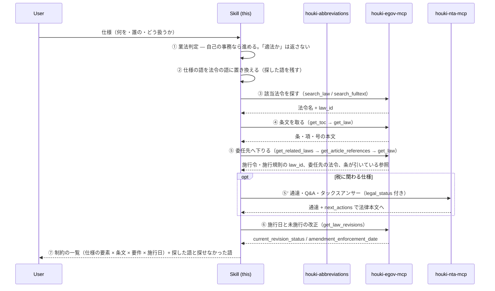
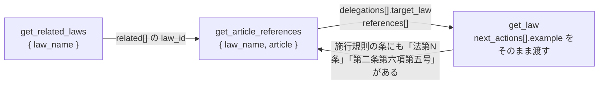

# Workflow — 実装する前に、その仕様が法令のどこに触れるかを条文で確かめる

houki-research-skill が想定する **実現可能性調査のワークフロー**。「この機能を作ってよいか」ではなく、「この仕様の各要素が、どの法令のどの条に触れ、その条は何を求めているか」を、条文と委任先（施行令・施行規則）と施行日まで揃えて返す。判断は利用者が行う。

## このワークフローを使う場面

問いの形が **「この仕様は法令のどこに触れるか」** のとき。

- 新しい機能の仕様を決める前に、法令上の要件（保存期間・記載事項・同意の取り方・届出の要否など）を条文で確かめたい
- 既存の機能が参照している条文が、いまも同じ内容か、施行待ちの改正が無いかを確かめたい
- 設計レビューや見積もりで「法令上の制約」の欄を、根拠付きで埋めたい

該当しないケース:

- 「この仕様は適法か」「この設計で問題ないか」→ 可否の判定は返さない（[`docs/BUSINESS-LAW.md` の応答型](../docs/BUSINESS-LAW.md#応答型)）。触れる条文と、その条文が求めることまでを返し、判断は利用者に返す
- 「この取扱いの根拠と、今も有効か」（通達から入る問い）→ [`tax-research.md`](tax-research.md)
- 「この改正はいつから、何が変わるか」→ `revision-tracking.md`（予定）。本ワークフローのステップ ⑥ で施行日は見るが、改正前後の差分は扱わない
- 「私の場合はどうなるか」（個別の事案）→ 応答型の「返さないもの」に従う

自社のシステムについて自社で調べることは、業法の独占業務の外（自己の事務）にある。ただし「適法か」に答えた時点で当てはめになるので、**返すのは条文と要件まで**という線は変わらない。

## フロー全体像



## 各ステップの詳細

### ステップ ①: 業法判定

[`docs/BUSINESS-LAW.md`](../docs/BUSINESS-LAW.md) の §2 に照らす。仕様の確認は **自己の事務** なので、そのまま進める。

ただし問いの中に「この仕様で問題ないか」「適法か」が含まれていたら、回答冒頭で **可否は返さないこと** を 1 文で書く。触れる条文と要件は返す。

| 問いの形 | 返す | 返さない |
|---|---|---|
| どの条に触れるか | 条文・要件・委任先・施行日 | — |
| 適法か / 問題ないか | 上と同じ | 「適法です」「問題ありません」「おそらく大丈夫」 |

### ステップ ②: 仕様の語を法令の語に置き換える

仕様書の語（「領収書を PDF で保存」「ユーザーの位置情報を取得」「未成年の会員登録」）は、法令の語（「電子取引」「電磁的記録」「個人情報」「要配慮個人情報」「未成年者」「法定代理人」）と一致しない。ここは LLM が埋める部分で、**どの語で探したかを回答に残す**。残さないと、利用者は探し漏れに気づけない。

| 仕様の語 | 法令の語の候補 | 当たりを付ける手段 |
|---|---|---|
| 領収書を PDF で保存する | 電子取引、電磁的記録、国税関係書類、保存 | `resolve_abbreviation`（「電帳法」→ 正式名）、`search_fulltext` |
| 位置情報を取得する | 個人情報、個人関連情報、取得、利用目的 | `search_fulltext { "keyword": "個人情報保護法 利用目的" }` |
| 未成年の会員登録 | 未成年者、法定代理人、同意 | `search_fulltext { "keyword": "民法 未成年者 法律行為" }` |
| 契約書を電子署名で結ぶ | 電子署名、真正な成立の推定 | `search_law { "keyword": "電子署名" }` |

略称（「電帳法」「個情法」「労基法」）は `resolve_abbreviation` で正式名に直してから探す（鉄則 2）。

同じ語を使う別分野の法令が当たることがある（「電子取引 電磁的記録」で関税法が当たる、など）。**除外した法令と理由も「探した語」と一緒に回答に書く**。

### ステップ ③: 該当法令を探す

入口は問いに含まれる情報で選ぶ（SKILL.md 鉄則 3 の表と同じ）。

| 分かっていること | 呼ぶ tool |
|---|---|
| 法令名（略称でも可） | `search_law { "keyword": "<法令名>" }` |
| 法令名は不確かだが、語は分かる | `search_fulltext { "keyword": "<語> <語>" }`（ローカル DB が要る。無いときは `source: "api-fallback"` で `search_law` に切り替わるので、回答で「法令名の一致で探した」と明示する） |
| 分野だけ | `search_law { "keyword": "<語>", "domain": "tax" }` |

1 つの仕様が複数の法令に触れることが普通（電子取引の保存なら電子帳簿保存法と、その帳簿の元になる消費税法・法人税法）。**見つかった法令ごとに以下を繰り返す**。

### ステップ ④: 条文を取る

条が分からないときは `get_toc` で目次を見て当たりを付け、`get_law` で条・項・号の単位で取る。要件は号まで下りていることが多い。

```jsonc
{ "tool": "get_toc", "args": { "law_name": "電子計算機を使用して作成する国税関係帳簿書類の保存方法等の特例に関する法律" } }
{ "tool": "get_law", "args": { "law_name": "電子計算機を使用して作成する国税関係帳簿書類の保存方法等の特例に関する法律", "article": "7" } }
```

民法・会社法のような長い法令は、法令全体を取ってコンテキストに載せない。条が分かっているなら `get_law` を条の単位で呼び、**章・節を通して読む必要があるとき**は `get_law_range` を使う（houki-egov-mcp v0.14.0 以上）。

```jsonc
{ "tool": "get_toc", "args": { "law_name": "民法", "depth": 2 } }
// → toc[2].children[1].path = "Part3/Chapter2"（第三編 債権 第二章 契約）
{ "tool": "get_law_range", "args": { "law_name": "民法", "path": "Part3/Chapter2" } }
// → 198 条のうち 186 条（第521条〜第684条、本文 29,911 文字）。range.truncated: true
{ "tool": "get_law_range", "args": { "law_name": "民法", "path": "Part3/Chapter2", "from_article": "685" } }
// → 続きの 12 条。range.next_from_article の値をそのまま渡す
```

使い分けの目安:

| 読み方 | 呼ぶ tool |
| --- | --- |
| 要件を 1 条ずつ確かめる（条・項・号が分かっている） | `get_law` |
| 章・節を通して読む（制度の組み立てを見る） | `get_law_range` |
| どの条にあるか探す | `get_toc` か `search_fulltext` |

`get_law_range` は既定で本文 30,000 文字までを条の単位で返す。民法の章はほとんどが 1 回で収まり、会社法・所得税法の大きい章は 2〜3 回に分かれる。`range.truncated` が `true` のときは `range.next_from_article` を `from_article` に渡して続きを取る。**`truncated: true` のまま「この章にはこれしか無い」と書かない。**

章番号は編ごとに振り直される（民法には第一章が 5 つある）。`chapter` だけを渡して複数に当たると候補のパス付きで `INVALID_ARGUMENT` が返るので、`next_actions` の `path` を選び直す。

### ステップ ⑤: 委任先へ下りる

法律の条文に「政令で定める」「財務省令で定める」「厚生労働省令で定める」「別表」とあれば、要件の実体はそこにある。**法律の条だけで止めると、保存期間や記載事項のような数字が抜ける**。

houki-egov-mcp v0.10.1 以上には、委任先へ下りるためのツールが 2 つある。**3 手で下りる**。



| 手 | 呼ぶ tool | 見るフィールド | 意味 |
|---|---|---|---|
| 1 | `get_related_laws { "law_name": "<法律名>" }` | `related[]`（`relation` / `title` / `law_id` / `abbr`）、`not_found[]` | 法律名の末尾に「施行令」「施行規則」を付けた名前で e-Gov に実在するものだけが返る。`not_found` に候補が残っていれば、その名前の下位法令は無い |
| 2 | `get_article_references { "law_name": "<法律名>", "article": "<条>" }` | `delegations[]`（`raw` / `count` / `target_law`）、`references[]`、`coverage.note` | 「政令で定める」「財務省令で定める」が何回あり、どの施行令・施行規則を指すか（**法令単位**。条は決めない）。他法令・同一法令内の参照は `references[]` に条・項・号付きで入る |
| 3 | `get_law`（`next_actions[].example` をそのまま渡す） | 本文 | 引用先の条を取る。`example` は引数だけなので、そのまま渡せる |

```jsonc
{ "tool": "get_related_laws", "args": { "law_name": "電帳法" } }
// → related: [ { relation: "enforcement_order", law_id: "503CO0000000128", title: "…法律施行令" },
//              { relation: "enforcement_rule",  law_id: "410M50000040043", title: "…法律施行規則" } ]
{ "tool": "get_article_references", "args": { "law_name": "電帳法", "article": "7" } }
// → references: []（7 条は他の条を引いていない）
//   delegations: [ { raw: "財務省令で定める", count: 1, target_law: { title: "…法律施行規則", law_id: "410M50000040043" } } ]
//   next_actions: [ { action: "search_fulltext", example: { keyword: "…法律施行規則 法第七条" } } ]
```

委任先の **条** は 2 つの方法で探す。ローカル DB があれば `next_actions` の `search_fulltext`（施行規則の本文で「法第七条」を引いている条が当たる）、無ければ `get_toc { "law_name": "<施行規則名>" }` で見出し（「（電子取引の取引情報に係る電磁的記録の保存）」のように法律の条と同じ見出しが付く）から当たりを付ける。

**規則の条が、さらに同じ規則の別の条を準用していることがある**（電帳法施行規則 4 条 1 項が 2 条 2 項 2 号と 6 項 5 号を準用する、など。二段目の委任）。施行規則の条に対しても `get_article_references` を呼ぶと、準用先が `references[]` に入る。

```jsonc
{ "tool": "get_article_references", "args": { "law_name": "…法律施行規則", "article": "4", "paragraph": 1 } }
// → references: [
//     { kind: "external", raw: "法第七条", law_name: "…法律", law_id: "410AC0000000025", article: "7" },   // 「法」は親の法律に解決される
//     { kind: "internal", raw: "第二条第二項第二号", article: "2", paragraph: 2, item: "2" },
//     { kind: "internal", raw: "第六項第五号", article: "2", paragraph: 6, item: "5", article_from: "第二条第二項第二号" },
//     { kind: "relative", raw: "同項第六号", resolved: false }, …
//   ]
//   next_actions: [ { action: "get_law", example: { law_name: "…法律施行規則", article: "2", paragraph: 6, item: "5" } }, … ]
```

`references[].kind` の読み方:

| `kind` | 意味 | 扱い |
|---|---|---|
| `external`（`resolved: true`） | 他法令の条。`law_id` 付き。施行令・施行規則の本文の「法第N条」は親の法律に解決されている | `next_actions` の `get_law` で取る |
| `external`（`resolved: false`） | 法令名の候補（`law_name`）は切り出せたが、e-Gov に完全一致する名前が無かった | 「未確認」に書く。`law_name` を `search_law` で探し直してもよい |
| `internal` | 同一法令内の条・項・号。`article_from` があるときは、「第二条第二項第二号及び第六項第五号」の後半のように直前の参照の条を引き継いだもの | `next_actions` の `get_law` で取る |
| `relative` | 「前項」「同条第六項第五号」「同法第N条」。**解決されない** | 本文を読んで指す先を決める。取るなら自分で `get_law` の引数を組む |

`coverage.note` が付いていることを前提に読む。**取れた参照だけが返る**ので、`references` が空でも「この条は他の条を引いていない」とは言い切らず、本文で確かめる。取らなかったものは「未確認」に書く。

houki-egov-mcp が v0.10.0 より前のときは、上の 2 ツールが無い（`UNKNOWN_TOOL`）。名称の規則と `law_type` で引く。

| 条文の語 | 引き方 |
|---|---|
| 政令で定める | `search_law { "keyword": "<法律名>", "law_type": "CabinetOrder" }` → 「<法律名>施行令」 |
| 〜省令で定める | `search_law { "keyword": "<法律名>", "law_type": "MinisterialOrdinance" }` → 「<法律名>施行規則」 |
| 別表 / 様式 | `get_toc` で別表の位置を確認してから `get_law` |

別表・様式は v0.10.x でも `get_article_references` の対象外なので、`get_toc` で探す。

#### ⑤': 税に関わる仕様のとき

保存・記載・申告に関わる仕様なら、houki-nta-mcp で通達・Q&A・タックスアンサーを引き、**`legal_status` を付けて別の行に置く**。通達は税務職員を拘束するが国民を拘束しないので、法律の要件と同じ列に混ぜない。

houki-nta-mcp v0.18.x の基本通達は消基通・所基通・法基通・相基通の 4 種で、**電子帳簿保存法の取扱通達は入っていない**。電帳法の Q&A（一問一答）はタックスアンサー・質疑応答事例に部分的にある。無いときは「houki-nta-mcp の対象外」と回答に書き、国税庁サイトの URL を案内する。

### ステップ ⑥: 施行日と未施行の改正

`get_law_revisions` で、いま取った条文が **実装時点で有効な版か**、**施行待ちの改正が無いか** を見る。

```jsonc
{ "tool": "get_law_revisions", "args": { "law_name": "<法令名>", "latest": 5 } }
```

| 見るもの | 意味 |
|---|---|
| `current_revision_status: "UnEnforced"` | 公布済みで未施行。実装が稼働する時期によっては、こちらの版に合わせる |
| `amendment_enforcement_date` | 施行日。`amendment_enforcement_comment` に「政令で定める日」とあれば、この日付は上限の見込みで確定日ではない |
| `amendment_law_title` | どの改正法か。改正前後の差分が要るなら `revision-tracking.md`（予定）へ |

未施行の改正があるときは、`get_law` の `at` にその施行日を入れると、その版の条文が取れる（`{ "law_name": "電帳法", "article": "7", "at": "2027-01-01" }`）。取った条が現行と同じなら「この条は変わらない」と書ける。**どの条が変わるか**は本ワークフローでは追わない（`revision-tracking.md`）。

### ステップ ⑦: 制約の一覧を返す

回答の中心は **仕様の要素ごとの表** にする。散文で条文を並べない。

| 仕様の要素 | 触れる条文 | 条文が求めること（引用） | 委任先 | 通達・Q&A（`legal_status`） | 施行日 / 未施行の改正 | 未確認 |
|---|---|---|---|---|---|---|
| 領収書を PDF で保存 | 電子帳簿保存法 第7条 | 「電子取引を行った場合には…電磁的記録を保存しなければならない」 | 施行規則 第4条（真実性・可視性の要件） | 一問一答（対象外。国税庁 URL） | 現行。未施行の改正なし（2026-09-19 取得） | 取引先から紙で届いた場合の扱いは別条 |

各列の決まり:

- **触れる条文**: 法令名 + 条・項・号。`get_law` の応答の `law_num` と `url` を Sources に置く
- **条文が求めること**: 本文の引用。言い換えない。長ければ号だけ引く
- **委任先**: 施行令・施行規則の条。⑤ で引けなかったら「未確認」に回す
- **通達・Q&A**: 法律と同じ列に入れない。`legal_status` を添える
- **施行日**: `get_law_revisions` の値と、取得日時
- **未確認**: 探したが見つからなかったもの、houki family の対象外のもの、探すべきだが探していないもの

表の後ろに、**探した語と探せなかった語** を書く（ステップ ②）。最後に [`docs/CITATION.md`](../docs/CITATION.md) の形で `## Sources` を置く。

返さないもの（応答型）:

- 「この仕様は適法です」「問題ありません」「おそらく〜でしょう」
- 「こう直せば通ります」のような設計の指示（要件を示すまで。どう満たすかは利用者が決める）

## 例

[`../examples/electronic-bookkeeping.md`](../examples/electronic-bookkeeping.md) — 「メールで届いた領収書の PDF を保存する機能」を題材にした実測（2026-09-19、egov 0.6.1 / nta 0.18.1）。電帳法 7 条 → 施行規則 4 条 → 準用先の 2 条 6 項 5 号 → 法人税法施行規則 59 条（保存期間）→ 2027-01-01 施行の未施行改正、まで 12 回の呼び出しで揃える。同じ ⑤ を egov 0.10.1 の `get_related_laws` / `get_article_references` で通した再実測を末尾に置いた。

## アンチパターン

- ❌ 法律の条だけで止める → 保存期間・記載事項・要件の実体は施行規則にある。⑤ を飛ばさない
- ❌ `get_article_references` の `references` が空だから「他の条を引いていない」と書く → 正規表現で取れた範囲だけが返る（`coverage.note`）。本文で確かめる
- ❌ `relative`（「前項」「同条第六項第五号」）を解決済みとして citation に書く → `resolved: false`。指す先は本文を読んで決め、決められなければ「未確認」
- ❌ 探した語を回答に書かない → 利用者が探し漏れに気づけない。設計語と法令語の置き換えは LLM の推測なので、必ず見せる
- ❌ 「適法です」「問題ありません」と書く → 当てはめ。応答型の「返さないもの」
- ❌ 通達の要件を法律の要件と同じ行に書く → `legal_status` が消える。別の列か別の行にする
- ❌ `get_law_revisions` を省く → 施行待ちの改正を見落とす。実装が稼働するのは数か月先なので、現行だけ見ても足りない
- ❌ `search_fulltext` が `api-fallback` のまま「本文に無かった」と答える → 本文検索ができていない。「法令名の一致で探した」と書き、`bulk_download_everything` を案内する
- ❌ 民法・会社法を `get_law` で丸ごと取る → 応答が長すぎる。条が分かっていれば `get_law`、章・節を通して読むなら `get_law_range`
- ❌ `get_law_range` の `range.truncated` が `true` なのに、返った条だけで「この章の規定はこれだけ」と書く → `range.next_from_article` を `from_article` に渡して続きを取る
- ❌ houki-nta-mcp に無い通達（電帳法取扱通達など）を「通達は無い」と答える → 対象外なだけ。「houki-nta-mcp の対象外」と書いて国税庁の URL を案内する
