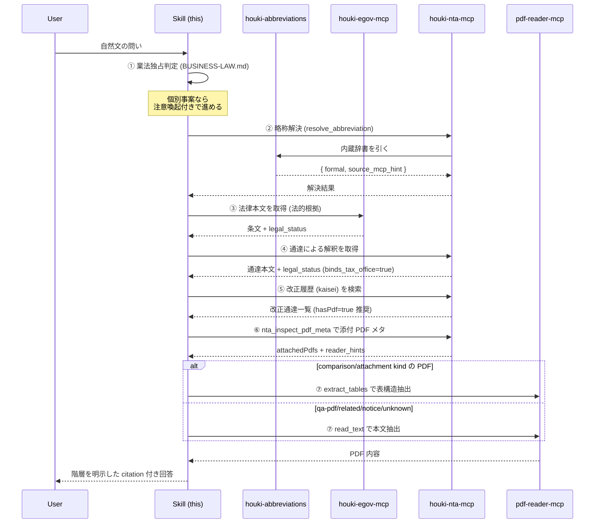
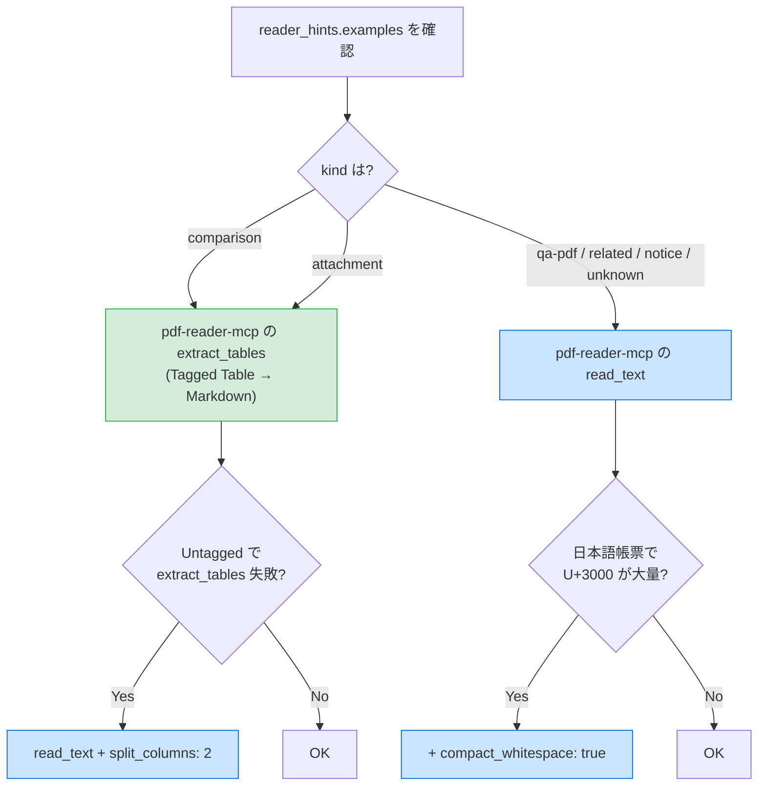

# Workflow — 税務リサーチの基本フロー

houki-research-skill が想定する **税務リサーチの典型ワークフロー**。「制度の概観 + 法的根拠 + 通達による解釈 + 改正履歴 + 添付 PDF (新旧対照表)」を縦串で引用する。

## このワークフローを使う場面

- 税制の概要を **法的根拠から** 引きたい
- 改正点を **改正前 / 改正後** で正確に整理したい
- 通達による行政解釈を **法律本文と紐づけて** 引きたい

該当しないケース:

- 略称の意味だけ知りたい → houki-abbreviations の `resolve_abbreviation` だけで十分
- 個別事案の判断 → [`docs/BUSINESS-LAW.md`](../docs/BUSINESS-LAW.md) の境界 ② を参照し有資格者へ案内

## フロー全体像



## 各ステップの詳細

### ステップ ①: 業法独占判定

ユーザーの問いを読み、[`docs/BUSINESS-LAW.md`](../docs/BUSINESS-LAW.md) の §2「3 つの境界」のどこに該当するかを判定する。

| 境界 | 行動 |
|---|---|
| ✅ 制度の概観・条文の引用 | そのまま進める |
| ⚠️ 個別事案への適用 | 注意喚起テンプレートを **回答冒頭** に入れて進める |
| ❌ 業として行う場面 | このワークフロー自体を実施しない |

### ステップ ②: 略称解決

ユーザーが「**消基通**」「**インボイス**」のような略称を使った場合、houki-nta-mcp の `resolve_abbreviation` を呼ぶ:

```jsonc
{
  "tool": "resolve_abbreviation",
  "args": { "name": "消基通" }
}
// → { formal: "消費税法基本通達", source_mcp_hint: "nta", ... }
```

`source_mcp_hint` が `"egov"` なら houki-egov-mcp を、`"nta"` なら houki-nta-mcp を主軸にする。

### ステップ ③: 法律本文を取得

法的根拠 (国会制定の法律) を houki-egov-mcp で取得:

```jsonc
{
  "tool": "search_law",
  "args": { "keyword": "適格請求書発行事業者の登録" }
}
// or
{
  "tool": "get_law",
  "args": { "lawNumber": "消費税法", "article": "57の2" }
}
```

これが citation の **「法律 (法的根拠)」** セクションになる。

### ステップ ④: 通達による解釈を取得

```jsonc
{
  "tool": "nta_get_tsutatsu",
  "args": { "name": "消基通", "clause": "1-7-2" }
}
// → 本文 + legal_status (binds_tax_office=true / binds_citizens=false)
```

これが citation の **「行政解釈 (通達)」** セクションになる。`legal_status` の `binds_citizens=false` を **必ず** 注釈する。

### ステップ ⑤: 改正履歴を検索

```jsonc
{
  "tool": "nta_search_kaisei_tsutatsu",
  "args": { "keyword": "インボイス", "hasPdf": true, "limit": 5 }
}
// → 改正通達一覧
```

`hasPdf: true` で **添付 PDF (新旧対照表) を持つもの** だけに絞る。

### ステップ ⑥: 添付 PDF メタを取得

```jsonc
{
  "tool": "nta_inspect_pdf_meta",
  "args": { "docType": "kaisei", "docId": "0025004-026" }
}
// → attachedPdfs + reader_hints.examples (kind 別に extract_tables 推奨)
```

houki-nta-mcp v0.7.2+ の `reader_hints.examples` を信頼し、**kind ごとに正しい tool を選ぶ**。

### ステップ ⑦: PDF 本文を抽出

`reader_hints.examples` に従って tool を呼ぶ:



### ステップ ⑧: 階層を明示した citation 付き回答

[`docs/CITATION.md`](../docs/CITATION.md) のフォーマットに従って、本文の末尾に `## Sources` セクションを置く。

## 例

具体的な session 例は [`../examples/invoice-registration.md`](../examples/invoice-registration.md) を参照。

## アンチパターン

- ❌ 法律本文を確認せずに通達だけ引用する → 通達は内部文書なので、法的根拠が抜ける
- ❌ 改正前後の差分を `read_text` で読む → カラムが交互連結し改正点が判別不能。`extract_tables` または `split_columns: 2` を使う
- ❌ `legal_status` の引用を省略する → 通達と法律を同列に扱う citation になる
- ❌ 「あなたの確定申告では…」と個別判断を返す → 業法独占規定 (税理士法 52 条) に抵触するおそれ
