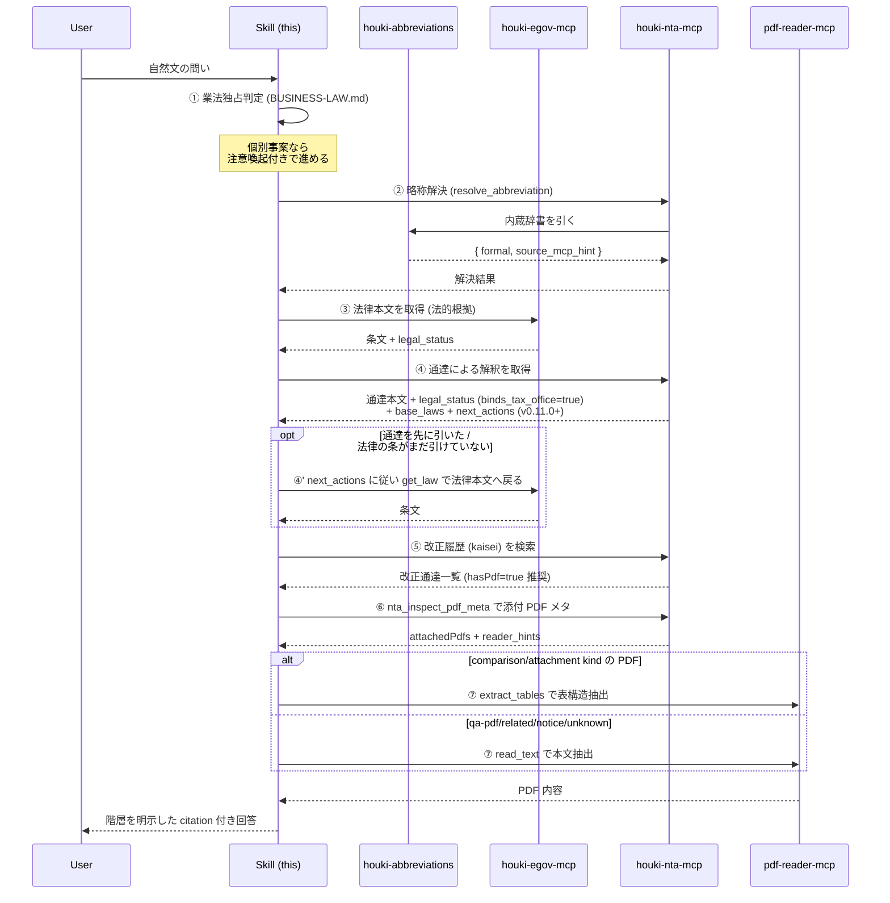
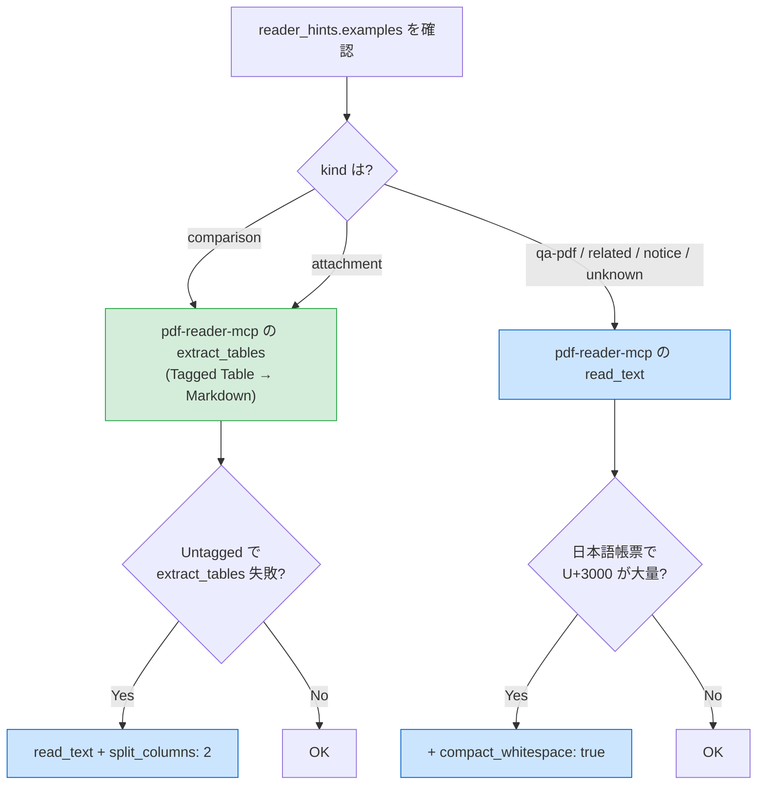

# Workflow — 税務リサーチの基本フロー

houki-research-skill が想定する **税務リサーチの典型ワークフロー**。「制度の概観 + 法的根拠 + 通達による解釈 + 改正履歴 + 添付 PDF (新旧対照表)」を縦串で引用する。

## このワークフローを使う場面

- 税制の概要を **法的根拠から** 引きたい
- 改正点を **改正前 / 改正後** で正確に整理したい
- 通達による行政解釈を **法律本文と紐づけて** 引きたい

該当しないケース:

- 略称の意味だけ知りたい → houki-abbreviations の `resolve_abbreviation` だけで十分
- 個別事案の判断 → [`docs/BUSINESS-LAW.md`](../docs/BUSINESS-LAW.md) の境界 ② を参照し有資格者へ案内

## フロー全体像


```mermaid
sequenceDiagram
    participant U as User
    participant S as Skill (this)
    participant A as houki-abbreviations
    participant E as houki-egov-mcp
    participant N as houki-nta-mcp
    participant P as pdf-reader-mcp

    U->>S: 自然文の問い
    S->>S: ① 業法独占判定 (BUSINESS-LAW.md)
    Note over S: 個別事案なら<br/>注意喚起付きで進める

    S->>N: ② 略称解決 (resolve_abbreviation)
    N->>A: 内蔵辞書を引く
    A-->>N: { formal, source_mcp_hint }
    N-->>S: 解決結果

    S->>E: ③ 法律本文を取得 (法的根拠)
    E-->>S: 条文 + legal_status

    S->>N: ④ 通達による解釈を取得
    N-->>S: 通達本文 + legal_status (binds_tax_office=true)<br/>+ base_laws + next_actions (v0.11.0+)
    opt 通達を先に引いた / 法律の条がまだ引けていない
        S->>E: ④' next_actions に従い get_law で法律本文へ戻る
        E-->>S: 条文
    end

    S->>N: ⑤ 改正履歴 (kaisei) を検索
    N-->>S: 改正通達一覧 (hasPdf=true 推奨)

    S->>N: ⑥ nta_inspect_pdf_meta で添付 PDF メタ
    N-->>S: attachedPdfs + reader_hints

    alt comparison/attachment kind の PDF
        S->>P: ⑦ extract_tables で表構造抽出
    else qa-pdf/related/notice/unknown
        S->>P: ⑦ read_text で本文抽出
    end
    P-->>S: PDF 内容

    S-->>U: 階層を明示した citation 付き回答
```

## 各ステップの詳細

### ステップ ①: 業法独占判定

ユーザーの問いを読み、[`docs/BUSINESS-LAW.md`](../docs/BUSINESS-LAW.md) の §2「3 つの境界」のどこに該当するかを判定する。

| 境界 | 行動 |
|---|---|
| ✅ 制度の概観・条文の引用 | そのまま進める |
| ⚠️ 個別事案への適用 | 注意喚起テンプレートを **回答冒頭** に入れて進める |
| ❌ 業として行う場面 | このワークフロー自体を実施しない |

### ステップ ②: 略称解決

ユーザーが「**消基通**」「**インボイス**」のような略称を使った場合、houki-nta-mcp の `resolve_abbreviation` を呼ぶ:

```jsonc
{
  "tool": "resolve_abbreviation",
  "args": { "abbr": "消基通" }
}
// → { formal: "消費税法基本通達", source_mcp_hint: "houki-nta", ... }
```

`source_mcp_hint` が `"egov"` なら houki-egov-mcp を、`"nta"` なら houki-nta-mcp を主軸にする。

### ステップ ③: 法律本文を取得

法的根拠 (国会制定の法律) を houki-egov-mcp で取得:

```jsonc
// 条番号が分かっているとき
{
  "tool": "get_law",
  "args": { "law_name": "消費税法", "article": "57の2" }
}
// 法令名は分かるが条が不明なとき → 目次
{
  "tool": "get_toc",
  "args": { "law_name": "消費税法" }
}
// 法令名を探すとき（タイトル一致）
{
  "tool": "search_law",
  "args": { "keyword": "適格請求書発行事業者の登録" }
}
// どの法令の何条か自体が不明なとき → 条文本文の横断検索（ローカル DB が必要）
{
  "tool": "search_fulltext",
  "args": { "keyword": "消費税法 適格請求書発行事業者 登録" }
}
```

`search_fulltext` の応答で `source` が `"api-fallback"` なら本文検索は行われていない（`search_law` の結果が `fallback` に入っている）。その場合は `next_actions` の `bulk_download_everything`（`houki-egov-mcp --bulk-download-everything`）をユーザーに案内し、回答には「法令名の一致で探した」と書く。

これが citation の **「法律 (法的根拠)」** セクションになる。

### ステップ ④: 通達による解釈を取得

```jsonc
{
  "tool": "nta_get_tsutatsu",
  "args": { "name": "消基通", "clause": "1-7-2" }
}
// → 本文 + legal_status (binds_tax_office=true / binds_citizens=false)
```

これが citation の **「行政解釈 (通達)」** セクションになる。`legal_status` の `binds_citizens=false` を **必ず** 注釈する。

houki-nta-mcp v0.11.0 以上では、応答に解釈の対象になる法律と、houki-egov-mcp への戻り方が入る:

```jsonc
// nta_get_tsutatsu (format: "json") の応答の末尾
{
  "base_laws": ["消費税法", "消費税法施行令", "消費税法施行規則"],
  "next_actions": [
    {
      "action": "delegate_to_mcp",
      "reason": "通達は国民・裁判所を拘束しない。根拠は法律本文で確認する",
      "example": { "mcp": "houki-egov", "tool": "get_law", "law_name": "消費税法" }
    }
  ]
}
// nta_search_tsutatsu では base_laws の代わりに
//   "base_laws_by_tsutatsu": { "消費税法基本通達": ["消費税法", "消費税法施行令", "消費税法施行規則"] }
// が 1 回だけ入り、next_actions は結果に現れた通達ごとに 1 件
```

### ステップ ④': 通達から法律本文へ戻る

ステップ ③ を飛ばして通達から入った場合や、③ で引いた条と通達が参照している条が違う場合は、ここで法律本文へ戻る。

1. `next_actions[].example` を houki-egov-mcp の `get_law` にそのまま渡す (法律名だけが入っている)
2. 条番号は応答に入っていないので、通達の本文の参照 (例: 消基通 1-7-2 の「法第57条の2第4項」) を読み、`article` / `paragraph` を足して引き直す。基本通達の本文では「法」は法律、「令」は施行令、「規則」は施行規則を指すのが通例

```jsonc
// 消基通 1-7-2 の本文「法第57条の2第4項」→ base_laws の先頭 (消費税法) の 57 条の 2 第 4 項
{
  "tool": "get_law",
  "args": { "law_name": "消費税法", "article": "57の2", "paragraph": 4 }
}
// 所基通 49-39 の本文「令第138条」→ base_laws の 2 番目 (所得税法施行令) の 138 条
{
  "tool": "get_law",
  "args": { "law_name": "所得税法施行令", "article": "138" }
}
```

引いた条文は citation の「法律 (法的根拠)」「政令 / 省令」に置く。

### ステップ ⑤: 改正履歴を検索

```jsonc
{
  "tool": "nta_search_kaisei_tsutatsu",
  "args": { "keyword": "インボイス", "hasPdf": true, "limit": 5 }
}
// → 改正通達一覧
```

`hasPdf: true` で **添付 PDF (新旧対照表) を持つもの** だけに絞る。

### ステップ ⑥: 添付 PDF メタを取得

```jsonc
{
  "tool": "nta_inspect_pdf_meta",
  "args": { "docType": "kaisei", "docId": "0025004-026" }
}
// → attachedPdfs + reader_hints.examples (kind 別に extract_tables 推奨)
```

houki-nta-mcp v0.7.2+ の `reader_hints.examples` を信頼し、**kind ごとに正しい tool を選ぶ**。

### ステップ ⑦: PDF 本文を抽出

`reader_hints.examples` に従って tool を呼ぶ:


```mermaid
flowchart TB
  hint["reader_hints.examples を確認"]
  hint --> q1{"kind は?"}
  q1 -->|comparison| t1["pdf-reader-mcp の extract_tables<br/>(Tagged Table → Markdown)"]
  q1 -->|attachment| t1
  q1 -->|qa-pdf / related / notice / unknown| t2["pdf-reader-mcp の read_text"]
  t1 --> q2{"Untagged で<br/>extract_tables 失敗?"}
  q2 -->|Yes| t3["read_text + split_columns: 2"]
  q2 -->|No| done1[OK]
  t2 --> q3{"日本語帳票で<br/>U+3000 が大量?"}
  q3 -->|Yes| t4["+ compact_whitespace: true"]
  q3 -->|No| done2[OK]

  classDef pri fill:#d4edda,stroke:#28a745
  classDef sec fill:#cce5ff,stroke:#0066cc
  class t1 pri
  class t2,t3,t4 sec
```

### ステップ ⑧: 階層を明示した citation 付き回答

[`docs/CITATION.md`](../docs/CITATION.md) のフォーマットに従って、本文の末尾に `## Sources` セクションを置く。

## 例

具体的な session 例は [`../examples/invoice-registration.md`](../examples/invoice-registration.md) を参照。

## アンチパターン

- ❌ 法律本文を確認せずに通達だけ引用する → 通達は内部文書なので、法的根拠が抜ける
- ❌ 通達の応答の `next_actions` (`delegate_to_mcp` → houki-egov-mcp の `get_law`) を読まずに回答を終える → 同上。成功時の応答にも付くので、エラーのときだけ見るのでは足りない
- ❌ 改正前後の差分を `read_text` で読む → カラムが交互連結し改正点が判別不能。`extract_tables` または `split_columns: 2` を使う
- ❌ `legal_status` の引用を省略する → 通達と法律を同列に扱う citation になる
- ❌ 「あなたの確定申告では…」と個別判断を返す → 業法独占規定 (税理士法 52 条) に抵触するおそれ
